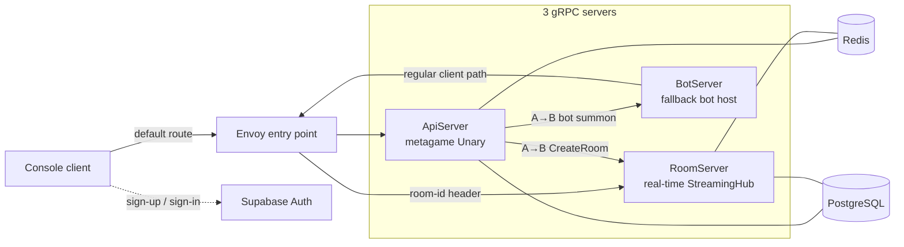

import { CardGrid, LinkCard } from '@astrojs/starlight/components';

SharpCampus is three gRPC servers and three pieces of infrastructure. This chapter draws the whole picture and explains why it is cut this way; the three chapters after it each dig into one path — matchmaking, the room lifecycle, and settlement events.

## The whole picture

In the deployed shape, the only address a client knows is Envoy. Account and matchmaking calls take the default route to the ApiServer, while duel streams carry a `room-id` gRPC header and get routed to whichever RoomServer owns that room. During development you can skip the entry point and connect straight to each server's port — the behaviour is the same ([part 1 of the getting-started guide](../getting-started/local-run/) runs that shape).

## Why the servers are split

The three servers differ in the nature of their state, and that difference reaches all the way into how they scale and how they shut down — which is why they are separate from the start.

- The **ApiServer** is stateless. Account checks, profiles, shop and missions, matchmaking — each is a single request-response, and the state lives in Redis and PostgreSQL. Any instance can answer any request, so it scales horizontally without ceremony.
- The **RoomServer** holds state. The simulation of a live match exists only in the memory of the process that created the room. That is what makes routing necessary — the client must reach *the* server that owns its room — and what makes draining necessary: a shutting-down server has to tick its matches to completion before it exits.
- The **BotServer** is an auxiliary that only works when the queue has nobody to offer. A summoned bot signs in with an account of its own and enters the queue through the same path as any client, so the rest of the system carries no bot special cases.

This split is the premise of every chapter that follows. Server-to-server RPC (A→B), room-id routing, draining — all of it falls out of "meta is stateless, matches are stateful".

## Three call paths, two contracts

Every RPC is MagicOnion. There are three paths, and the contract interfaces are split into two projects by who is allowed to see them.

| Path | Style | Auth | Contract project |
| --- | --- | --- | --- |
| Client → ApiServer | Unary (request-response) | JWT | `SharpCampus.Shared` |
| Client → RoomServer | StreamingHub (bidirectional stream) | JWT + entry token | `SharpCampus.Shared` |
| ApiServer → RoomServer / BotServer | Unary (server-to-server, A→B) | internal network only | `SharpCampus.Shared.Internal` |

One of this project's central use cases is that server-to-server calls use the same MagicOnion as the clients do — no second protocol. When a match is made, the ApiServer calls the RoomServer's `IRoomControlService.CreateRoomAsync` through an ordinary MagicOnion client. The contracts in `Shared.Internal` never ship with a client.

Authentication is a boundary: Supabase Auth (GoTrue) issues the JWTs and the servers only verify them. Since no server is an issuer, swapping in a different IdP means changing one verification setup and nothing else.

## Where state lives

This is the table to reason from when thinking about failures and scaling.

| State | Where | Character |
| --- | --- | --- |
| Live matches (boards, pieces, ticks) | RoomServer process memory | Born and gone with the room. The reason room-id routing and draining exist |
| Match queue, tickets, room registry, room locations | Redis | Shared by every ApiServer instance; TTLs retire stale entries |
| Leaderboards (rating, daily wins) | Redis Sorted Sets | Derived data, pushed after settlement commits |
| Profiles, match records, mission progress, owned skins | PostgreSQL | Durable data; what the settlement transaction writes |
| Game constants (gravity, attack tables, mission definitions) | MasterMemory in-memory | Read-only, loaded from `masterdata/` at startup |

## Going deeper

<CardGrid>
  <LinkCard title="Matchmaking" href="matchmaking/" description="From joining the queue to the entry token: how the pairing worker reads the Redis queue and creates rooms over A→B calls." />
  <LinkCard title="Room lifecycle" href="room-lifecycle/" description="A room's whole life: creation, the mailbox actor model, the tick pipeline, reconnection grace, rematches, and draining." />
  <LinkCard title="Settlement events" href="settlement/" description="How a finished match fans out into coins, rating, missions, and leaderboards — side effects lifted out of the tick loop." />
</CardGrid>
