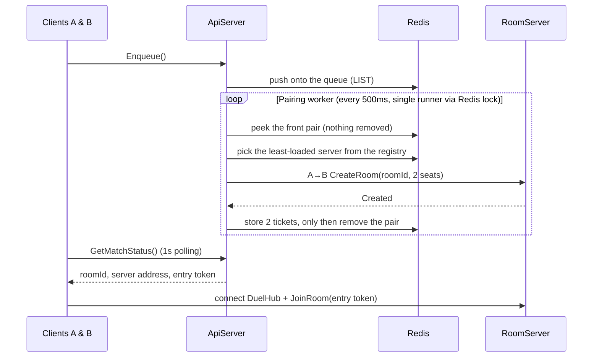

import SourceLink from '../../../components/SourceLink.astro';

This is the path from the moment a client picks **Play a duel** to the moment it takes a seat in a room. The protagonist is a single pairing worker inside the ApiServer; the queue, the tickets, and the registry all live in Redis.

## The flow at a glance

## One queue, in Redis

Joining, cancelling, and polling on `IMatchmakingService` are all Unary calls, and the queue itself is a Redis LIST. Run as many ApiServer instances as you like — whichever one takes the request sees the same queue, so matchmaking works regardless of instance count. Next to the queue sits a hash of each waiter's enqueue time; the bot fallback below reads it.

## The pairing worker: from queue to room

Pairing is not a client call — it belongs to <SourceLink path="src/SharpCampus.ApiServer/Matchmaking/MatchmakingWorker.cs" />. A `BackgroundService` runs a pass every 500ms, pairing the two people at the front of the queue into a room.

With several instances running, two of them must never pair the same two people at once, so only the instance that wins a Redis lock (`SET NX EX`) runs the pass; the losers skip theirs.

Pairing is plain arrival order (FIFO). A live service would pair within a rating band and widen it as waits grow, but this project chose to show the pipeline itself — the `Production note:` comments in the code mark that boundary.

## Why it peeks instead of popping

The worker reads the pair without removing it, and only removes the two from the queue after the room exists and the tickets are stored. The reason this order matters is the most instructive part of the worker.

- Pop first and the pair spends the first `CreateRoom` — easily a second on a cold connection — in a state where they are neither queued nor ticketed. A client polling every second can see that window and conclude its match was dropped.
- Peek and there is nothing to undo on failure. If room creation is refused, the queue is untouched and the next pass picks the same pair up again.
- Tickets before removal is the same principle: a polling client only ever sees "queued" or "matched", never a gap between them.

Consistency between the peek and the removal is what the pairing lock protects — the queue is only touched under the lock, so no other instance can slip in between.

## Placement and the A→B call

Which RoomServer gets the room is the registry's decision. Every RoomServer re-registers its name and current room count in Redis every 5 seconds (TTL 15 seconds, so a dead server simply fades out), and the worker picks the least-loaded one.

Room creation is a server-to-server MagicOnion call. The worker issues a `roomId` (a Ulid), packs the two seats — nickname and skin pulled from each waiter's profile — and calls `CreateRoomAsync` on <SourceLink path="src/SharpCampus.Shared.Internal/Rooms/IRoomControlService.cs" />. The point of this call is that the same framework and the same source generators the client uses serve server-to-server RPC unchanged.

Any answer other than `Created` — at capacity, draining, unreachable — leaves the pair in the queue, and the next pass retries against another server.

## Tickets and the entry token

Once the room exists, the worker leaves a ticket for each waiter: the `roomId`, the server address to connect to, and an **entry token**.

The entry token is `{ userId, roomId, expiry (60s) }` signed with HMAC-SHA256. Only the ApiServer and RoomServer share the signing key, so knowing a room's address and `roomId` is not enough to get in. Forged, expired, or wrong-room tokens are all refused at the door.

Separate from the ticket, each player's "active room" entry outlives it. If the client dies mid-match, reconnecting finds this entry and is sent back to the same room. The return procedure is covered in [Room lifecycle](../room-lifecycle/).

## Match notification is polling

A made match is delivered by 1-second `GetMatchStatus()` polling, not push. For a teaching codebase polling is simpler and dependency-free; a live service would switch to a stream or push notification, and the code marks the spot with a `Production note:`.

## When nobody shows up: the bot

If a waiter is left alone after all pairs are placed and has waited past the threshold (15 seconds in the dev settings, 2 minutes by default), the worker calls the BotServer's `IBotControlService.SummonAsync` over A→B. The summoned bot signs in with its own Supabase account and **enters the queue through the same three calls as any client**. The next pass pairs human and bot through the regular path, so pairing, tokens, settlement, and leaderboards carry no bot special cases anywhere.

Summon attempts are paced to one per window by a Redis cooldown marker (TTL 30 seconds). A BotServer that is down or out of accounts costs a log line and nothing else — the matchmaking pipeline is unaffected.

## The last hop: room-id routing

On a local dev run the ticket's server address points straight at the RoomServer and the story ends there. In the deployed shape every client connects to a single Envoy, the ticket's address *is* Envoy, and the `room-id` gRPC header the client attaches is what an Envoy Lua filter reads to resolve "the server that owns this room" from the room-location key in Redis — then hands the stream to that RoomServer. The client code is identical in both shapes: connect to whatever address the ticket gives, attach the header.

To watch this routing happen for real, see [part 2 of the getting-started guide](../../getting-started/docker-compose/).
