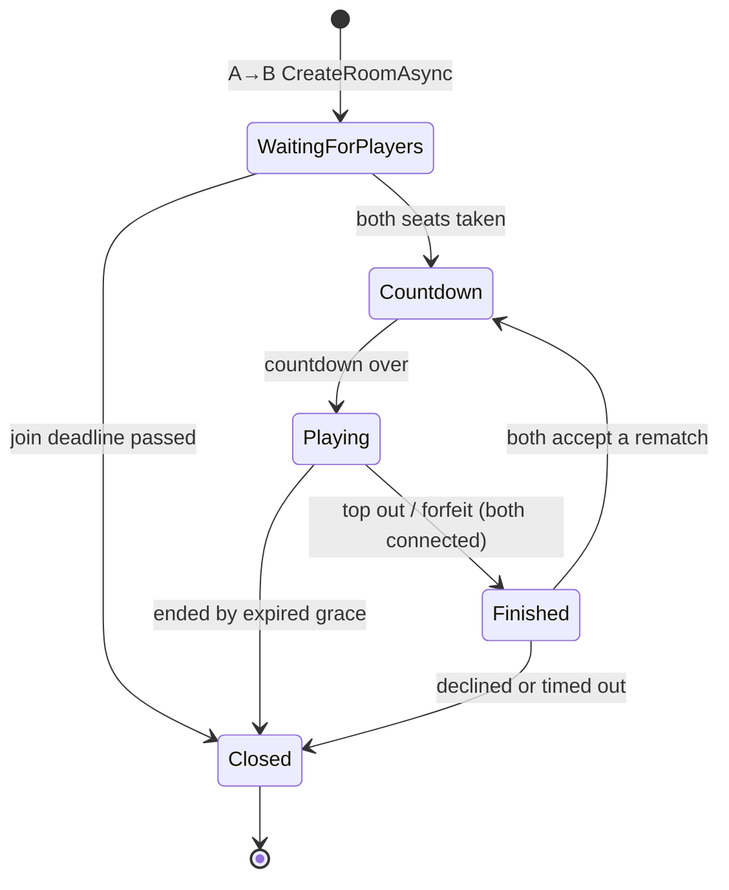

import SourceLink from '../../../components/SourceLink.astro';

One room is one match. This chapter follows a room from creation to close, watching how the rule at the heart of the RoomServer's design — *all mutation happens on the loop thread* — holds at every step.

## The states at a glance

Whichever path decides the game, a settlement event is published. `Finished` is the state where a decided match asks about a rematch; endings with nobody left to ask (an expired disconnect grace, say) go straight to `Closed`.

## Only the ApiServer creates rooms

There is no path from a client to a new room. The pairing worker's A→B `CreateRoomAsync` is the single entrance, and <SourceLink path="src/SharpCampus.RoomServer/Rooms/RoomManager.cs" /> takes the request, checks capacity, duplicates, and draining, then registers the room.

Registering means registering a [LogicLooper](https://github.com/Cysharp/LogicLooper) loop action: one room becomes one action, and everything that ever happens to this room happens inside a tick running at 20 TPS. Before the call returns, the room-location key (`room:<roomId>`) is written to Redis — the pairing worker issues tickets the moment the response lands, so the key the entry point routes on has to exist first.

Seeds are minted per game by the RoomServer. Both boards deal from the same piece sequence, so a client that knew the seed could read its opponent's next pieces — which is why the seed is not in the A→B payload either.

## The hub validates, the room seats

<SourceLink path="src/SharpCampus.RoomServer/Hubs/DuelHub.cs" /> is a thin adapter over the room's mailbox. When a join arrives, the hub first filters everything that can be checked statelessly: the entry token's signature and expiry, that the token's `roomId` matches the target room, that the token's `userId` matches the connection's JWT `sub`, and that the account is one of the room's two expected seats. Only a join that passed all of it is posted to the mailbox.

The seating plan is fixed at creation — two entries of (account, nickname, skin) — and never mutated. Another account cannot sit down even with a token, and the nickname came from the profile, so it cannot be spoofed.

## The mailbox: a single thread instead of locks

Every field in <SourceLink path="src/SharpCampus.RoomServer/Rooms/DuelRoom.cs" /> is written on the loop thread only. Hub calls — join, inputs, forfeit, disconnect, snapshot, rematch answers — never touch the room directly; they enqueue a command onto a `ConcurrentQueue`, and the loop drains whatever accumulated at the start of each tick.

- Only the commands that owe the caller an answer (join, snapshot) reply through a `TaskCompletionSource`. The hub awaits the task; the loop just sets the result and moves on.
- Broadcasts are made by the loop itself through the group proxy, which only serialises onto each connection's write queue — the loop never waits on a client.
- A closing room drains its mailbox one final time so that anything that slipped in still gets an answer. Without this, a hub could await forever.

Instead of reasoning about lock contention, the design makes "one thread touches room state" true by construction — an actor model in miniature.

## The tick pipeline (20 TPS)

One `Playing` tick flows like this:

1. **Drain commands**: everything in the mailbox is processed; inputs pile up in per-seat queues.
2. **Count grace**: disconnected seats have their remaining grace ticks decremented; expiry ends the match.
3. **Simulate**: each seat's queued inputs are consumed up to a per-tick cap and fed to GameCore's `Tick()`. Anything over the cap is dropped, not carried over — a client that floods inputs must not buy extra actions on later ticks. Gravity, rotation, line clears, garbage, and the win/loss decision all happen inside.
4. **Broadcast the delta**: the tick's outcome goes out to both players.
5. **Check for the end**: if the simulation reported a finish, the room moves on to the result and the settlement publish.

## Disconnects and reconnection

When a connection drops, the hub's `OnDisconnected` posts a disconnect command — carrying the connection id, so that a stale connection's late-arriving disconnect cannot empty a seat a newer connection has already reclaimed.

A mid-match disconnect is not an instant loss. The seat gets a 10-second grace, and the game keeps running without that seat's inputs. Reconnect within it and you resume the same seat: the room re-announces the match start to that one connection, and the client walks its usual start-then-snapshot path, which rebuilds the whole board. This is why matchmaking's active-room entry outlives the ticket — a client that died and came back can still find its way to the same room.

If the grace runs out, the remaining player wins; if both run out, it is a draw. A forfeit, by contrast, ends the match on the spot with no grace: grace is for connections that failed, not for players who chose to stop.

## Rematch: the server calls the client

If a match ended normally (top out or forfeit) with both players connected, the room enters `Finished` and asks about a rematch. The ask uses MagicOnion 7's **Client Results** — the server invoking a method on the client and receiving its return value.

- A loop action cannot `await`, so each ask runs as its own task and posts the answer back into the mailbox — even the answer becomes a command handled on the loop thread.
- Client Results default to a 5-second deadline while the offer window is 10 seconds, so every call carries a `CancellationToken` of its own.
- One decline settles it for both, immediately — an accepting player should not sit out the rest of a timeout that can no longer produce a match. Errors, drops, and silence all count as declines.
- If both accept, a new seed and a new `MatchId` start the countdown again. This is why the match id is per game: a rematch is settled as a match of its own.

## Close and cleanup

However a room reaches `Closed`, it drains its mailbox one last time and the manager cleans up after it: removal from the room list, deletion of the room-location key, and release of both players' active-room entries — at which point both are free to queue again.

One trap is handled here too. When a loop action throws, LogicLooper hands the exception to the task returned at registration and quietly unregisters the action. If nobody observes that task, the room stops ticking forever without a single log line — still holding its seats and its players' return entries. So the manager always observes the registration task, and on a fault it logs the error and aborts the room.

## Draining: shutdown must not cut a match

When the RoomServer receives SIGTERM (a rolling update, a scale-down), <SourceLink path="src/SharpCampus.RoomServer/Rooms/RoomDrainService.cs" /> steps in **before** Kestrel stops — `IHostedLifecycleService.StoppingAsync` is the last moment in shutdown where the match streams are still alive.

1. **Refuse new placements**: from here on, `CreateRoomAsync` answers `Draining`. The pairing worker treats a refusal as "queue untouched, retry next pass against another server", so the ApiServer needs no special handling at all.
2. **Leave the registry**: the server deletes its own entry immediately and disappears from the worker's options.
3. **Wait for completion**: the server waits for every live room to close, within a configured limit (240 seconds in the Kubernetes shape).

The limits form a chain: drain timeout < the .NET host's shutdown timeout < Kubernetes' `terminationGracePeriodSeconds`. Each inner stage must be shorter than the outer one so it can finish its own cleanup before being cut off. To watch a rolling update spare a live match, see [part 3 of the getting-started guide](../../getting-started/kubernetes/).

What happens after a match ends — where the published settlement event goes — continues in [Settlement events](../settlement/).
