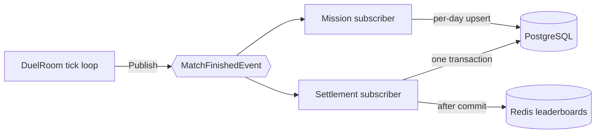

import SourceLink from '../../../components/SourceLink.astro';

The moment a match ends, there is suddenly a lot to do: pay out coins, compute ratings, write two match records, advance missions, refresh leaderboards. All of it talks to a database or Redis — and at that moment the room is still inside a tick loop running on a 50ms budget. This chapter is about resolving that tension with [MessagePipe](https://github.com/Cysharp/MessagePipe)'s pub/sub.

## Separating the verdict from its side effects

The principle is single: **the tick loop only judges the game; whatever follows from the verdict is handed off as an event.** When the game is decided, the room publishes a `MatchFinishedEvent` and moves straight on. The publish is fire-and-forget — the loop thread never waits on a subscriber.

There is exactly **one** event type, `MatchFinishedEvent`, with two subscribers attached. Not having fine-grained events (lines cleared, garbage sent, and so on) is deliberate: everything settlement and missions need is already in the end-of-match board statistics and the outcome, so there was no reason to multiply events. What carries the design instead is that *the same event is subscribed to independently, subscriber by subscriber*.

## The event carries its own copy

<SourceLink path="src/SharpCampus.RoomServer/Rooms/MatchFinishedEvent.cs" /> holds the match id, the outcome and end reason, the duration in ticks, and both players' accounts with their board statistics — lines cleared, garbage sent, hard drops, max combo, and more. The event ships everything its consumers need so that no handler ever has to look back into the room. A handler that runs after the room has already closed still has a whole match to work from.

The unit is the game, not the room: a rematch publishes again under a new `MatchId` and settles as a match of its own.

## The settlement subscriber: one transaction

<SourceLink path="src/SharpCampus.RoomServer/Rooms/MatchSettlementHandler.cs" /> runs off the room's loop thread with no request behind it, so it opens the scope its DbContext needs by itself.

The arithmetic belongs to <SourceLink path="src/SharpCampus.Server.Common/Settlement/SettlementCalculator.cs" /> — a pure function over two profiles and the economy constants, which keeps the rules testable without a database.

- Rating is Elo: `R' = R + K(S − E)`, with K coming from the economy table in master data.
- A draw moves no rating — a double top-out is not evidence about either player — and pays what a loss pays: neither earned the win, but both played the game out.

The writes are bundled by <SourceLink path="src/SharpCampus.Server.Common/Settlement/MatchSettlementService.cs" /> into a **single transaction**: both profiles' coins and ratings, plus two match-record rows, commit together or fail together. Only after the commit does the handler push to Redis — updating the rating Sorted Set, and adding to the daily-wins board if there was a winner.

Failure splits into two stages. If the transaction fails, a log line is all that happens (a live service would write the event to an outbox and retry — the code says so in a `Production note:`). If the leaderboard push fails, the profiles are already committed, so the only thing behind is derived data.

## The mission subscriber: same event, different concern

<SourceLink path="src/SharpCampus.RoomServer/Rooms/MissionProgressHandler.cs" /> is the second subscriber to the same event. While settlement pays for the game, this one counts it towards the day: it walks the mission list in master data, computes each metric's increment (matches played, wins, lines cleared, garbage sent, hard drops), and upserts progress keyed by UTC date.

The two handlers know nothing of each other, and the room does not know how many subscribers there are. One publish, and adding a subscriber *is* adding a feature.

## Isolation per subscriber

Each subscription is owned by a hosted service of its own (<SourceLink path="src/SharpCampus.RoomServer/Rooms/MatchSettlementSubscription.cs" /> and its mission twin). Separate lifetimes mean separate failures: if the settlement handler dies to a database outage, mission progress still gets recorded — and vice versa. One side's exception never stopping the other is half the reason pub/sub is here at all.

## Shutdown and writes in flight

Fire-and-forget publishing has a price: when the process goes down, there may be a settlement that was published but is still being written. So each subscription service waits on shutdown, through the <SourceLink path="src/SharpCampus.RoomServer/Rooms/InFlightHandler.cs" /> wrapper, for its in-flight handlers to finish.

This window is not theoretical. A bot declines rematch offers instantly, so a bot match's room closes the moment the game ends — and on a draining server, the final match's settlement write races process exit. Draining is therefore two-fold: the room drain in [Room lifecycle](../room-lifecycle/) plays the match out, and the write drain here sees its settlement through.

MessagePipe's own API and DI wiring get their own page in the libraries section.
