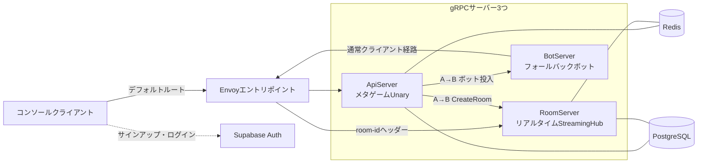

import { CardGrid, LinkCard } from '@astrojs/starlight/components';

SharpCampusは3つのgRPCサーバーと3種類のインフラで構成されます。この章で全体像と「なぜこう分けたのか」を押さえ、続く3つの章がマッチメイキング、ルームのライフサイクル、精算イベントをそれぞれ深掘りします。

## 全体像

デプロイ形態でクライアントが知っているアドレスはEnvoyだけです。アカウントやマッチメイキングの呼び出しはデフォルトルートでApiServerへ向かい、対戦ストリームは`room-id` gRPCヘッダーを手がかりに、そのルームを所有するRoomServerへルーティングされます。開発中はエントリポイントなしで各サーバーのポートへ直接つないでも挙動は同じです（[スタートガイド第1部](../getting-started/local-run/)がこの形です）。

## サーバーを分けた理由

3つのサーバーは状態の性質が違います。その違いがスケールのしかたと終了のしかたまで分けてしまうため、最初から分離しています。

- **ApiServer**はステートレスです。アカウント確認、プロフィール、ショップ・ミッション、マッチメイキングはすべて1回のリクエスト・レスポンスで完結し、状態はRedisとPostgreSQLにあります。どのインスタンスが受けても同じなので、水平スケールが自由です。
- **RoomServer**は状態を持ちます。進行中の対戦のシミュレーションは、ルームを作ったプロセスのメモリにしか存在しません。だからクライアントを「そのルームを持つそのサーバー」へ送るルーティングが必要になり、終了時には進行中の対戦を最後までティックしてから抜けるドレイニングが必要になります。
- **BotServer**はキューに相手がいないときだけ働く補助サーバーです。投入されたボットは自分のアカウントでログインし、通常のクライアントと同じ経路でキューに入るため、残りのシステムにボット特例のコードはありません。

この分離が以降の章の前提です。サーバー間RPC（A→B）、room-idルーティング、ドレイニングはどれも「メタはステートレス、対戦はステートフル」という切り分けから生まれています。

## 3種類の通信経路と2つの契約

RPCはすべてMagicOnionです。経路は3種類あり、契約インターフェースは公開範囲に応じて2つのプロジェクトに分かれます。

| 経路 | 方式 | 認証 | 契約プロジェクト |
| --- | --- | --- | --- |
| クライアント → ApiServer | Unary（リクエスト・レスポンス） | JWT | `SharpCampus.Shared` |
| クライアント → RoomServer | StreamingHub（双方向ストリーム） | JWT + 入場トークン | `SharpCampus.Shared` |
| ApiServer → RoomServer・BotServer | Unary（サーバー間、A→B） | 内部ネットワーク限定 | `SharpCampus.Shared.Internal` |

サーバー間の呼び出しに別のプロトコルを持ち込まず、クライアントと同じMagicOnionをそのまま使うのが、このプロジェクトの中心的なユースケースの1つです。マッチが成立すると、ApiServerはMagicOnionクライアントでRoomServerの`IRoomControlService.CreateRoomAsync`を呼びます。`Shared.Internal`の契約がクライアントの配布物に載ることはありません。

認証はSupabase Auth（GoTrue）がJWTを発行し、サーバーは検証だけを行います。サーバーは発行者ではないので、別のIdPに差し替えるときは検証設定の1か所を変えるだけで済みます。

## 状態の置き場所

障害とスケールを考えるときの基準になる表です。

| 状態 | 置き場所 | 性質 |
| --- | --- | --- |
| 進行中の対戦（ボード・ピース・ティック） | RoomServerのプロセスメモリ | ルームとともに生まれて消える。room-idルーティングとドレイニングの存在理由 |
| マッチキュー・チケット・ルームレジストリ・ルーム位置 | Redis | ApiServer複数台で共有。TTLで自然に消える |
| ランキング（レーティング・日間勝利数） | RedisのSorted Set | 精算がコミット後に反映する派生データ |
| プロフィール・戦績・ミッション進行・所持スキン | PostgreSQL | 永続データ。精算トランザクションの書き込み先 |
| ゲーム定数（重力・攻撃テーブル・ミッション定義） | MasterMemoryインメモリ | 読み取り専用。起動時に`masterdata/`からロード |

## さらに深く

<CardGrid>
  <LinkCard title="マッチメイキング" href="matchmaking/" description="キュー参加から入場トークンまで。ペアリングワーカーがRedisのキューを読み、A→B呼び出しでルームを作る経路をたどります。" />
  <LinkCard title="ルームのライフサイクル" href="room-lifecycle/" description="ルーム生成、メールボックスのアクターモデル、ティックパイプライン、再接続の猶予、再戦、ドレイニングまでルームの一生を見ます。" />
  <LinkCard title="精算イベント" href="settlement/" description="対戦終了がコイン・レーティング・ミッション・ランキングへ広がる経路。ティックループから副作用を切り離す方法です。" />
</CardGrid>
