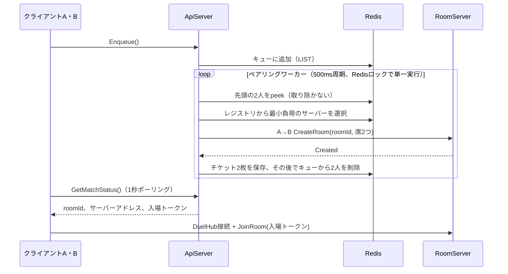

import SourceLink from '../../../../components/SourceLink.astro';

クライアントが**Play a duel**を選んだ瞬間から、ルームの席に着くまでの経路です。主役はApiServerの中で動く1つのペアリングワーカーで、キュー・チケット・レジストリはすべてRedisにあります。

## 流れをひと目で

## キューはRedisに1つ

`IMatchmakingService`のキュー参加・キャンセル・状態照会はすべてUnary呼び出しで、待ち行列そのものはRedisのLISTです。ApiServerを何台立てても、どのインスタンスがリクエストを受けても同じキューを見るため、マッチメイキングはインスタンス数と無関係に動きます。キューの隣には各待機者の参加時刻を持つハッシュが1つあり、後述のボットフォールバックがこの時刻を見ます。

## ペアリングワーカー: キューからルームへ

ペアリングはクライアントの呼び出しではなく、<SourceLink path="src/SharpCampus.ApiServer/Matchmaking/MatchmakingWorker.cs" />の仕事です。`BackgroundService`が500msごとに1パスを回し、待ち行列の先頭2人を組にしてルームを作ります。

インスタンスが複数あるとき、同じ2人を別々のインスタンスが同時に組んではいけないので、パスはRedisロック（`SET NX EX`）を取った1つのインスタンスだけが進めます。ロックを取れなかったインスタンスはそのパスを飛ばします。

組み合わせは到着順（FIFO）です。実サービスならレーティング帯の中で組み、待ちが長引くほど帯を広げるところですが、このプロジェクトはパイプラインそのものを見せる側に振りました（コードの`Production note:`コメントがその境界を示しています）。

## 取り出さずに読む理由

ワーカーはキューから2人を取り出さず（pop）、読むだけ（peek）にします。ルーム生成とチケット保存が終わってから、ようやくキューから削除します。この順序になっている理由が、このワーカーでいちばん学びのある部分です。

- 先に取り出してからルームを作ると、最初のCreateRoomにかかる時間のあいだ、その2人は「キューにもいないしチケットもない」状態になります。1秒ポーリング中のクライアントがその窓を見ると、マッチが消えたと誤解します。
- 読むだけなら、失敗しても戻すものがありません。ルーム生成が拒否されたらキューは無傷のままで、次のパスが同じ2人をまた拾います。
- チケットを先に書き、削除を最後に置くのも同じ原則です。クライアントから見えるのは常に「待機中」か「マッチ成立」だけです。

peekと削除のあいだの整合性は、前述のペアリングロックが守ります。ロックの中でしかキューに触れないため、その間に他のインスタンスが割り込むことはありません。

## ルームの配置とA→B呼び出し

ルームをどのRoomServerに作るかはルームレジストリが決めます。各RoomServerは5秒ごとに自分の名前と現在のルーム数をRedisに再登録し（TTL 15秒、死んだサーバーは自然に消える）、ワーカーはそのうち負荷が最も少ないサーバーを選びます。

ルーム生成はサーバー間のMagicOnion呼び出しです。ワーカーがUlidで`roomId`を発行し、席2つ（各待機者のプロフィールから取ったニックネームとスキン）を載せて、<SourceLink path="src/SharpCampus.Shared.Internal/Rooms/IRoomControlService.cs" />の`CreateRoomAsync`を呼びます。クライアントと同じフレームワーク、同じソースジェネレーターをサーバー間RPCにもそのまま使うのが、この呼び出しの要点です。

応答が`Created`以外なら（定員超過、ドレイニング中、無応答）、その組はキューに残ったままで、次のパスが別のサーバーに再試行します。

## チケットと入場トークン

ルームができると、ワーカーは待機者ごとにチケットを残します。チケットには`roomId`、接続先サーバーアドレス、そして**入場トークン**が入っています。

入場トークンは`{ userId, roomId, 有効期限(60秒) }`をHMAC-SHA256で署名した値です。署名キーはApiServerとRoomServerだけが共有するので、ルームのアドレスと`roomId`を知っているだけでは入れません。偽造・期限切れ・別ルームのトークンはすべて入口で拒否されます。

チケットとは別に、各プレイヤーの「アクティブルーム」エントリがチケットより長く残ります。対戦中にクライアントが落ちても、再接続すればこのエントリが同じルームへ送り返します。復帰の手順は[ルームのライフサイクル](../room-lifecycle/)で扱います。

## マッチ通知はポーリング

マッチ成立はpushではなく、1秒周期の`GetMatchStatus()` Unaryポーリングで届きます。教材としてはポーリングが単純で依存もないからです。実サービスならストリームやプッシュ通知に置き換える箇所で、コードに`Production note:`の印があります。

## 相手がいなければボット

すべての組を配置してもひとり残った待機者がいて、その待ち時間がしきい値（開発設定15秒、デフォルト2分）を超えると、ワーカーはA→BでBotServerの`IBotControlService.SummonAsync`を呼びます。投入されたボットは自分のSupabaseアカウントでログインし、**通常のクライアントと同じ3回の呼び出しでキューに入ります**。次のパスが人間とボットを通常経路のまま組むので、ペアリング・トークン・精算・ランキングのどこにもボット特例のコードはありません。

投入の試行はRedisのクールダウンマーカー（TTL 30秒）で窓あたり1回に抑えられます。BotServerが落ちていてもアカウントプールが尽きていても、残るのはログ1行だけで、マッチメイキングのパイプラインは影響を受けません。

## ルームまでの最後の区間: room-idルーティング

ローカル開発ではチケットのサーバーアドレスがRoomServer直結の宛先なので、話はそこで終わりです。デプロイ形態ではすべてのクライアントがEnvoy 1台にだけ接続し、チケットのアドレスはEnvoyになります。クライアントが付ける`room-id` gRPCヘッダーをEnvoyのLuaフィルターが読み、Redisのルーム位置キーで「このルームを持つサーバー」を解決してから、そのRoomServerへストリームを引き渡します。クライアントのコードは2つの形態で同じです。チケットが渡すアドレスに接続し、ヘッダーを付けるだけです。

このルーティングを実際に確かめる手順は[スタートガイド第2部](../../getting-started/docker-compose/)にあります。
