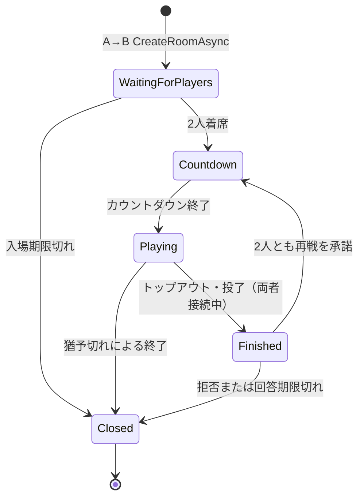

import SourceLink from '../../../../components/SourceLink.astro';

ルーム1つが対戦1つです。この章はルームが作られてから閉じるまでの状態遷移をたどりながら、RoomServer設計の中心にある「すべての変更はループスレッドだけで行う」という規則が各段階でどう守られているかを見ます。

## 状態遷移をひと目で

勝敗が付けばどの経路でも精算イベントが発行されます。`Finished`は決着後に再戦を尋ねる状態で、尋ねる相手がいない終わり方（切断猶予の満了など）はそのまま`Closed`へ進みます。

## ルームを作るのはApiServerだけ

クライアントからルームを作る経路はありません。ペアリングワーカーのA→B `CreateRoomAsync`が唯一の入口で、<SourceLink path="src/SharpCampus.RoomServer/Rooms/RoomManager.cs" />がリクエストを受けて定員・重複・ドレイニング中かどうかを確認してからルームを登録します。

登録は[LogicLooper](https://github.com/Cysharp/LogicLooper)のループアクション登録と同義です。ルーム1つがループアクション1つになり、以後このルームで起きるすべてのことは20 TPSで回るティックの中で処理されます。応答を返す前に、ルーム位置キー（`room:<roomId>`）をRedisへ先に書きます。応答が返った瞬間にペアリングワーカーがチケットを発行するので、エントリポイントがルーティングに使うキーはそれより先に存在していなければならないからです。

シードはゲームごとにRoomServerが新しく作ります。両者のボードは同じピース順を使うため、シードを知れば相手の次のピースが読めてしまいます。だからシードはA→Bのペイロードにも載りません。

## 検証はハブ、着席はルーム

<SourceLink path="src/SharpCampus.RoomServer/Hubs/DuelHub.cs" />はルームのメールボックスの上に載る薄いアダプターです。入場リクエストが来ると、ハブはステートレスに検証できるものを先に全部ふるいにかけます。入場トークンの署名と有効期限、トークンの`roomId`が対象ルームと一致するか、トークンの`userId`が接続のJWT `sub`と一致するか、そしてそのアカウントがこのルームの想定座席2つのどちらかか。ここまで通った入場だけがメールボックスに投入されます。

座席の割り当てはルーム生成時に渡された（アカウント、ニックネーム、スキン）2件で固定され、以後変わりません。他のアカウントはトークンがあっても座れず、ニックネームはプロフィール由来なので偽装できません。

## メールボックス: ロックの代わりに単一スレッド

<SourceLink path="src/SharpCampus.RoomServer/Rooms/DuelRoom.cs" />のフィールドはすべてループスレッドだけが書きます。ハブの呼び出し（入場、入力、投了、切断、スナップショット、再戦回答）はルームを直接触らず、`ConcurrentQueue`にコマンドを積むだけで、ループがティックの頭にたまったコマンドを一括処理します。

- 呼び出し元に答えを返す必要があるコマンド（入場、スナップショット）だけが`TaskCompletionSource`で応答します。ハブはそのタスクを待ち、ループは結果を書き込んで先へ進みます。
- ブロードキャストはループ自身がグループプロキシを直接呼びます。プロキシは各接続の書き込みキューへ直列化するだけなので、ループがクライアントを待つことはありません。
- 閉じるルームはメールボックスを最後にもう1度空にし、そのあいだに入ったコマンドの待ち手にも応答します。これがないと、ハブが永遠に待ち続けるハングが生まれます。

ロック競合を悩む代わりに「ルームの状態に触れるスレッドは1つ」を作りで保証する、アクターモデルの縮図です。

## ティックパイプライン（20 TPS）

`Playing`状態のティック1回はこう流れます。

1. **コマンドの処理**: メールボックスにたまったコマンドをすべて処理します。入力は座席別の待ち行列に積まれます。
2. **猶予のカウント**: 切断中の座席の残り猶予ティックを減らし、尽きたら対戦を終わらせます。
3. **シミュレーション**: 座席ごとの待ち入力をティックあたりの上限まで消費してGameCoreの`Tick()`に渡します。上限を超えた入力は次のティックへ持ち越されず捨てられます。入力を溜めて送るクライアントが後のティックで行動を余分に得てはいけないからです。重力・回転・ライン消去・ガベージ・勝敗判定はすべてこの中で起きます。
4. **デルタのブロードキャスト**: ティックの結果を両者に送ります。
5. **終了判定**: シミュレーションが決着を報告していたら、結果通知と精算の発行へ進みます。

## 切断と再接続

接続が切れると、ハブの`OnDisconnected`が切断コマンドをメールボックスに積みます。コマンドには接続IDが同乗します。新しい接続がすでに席を取り戻したあとで、古い接続の切断が遅れて届いて席を空けてしまう事故を防ぐためです。

対戦中の切断は即負けではありません。座席に10秒の猶予がかかり、ゲームはその席の入力なしで進み続けます。猶予内に再接続すれば同じ席に復帰します。ルームが対戦開始通知をその接続にだけ送り直し、クライアントはいつもの開始手順どおりスナップショットを要求してボード全体を復元します。マッチメイキングのアクティブルームエントリがチケットより長く残る理由がこれです。落ちて戻ってきたクライアントも同じルームにたどり着けます。

猶予が尽きれば残った側の勝ち、両方尽きれば引き分けです。一方、投了は猶予なしでその場で終わります。猶予は失敗した接続のためのもので、やめると決めたプレイヤーのためのものではないからです。

## 再戦: サーバーがクライアントを呼ぶ

対戦が正常に終わり（トップアウト・投了）、両者が接続中なら、ルームは`Finished`に移って再戦を尋ねます。この問いかけはMagicOnion 7の**Client Results**、つまりサーバーがクライアントのメソッドを呼んで戻り値を受け取る機能を使います。

- ループアクションは`await`できないので、問いかけは座席ごとにタスクとして起動し、答えが来たらメールボックスへ投げ返します。答えもまたコマンドになってループスレッドで処理されます。
- Client Resultsのデフォルト期限は5秒ですが提案の窓は10秒なので、呼び出しごとに専用の`CancellationToken`を作って渡します。
- 片方が拒否したら、その時点で両者に終了を告げます。承諾した側が、もう成立しない提案の残り時間を待たされる理由はないからです。エラー・切断・無回答はすべて拒否として扱います。
- 2人とも承諾したら、新しいシードと新しい`MatchId`でカウントダウンからやり直します。マッチIDがゲーム単位なのはこのためです。再戦は別のゲームとして精算されます。

## クローズと後片付け

どの経路で`Closed`に達しても、ルームはメールボックスを最後に空にし、マネージャーが後片付けをします。ルーム一覧からの削除、ルーム位置キーの削除、両プレイヤーのアクティブルームエントリの解放まで終われば、2人はすぐにまたキューに並べます。

罠が1つ、ここで処理されています。LogicLooperはループアクションが例外を投げると、その例外を登録時に返したタスクに載せてアクションを静かに解除します。誰もそのタスクを見ていなければ、ルームはログ1行もなく永遠にティックが止まったまま、座席と復帰エントリを抱え続けます。だからマネージャーは登録タスクを必ず監視し、フォールトを見つけたらエラーを記録してルームを中止処理します。

## ドレイニング: 終了が対戦を切らないように

RoomServerがSIGTERMを受けると（ローリングアップデート、スケールダウン）、<SourceLink path="src/SharpCampus.RoomServer/Rooms/RoomDrainService.cs" />がKestrelの停止**前**に介入します。`IHostedLifecycleService.StoppingAsync`が、シャットダウンの中でストリームがまだ生きている最後の時点だからです。

1. **新規配置の拒否**: 以後の`CreateRoomAsync`は`Draining`で断られます。ペアリングワーカーは断られたらキューに触れず次のパスで別のサーバーに再試行するので、ApiServer側は何も知らなくて済みます。
2. **レジストリからの離脱**: 自分の名前を即座に消し、ワーカーの選択肢から外れます。
3. **完走待ち**: 進行中のルームがすべて閉じるまで待ちます（設定した上限の中で。Kubernetes形態では240秒）。

期限には連鎖があります。ドレイン期限 < .NETホストのシャットダウン期限 < Kubernetesの`terminationGracePeriodSeconds`。内側が外側より短いからこそ、各段階が強制終了の前に自分の後始末を終えられます。ローリングアップデート中に対戦が切れないことを実際に確かめる手順は[スタートガイド第3部](../../getting-started/kubernetes/)にあります。

対戦が終わったあとの話、つまり発行された精算イベントの行き先は[精算イベント](../settlement/)に続きます。
