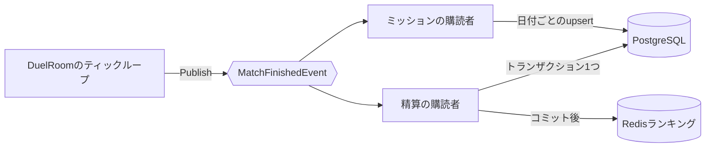

import SourceLink from '../../../../components/SourceLink.astro';

対戦が終わった瞬間、やるべきことが急に増えます。コインの支払い、レーティング計算、戦績2行の記録、ミッション進行の反映、ランキングの更新。どれもデータベースやRedisとやり取りする仕事ですが、この瞬間のルームはまだ50msの予算で回るティックループの中にいます。この章は、その緊張を[MessagePipe](https://github.com/Cysharp/MessagePipe)のpub/subで解く構造を扱います。

## 判定と副作用の分離

原則は1つです。**ティックループはゲームの判定だけを行い、その結果やるべきことはイベントとして手放す**。ルームは勝敗が付いたら`MatchFinishedEvent`を発行して、すぐ次の仕事に移ります。発行はfire-and-forgetなので、ループスレッドが購読者を待つことはありません。

イベントは`MatchFinishedEvent`の**1種類だけ**で、購読者が2つ付きます。ライン消去やガベージ送信といった細かいイベントを設けなかったのは意図的です。精算とミッションが必要とする数値は、対戦終了時点のボード統計と勝敗にすべて入っているので、イベントを増やす理由がありませんでした。代わりにこの設計を支えるのは「同じイベントを購読者ごとに独立して購読する」ことです。

## イベントは自分のコピーを持ち歩く

<SourceLink path="src/SharpCampus.RoomServer/Rooms/MatchFinishedEvent.cs" />には、マッチID、勝敗と終了理由、経過ティック数、そしてプレイヤー2人分のアカウントとボード統計（消去ライン、ガベージ、ハードドロップ、最大コンボなど）がすべて入ります。購読者がルームを見返さなくて済むよう、必要なものを丸ごと載せて送るのです。おかげでルームが閉じたあとに実行されるハンドラーも、完全な対戦1件分を材料に仕事ができます。

イベントの単位はルームではなくゲームです。再戦は新しい`MatchId`で改めて発行され、別の対戦として精算されます。

## 精算の購読者: トランザクション1つで

<SourceLink path="src/SharpCampus.RoomServer/Rooms/MatchSettlementHandler.cs" />はルームのループスレッドではない場所で、背後にリクエストもなく実行されます。だからDbContextが必要とするスコープを自分で作ります。

計算そのものは<SourceLink path="src/SharpCampus.Server.Common/Settlement/SettlementCalculator.cs" />の担当です。プロフィール2件と経済定数だけを受け取って結果を返す純粋関数なので、データベースなしでルールだけをテストできます。

- レーティングはEloです: `R' = R + K(S − E)`。Kはマスターデータの経済テーブルから来ます。
- 引き分けはレーティングを動かしません。同時トップアウトが2人の実力について語ることは何もないからです。コインは敗北報酬と同額を支払います。勝ちはしなかったものの、ゲームは最後まで戦い抜いたからです。

書き込みは<SourceLink path="src/SharpCampus.Server.Common/Settlement/MatchSettlementService.cs" />が**単一トランザクション**にまとめます。両プロフィールのコインとレーティングの更新、戦績2行の追加が、一緒にコミットされるか一緒に失敗するかのどちらかです。コミットが済んでからようやくRedisのランキングに反映します。レーティングのSorted Setを更新し、勝者がいれば日間勝利数ボードに加算します。

失敗の扱いは2段階に分かれます。トランザクションが失敗したらログが残るだけです（実サービスならoutboxに書いて再試行する箇所だと、コードの`Production note:`が示しています）。ランキング反映が失敗した場合、プロフィールはすでにコミット済みなので、遅れるのは派生データのボードだけです。

## ミッションの購読者: 同じイベント、別の関心事

<SourceLink path="src/SharpCampus.RoomServer/Rooms/MissionProgressHandler.cs" />は同じイベントの2番目の購読者です。精算がゲームの報酬を支払うあいだ、こちらは同じゲームをその日のミッション進行に反映します。マスターデータのミッション一覧を回って指標（プレイ数、勝利数、消去ライン、ガベージ、ハードドロップ）ごとの増分を計算し、UTC日付をキーに進行度をupsertします。

2つのハンドラーは互いの存在を知りません。ルームも購読者が何個いるかを知りません。発行1回に対して購読者を増やすことが、そのまま機能追加になる構造です。

## 購読者単位の隔離

購読は購読者ごとに別のhosted serviceが管理します（<SourceLink path="src/SharpCampus.RoomServer/Rooms/MatchSettlementSubscription.cs" />など）。ライフタイムが分かれているので、失敗も分かれます。精算ハンドラーがデータベース障害で死んでもミッション進行は記録され、逆もまた同じです。片方の例外がもう片方を止めないことが、pub/subを使う理由の半分です。

## シャットダウンと進行中の書き込み

fire-and-forgetの発行には代償があります。プロセスが落ちるとき、「発行はされたがまだ書き込み中」の精算がありえます。そこで各購読サービスは終了時に<SourceLink path="src/SharpCampus.RoomServer/Rooms/InFlightHandler.cs" />のラッパーで、進行中のハンドラーが終わるのを待ちます。

この窓は理論上の話ではありません。ボットは再戦の提案を即座に断るので、ボット対戦のルームは決着直後に閉じます。ドレイン中のサーバーなら、最後の対戦の精算書き込みがプロセス終了と競合します。だからドレイニングは2本立てです。[ルームのライフサイクル](../room-lifecycle/)のドレインが対戦を完走させ、ここの書き込み待ちがその対戦の精算まで完走させます。

MessagePipe自体のAPIとDI構成は、ライブラリのセクションで別途取り上げます。
