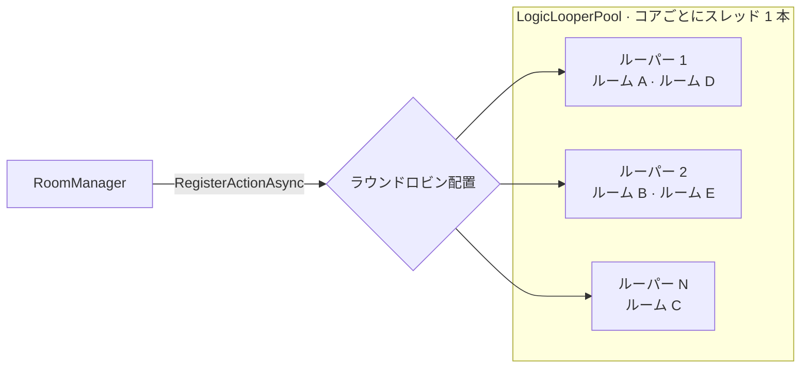

import SourceLink from '../../../../components/SourceLink.astro';

LogicLooper は Cysharp 製のサーバー向けゲームループライブラリです。スレッド 1 本が固定フレームレートで回り、登録されたアクション数百、数千個を毎ティック呼び出します。SharpCampus では RoomServer の心臓部です。[サーバー権威シミュレーション](../../architecture/room-lifecycle/)の重力・回転・ライン消去の判定は、すべてこのループのティックの中で起きます。バージョンは 1.6.0 です。

- GitHub: [Cysharp/LogicLooper](https://github.com/Cysharp/LogicLooper)

## なぜ使うのか

リアルタイムのルームを作る素朴な方法は、ルームごとに `Task.Delay` ループや専用スレッドを 1 本ずつ与えることです。ルーム 10 個までは問題ありませんが、数百になるとスレッドもタイマーも数百になり、スケジューリングのコストがシミュレーションのコストを追い越します。

LogicLooper の答えは逆向きです。**スレッド数はコア数に固定し、ルームをスレッドではなくループアクションにします**。ルーパー 1 本が自分に登録されたアクションを毎ティック順に呼ぶので、ルーム 1,000 個はスレッド 1,000 本ではなく「コア数分のルーパーに分配された 1,000 個のアクション」です。

## プール構成: コアごとにルーパー 1 本

RoomServer は起動時にルーパープールをシングルトンとして作ります。

```csharp
builder.Services.AddSingleton<ILogicLooperPool>(provider => new LogicLooperPool(
    provider.GetRequiredService<DuelRules>().TickRate,
    Environment.ProcessorCount,
    RoundRobinLogicLooperPoolBalancer.Instance));
```

<SourceLink path="src/SharpCampus.RoomServer/Program.cs" />

ティックレートはコードの定数ではなく[マスターデータ](../mastermemory/)から来ます(毎秒 20 ティック)。3 つ目の引数がバランサーです。新しいアクションをどのルーパーが受け取るかを決める方針で、ここではラウンドロビンで順番に割り振ります。



## ルーム = ループアクション 1 個

ルーム作成の最後の行が登録です。

```csharp
var room = new DuelRoom(roomId, players, rules, masterData, logger, matchFinished, Release);
_rooms[roomId] = room;
_ = ObserveAsync(room, loopers.RegisterActionAsync((in _) => Tick(room)));
```

<SourceLink path="src/SharpCampus.RoomServer/Rooms/RoomManager.cs" />

アクションの戻り値 `bool` が寿命です。`true` を返す間は次のティックでまた呼ばれ、ルームが終わって `false` を返すとルーパーがアクションを外します。解除の呼び出しは別にありません。ルームの `Tick()` メソッドを登録ラムダから分けてあるのも意図的です。テストがルーパーなしでルームを 1 ティックずつ直接回せます。

毎ティックは `Stopwatch.GetTimestamp()` で所要時間を測ってメトリクスに記録します。ルームたちがティック予算をどれだけ使っているかが「このプロセスはまだルームを受けられるか」の根拠になるためです。

## ループアクションの不変式: 決して待たない

ルーパースレッド 1 本がルーム複数を回すということは、**1 つのルームがブロックすると同じルーパーの他のルームも一緒に止まる**ということです。だからループアクションの中では await もロック待ちも I/O も禁止です。この制約が RoomServer の設計全体を決めています。

- ハブスレッドから来る入力・入室・切断は[メールボックス](../../architecture/room-lifecycle/)(`ConcurrentQueue<RoomCommand>`)に積まれ、ティックの先頭でまとめて処理されます。
- クライアントへのブロードキャストは [MagicOnion のマルチキャスター](../magiconion/)が書き込みキューに載せるだけなので、待つものがありません。
- 精算のようなデータベース作業は [MessagePipe](../messagepipe/) でループの外に投げます。

## 例外を観測せよ

`RegisterActionAsync` は `Task` を返しますが、このタスクはアクションが自分で終わったときだけでなく、**アクションが例外を投げたときも**完了します。ルーパーは例外を捕まえてこのタスクに載せ、アクションを静かに外すだけで、どこにもログしません。このタスクを捨てると、ティックは止まったのに座席と入場券はそのままのゾンビルームが残ります。

```csharp
internal async Task ObserveAsync(DuelRoom room, Task ticking)
{
    try
    {
        await ticking;
    }
    catch (Exception exception)
    {
        logger.RoomTickFaulted(exception, room.RoomId);
        room.Abort();
    }
}
```

<SourceLink path="src/SharpCampus.RoomServer/Rooms/RoomManager.cs" />

だから登録タスクは必ず誰かが await します。例外が出たらログを残してルームを強制終了し、プレイヤーとレジストリが片付くようにします。

## あわせて読む

- [ルームのライフサイクル](../../architecture/room-lifecycle/): このループの上でルームが生まれ、育ち、閉じるまでの全体(5 段階のティックパイプライン、ドレイニング)
- [MessagePipe](../messagepipe/): ループが決して待たないために副作用を送り出す通路
- [MasterMemory](../mastermemory/): ティックレートを含むシミュレーション定数の出どころ
