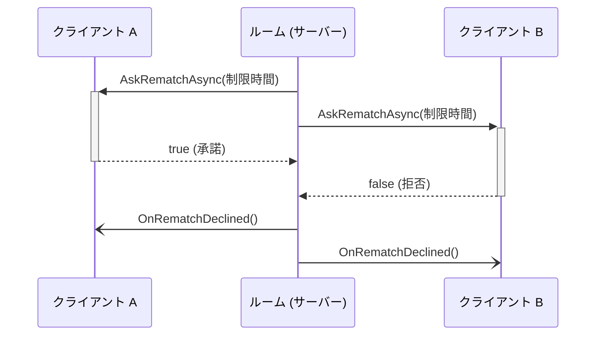

import SourceLink from '../../../../components/SourceLink.astro';

MagicOnion は Cysharp 製の .NET・Unity 向け RPC フレームワークです。転送には標準の gRPC(HTTP/2)をそのまま使いますが、プロトコルのスキーマを `.proto` ファイルではなく **C# インターフェース**で定義します。ペイロードの直列化は [MessagePack](../messagepack/) が担当します。SharpCampus の通信は、クライアントからサーバーへ、サーバーからサーバーへ、さらにサーバーからクライアントを呼ぶものまで、すべてこのフレームワークの上にあります。バージョンは 7.10.2 です。

- 公式ドキュメント: [cysharp.github.io/MagicOnion](https://cysharp.github.io/MagicOnion/)
- GitHub: [Cysharp/MagicOnion](https://github.com/Cysharp/MagicOnion)

## なぜ使うのか

一般的な gRPC 開発は、`.proto` ファイルを書き、protoc でサーバーとクライアントのスタブを生成し、契約が変わるたびにこのパイプラインを回し直す流れです。両端がともに C# のプロジェクトでは、この中間工程は純粋な管理コストになります。

MagicOnion では、共有プロジェクトに置いたインターフェース 1 つがスキーマであり、サーバー契約であり、クライアントプロキシの源です。サーバーはインターフェースを実装し、クライアントは同じインターフェースからプロキシを作ります。契約のずれは実行時エラーではなく**コンパイルエラー**として現れます。

ゲームサーバーの視点ではもう 1 つ利点があります。リクエスト・レスポンス(Unary)とリアルタイム双方向ストリーム(StreamingHub)を、1 つのフレームワークが同じ契約スタイルで提供するため、メタゲーム API とリアルタイム対戦をスタックを乗り換えずに作れます。土台が標準 gRPC なので、Envoy のような L7 インフラもそのまま通用します([アーキテクチャ概要](../../architecture/)の `room-id` ルーティングがその例です)。

## 契約: インターフェースがプロトコル

Unary サービスの契約は `IService<TSelf>` を継承したインターフェースです。マッチメイキングキューの契約は全文でこれだけです。

```csharp
public interface IMatchmakingService : IService<IMatchmakingService>
{
    UnaryResult<MatchStatusResponse> EnqueueAsync();
    UnaryResult CancelAsync();
    UnaryResult<MatchStatusResponse> GetStatusAsync();
}
```

<SourceLink path="src/SharpCampus.Shared/Services/IMatchmakingService.cs" />

戻り値の `UnaryResult<T>` が gRPC のリクエスト・レスポンス 1 往復を意味し、応答本文がない呼び出しには非ジェネリックの `UnaryResult` を使います。インターフェースの置き場所が公開範囲を決めます。クライアントが呼ぶ契約は `SharpCampus.Shared` に、ApiServer が RoomServer・BotServer を呼ぶ内部契約は `SharpCampus.Shared.Internal` にあり、後者はクライアント配布物に含まれません(この区分は[アーキテクチャ概要](../../architecture/#3種類の通信経路と2つの契約)に整理してあります)。

## Unary: メタゲーム API

ApiServer はアカウント・プロフィール・ショップ・ミッション・リーダーボード・対戦履歴・マッチメイキング・状態確認の 8 サービスを Unary で公開します。実装は普通のクラスで、ASP.NET Core の上で動くため認証も標準の方式です。サービスクラスに `[Authorize]` を付ければ、Supabase が発行した JWT を検証ミドルウェアが確認してくれます(状態確認用の `IStatusService` だけ匿名を許可)。

登録は 1 行ではなく配列です。

```csharp
app.MapMagicOnionService([
    typeof(StatusService),
    typeof(AccountService),
    // ...
    typeof(MatchmakingService),
]);
```

<SourceLink path="src/SharpCampus.ApiServer/Program.cs" />

引数なしの `MapMagicOnionService()` はエントリーアセンブリしかスキャンしません。このプロジェクトのサービス実装の大半は両サーバーが共有する `SharpCampus.Server.Common` にあるため、明示的な列挙が必要になります。

## StreamingHub: リアルタイム対戦

対戦ストリームは StreamingHub です。契約がインターフェース 2 つのペアになる点が Unary と異なります。クライアントがサーバーに呼ぶメソッドは `IDuelHub` に、サーバーがクライアントへ押し込むメソッドは `IDuelHubReceiver` に置きます。

```csharp
public interface IDuelHub : IStreamingHub<IDuelHub, IDuelHubReceiver>
{
    Task<JoinRoomResult> JoinAsync(JoinRoomRequest request);
    Task SendInputsAsync(GameInput[] inputs);
    Task<DuelSnapshot> RequestSnapshotAsync();
    Task ForfeitAsync();
}
```

<SourceLink path="src/SharpCampus.Shared/Duel/IDuelHub.cs" /> · <SourceLink path="src/SharpCampus.Shared/Duel/IDuelHubReceiver.cs" />

サーバー実装の <SourceLink path="src/SharpCampus.RoomServer/Hubs/DuelHub.cs" /> は `StreamingHubBase<IDuelHub, IDuelHubReceiver>` を継承した薄いアダプターです。入室に成功すると、接続を `Group.AddAsync($"room:{roomId}")` でルーム名のグループに入れます。このグループがブロードキャストの窓口です。同じ名前で合流した接続は同じ `IGroup<IDuelHubReceiver>` インスタンスを受け取るため、ルームはグループを 1 つ持っていれば足ります。

グループから得るプロキシを**マルチキャスター**と呼びます。`_group.All` は両方の席へ、`_group.Single(connectionId)` は特定の席へレシーバーメソッドを呼ぶ `IDuelHubReceiver` 実装です。呼び出しは各接続の書き込みキューに直列化して終わるので、ティックループが遅いクライアントを待つことはありません。この性質が[ルームのライフサイクル](../../architecture/room-lifecycle/)の「ループは決して待たない」原則を支えています。注意点も 1 つそこで扱います。グループは最後の接続が去った瞬間に破棄されるため、ルームは死んだグループをグループなしと同じに扱います。

## サーバー間呼び出し: A→B も同じフレームワーク

マッチが成立すると、ApiServer は RoomServer にルームの作成を依頼します。このサーバー間呼び出しに別のプロトコルは使わず、クライアントとまったく同じ MagicOnion クライアントを使います。

```csharp
var client = MagicOnionClient.Create<IRoomControlService>(
    _channels.GetOrAdd(controlEndpoint, GrpcChannel.ForAddress),
    ContractSerialization.Provider);

// ...
return await client.CreateRoomAsync(request);
```

<SourceLink path="src/SharpCampus.ApiServer/Matchmaking/RoomControlClient.cs" />

`GrpcChannel` は寿命の長いリソースなので、ルームサーバーごとに 1 つキャッシュします。相手サーバーが落ちていれば(`Unavailable`)、呼び出し側が待機中のペアをキューに戻します。この流れは[マッチメイキング](../../architecture/matchmaking/)で追いかけます。ボット召喚(`IBotControlService.SummonAsync`)も同じ形です。

## Client Results: サーバーがクライアントを呼ぶ

MagicOnion 7 の新機能です。レシーバーメソッドが `void` ではなく `Task<T>` を返すと、サーバーがクライアントのメソッドを呼び、**答えが返るまで待つ**ことができます。このプロジェクトでは再戦の提案がこの機能です。

```csharp
Task<bool> AskRematchAsync(int timeoutSeconds, CancellationToken cancellationToken = default);
```

<SourceLink path="src/SharpCampus.Shared/Duel/IDuelHubReceiver.cs" />



問いかけは席ごとに `_group.Single(connectionId)` を通して出て行き、片方が拒否すれば残り時間を待たずにすぐ片付けます。実戦で押さえる点は 2 つあります。Client Results の既定タイムアウトは 5 秒なので、それより長い提案時間を与えるには呼び出しごとに `CancellationTokenSource` を作ってトークンを渡す必要があります。そしてティックループのアクションは await できないため、ルームは質問を別タスクとして飛ばし、答えをメールボックスのコマンドとして受け取り直します。全体の流れは[ルームのライフサイクル](../../architecture/room-lifecycle/)にあります。 <SourceLink path="src/SharpCampus.RoomServer/Rooms/DuelRoom.cs" />

## Heartbeat: 切れた線に気づく

TCP 接続は音もなく死ぬことがあります。黙っている相手と切れた線を区別するには誰かが定期的に信号を送る必要があり、MagicOnion 7 はこれをサーバー・クライアント双方向の組み込み機能として提供します。

サーバー側はオプション 3 行です。

```csharp
options.EnableStreamingHubHeartbeat = true;
options.StreamingHubHeartbeatInterval = TimeSpan.FromSeconds(1);
options.StreamingHubHeartbeatTimeout = TimeSpan.FromSeconds(5);
```

<SourceLink path="src/SharpCampus.RoomServer/Program.cs" />

1 秒ごとに確認し、5 秒応答がなければ接続を切ります。この数値はルームの再接続猶予 10 秒から逆算したものです。音もなく死んだ接続に猶予の内側で十分早く気づかなければ、席は OS がソケットを諦めるまで放置されてしまいます。

クライアント側は逆方向のハートビートを自分で送りながら、応答の往復時間を対戦画面の遅延表示に使います。

```csharp
var options = StreamingHubClientOptions.CreateWithDefault(callOptions: new CallOptions(hubHeaders))
    .WithClientHeartbeatInterval(_heartbeatInterval)
    .WithClientHeartbeatResponseReceived(heartbeat => status.Measure(heartbeat.RoundTripTime));
```

<SourceLink path="src/SharpCampus.Client/Duel/DuelFlow.cs" />

まとめると、サーバーのハートビートは消えたクライアントに気づく装置、クライアントのハートビートは遅延を測り、死んだサーバーに気づく装置です。

## JsonTranscoding: 開発用の HTTP 窓口

gRPC サービスは curl で直接叩けません。MagicOnion の JSON transcoding は Unary サービスを HTTP/1 + JSON のエンドポイントとしても開く機能で、このプロジェクトでは開発環境でのみ有効にします。

```csharp
if (builder.Environment.IsDevelopment())
{
    magicOnion.AddJsonTranscoding();
    builder.Services.AddEndpointsApiExplorer();
    builder.Services.AddMagicOnionJsonTranscodingSwagger();
    builder.Services.AddSwaggerGen(options => options.IncludeMagicOnionXmlComments(typeof(IStatusService).Assembly));
}
```

<SourceLink path="src/SharpCampus.ApiServer/Program.cs" />

Swagger UI も一緒に付きますが、その説明文は別に書くのではなく、契約インターフェースの XML ドキュメントコメント(`///`)から来ます。`SharpCampus.Shared` が `GenerateDocumentationFile` で XML を出力し、`IncludeMagicOnionXmlComments` がそれを読む構造なので、契約のコメントがそのまま API ドキュメントになります。

## ソースジェネレーター: 前もって作っておくクライアント

`MagicOnionClient.Create<T>()` が返すプロキシは、既定では実行時のコード生成で作られます。ソースジェネレーターを使えばこれをコンパイル時に前倒しできます。マーカークラス 1 つで済みます。

```csharp
[MagicOnionClientGeneration(typeof(IStatusService))]
internal partial class MagicOnionClientInitializer;
```

<SourceLink path="src/SharpCampus.Client.Common/MagicOnionClientInitializer.cs" />

指定した型が属するアセンブリをスキャンし、その中のすべてのサービス契約についてクライアントプロキシを事前生成します。コンソールクライアントと BotServer がそれぞれこのマーカーを持ち、クライアント側に実行時コード生成が残りません。IL 生成が禁じられる Unity IL2CPP のような AOT 環境では、これは最適化ではなく必須の装置になります。直列化側の相棒である MessagePack のソースジェネレーターと合わせて見ると絵が完成します。[MessagePack-CSharp のページ](../messagepack/)に続きます。

## あわせて読む

- [アーキテクチャ概要](../../architecture/): 3 種類の経路(Unary/StreamingHub/A→B)と 2 つの契約が全体像のどこに置かれるか
- [ルームのライフサイクル](../../architecture/room-lifecycle/): DuelHub と Client Results の実戦での動き
- [マッチメイキング](../../architecture/matchmaking/): A→B 呼び出しがペアリングパイプラインのどこに挟まるか
- [MessagePack-CSharp](../messagepack/): これらすべての呼び出しのペイロードを担う直列化器
