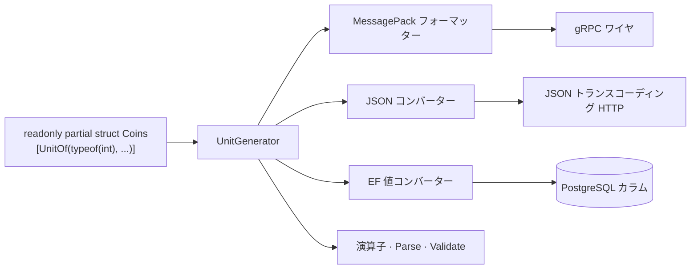

import SourceLink from '../../../../components/SourceLink.astro';

UnitGenerator は、`[UnitOf]` 属性を 1 つ付けた空の struct 宣言を、完成した値オブジェクト(value object)に仕上げてくれる Cysharp のソースジェネレーターです。このプロジェクトの ID・数値型 9 種(`UserId`、`RoomId`、`MatchId`、`TickNumber`、`PlayerIndex`、`Coins`、`Rating`、`SkinId`、`MissionId`)はすべてこの方式で作られています。バージョンは 2.0.0 です。

- GitHub: [Cysharp/UnitGenerator](https://github.com/Cysharp/UnitGenerator)

## なぜ使うのか

`UserId` も `Guid`、ショップの価格も残高もぜんぶ `int` のままだと、コンパイラーにとっては意味の違う値がすべて同じ型です。引数の順序を入れ替えても、ティック番号をコイン残高に足しても、コンパイルは通ります。値ごとに専用の型で包めばこうしたミスはすべて型エラーになりますが、このパターンが実務で敬遠される理由はコストです。等値比較、直列化フォーマッター、DB コンバーター、`Parse` まで型ごとに手で揃えると、数百行かかります。

UnitGenerator はそのコストを宣言 1 行に縮めます。どの便利機能を生成するかはオプションフラグの組み合わせで選び、残りはコンパイル時に作られます。

## 1 行の宣言とオプションメニュー

ソフト通貨 `Coins` の宣言全文です。

```csharp
/// <summary>
/// Soft currency an account spends on cosmetic items.
/// </summary>
// Arithmetic and comparison exist so the shop's debit is a translatable EF expression: the balance
// check and the subtraction both run inside the database.
[UnitOf(typeof(int), UnitOptions.Persisted | UnitGenerateOptions.ArithmeticOperator | UnitGenerateOptions.Comparable)]
public readonly partial struct Coins;
```

<SourceLink path="src/SharpCampus.Shared/Values/Coins.cs" />

9 種の宣言は、包むプリミティブとオプションだけが違います。

| 型 | プリミティブ | オプションの特徴 |
| --- | --- | --- |
| `UserId` | `Guid` | Persisted + ParseMethod |
| `RoomId` · `MatchId` | `Ulid` | Transported + ParseMethod |
| `Coins` | `int` | Persisted + 算術演算子 + 比較 |
| `Rating` | `int` | Persisted |
| `TickNumber` | `int` | MessagePack フォーマッター + 比較 |
| `PlayerIndex` | `int` | MessagePack フォーマッター + Validate |
| `SkinId` · `MissionId` | `string` | Persisted + 比較(演算子は除外) |

Persisted と Transported はこのプロジェクトが定義したプリセット定数です。「DB まで届く値」と「ワイヤだけを流れる値」という 2 つの系統が繰り返し現れるので、組み合わせを 1 か所に集めました。

```csharp
// Single home for the target-framework split, so each value object declares its options in one line.
internal static class UnitOptions
{
    // MessagePack carries these over the wire and into the master data binary, JSON carries them
    // through the master data source file and the transcoded HTTP endpoints. EF Core is the odd one
    // out: a server-side, net-only dependency, so the Unity-facing netstandard build must compile
    // without the converter while the net10.0 build the servers reference carries it.
    public const UnitGenerateOptions Persisted =
#if NET10_0_OR_GREATER
        UnitGenerateOptions.MessagePackFormatter
        | UnitGenerateOptions.JsonConverter
        | UnitGenerateOptions.EntityFrameworkValueConverter;
#else
        UnitGenerateOptions.MessagePackFormatter | UnitGenerateOptions.JsonConverter;
#endif
```

<SourceLink path="src/SharpCampus.Shared/UnitOptions.cs" />

`SharpCampus.Shared` は netstandard2.1 と net10.0 の 2 ターゲットでビルドされます。EF Core コンバーターはサーバー専用の依存なので、netstandard ビルドでは生成オプションから外れます。値オブジェクトの宣言はそのままで、プリセット 1 か所だけが `#if` で分かれる構造です。

## 生成物が各境界に差し込まれる場所

オプションが生み出すのは型の中の便利メンバーだけではありません。値がプロセスの外に出る境界ごとに、アダプターが 1 つずつ作られます。



MessagePack フォーマッターのおかげで、値オブジェクトはワイヤ上を包んだプリミティブそのままで流れます(詳しくは [MessagePack-CSharp のページ](../messagepack/))。JSON コンバーターは開発用の JSON トランスコーディング HTTP エンドポイントとマスターデータのソースファイルが使います。EF コンバーターだけは、生成しても EF が自力で見つけられないため、DbContext に手動で登録します。

```csharp
    protected override void ConfigureConventions(ModelConfigurationBuilder configurationBuilder)
    {
        // UnitGenerator emits these converters, but EF never finds them on its own: without this registration
        // every value object would be mapped as an unsupported entity type instead of its underlying column.
        configurationBuilder.Properties<UserId>().HaveConversion<UserId.UserIdValueConverter>();
        configurationBuilder.Properties<Coins>().HaveConversion<Coins.CoinsValueConverter>();
        configurationBuilder.Properties<Rating>().HaveConversion<Rating.RatingValueConverter>();
        configurationBuilder.Properties<MatchId>().HaveConversion<MatchId.MatchIdValueConverter>();
        configurationBuilder.Properties<SkinId>().HaveConversion<SkinId.SkinIdValueConverter>();
        configurationBuilder.Properties<MissionId>().HaveConversion<MissionId.MissionIdValueConverter>();
    }
```

<SourceLink path="src/SharpCampus.Server.Common/Data/SharpCampusDbContext.cs" />

## 演算子がデータベースの中で実行される

`Coins` に算術・比較オプションを与えた理由は、メモリ上で気軽に足し引きするためではありません。ショップの引き落としクエリが、値オブジェクトのままで EF の翻訳可能な式になるためです。

```csharp
        var debited = await db.Profiles
            .Where(p => p.UserId == userId && p.Coins >= price)
            .ExecuteUpdateAsync(setters => setters
                .SetProperty(p => p.Coins, p => p.Coins - price)
                // A lambda so the database's own clock stamps the row, the same way a rename does.
                .SetProperty(p => p.UpdatedAt, _ => DateTimeOffset.UtcNow));
```

<SourceLink path="src/SharpCampus.Server.Common/Data/ShopRepository.cs" />

`p.Coins >= price` の残高チェックと `p.Coins - price` の減算は、どちらも SQL に翻訳されてデータベースの中で実行されます。生成された `>=`・`-` 演算子と値コンバーターがあってはじめて成り立つ文です。

## ワイヤから入る値も検証される

`PlayerIndex` は対戦の席番号なので、有効なのは 0 か 1 だけです。Validate オプションを付けるとコンストラクターに検証フックが生えます。生成される MessagePack フォーマッターもデシリアライズ時にそのコンストラクターを通るため、改ざんされたペイロードからでも、存在しない席がプロセスに入ることはできません。

```csharp
// Validate runs from the constructor the generated MessagePack formatter deserialises through, so a
// seat that never existed cannot enter the process from the wire either.
[UnitOf(typeof(int), UnitGenerateOptions.MessagePackFormatter | UnitGenerateOptions.Validate)]
public readonly partial struct PlayerIndex
{
    private partial void Validate()
    {
        if (value is not (0 or 1))
        {
            throw new ArgumentOutOfRangeException(nameof(value), value, "A duel seat is 0 or 1.");
        }
    }
}
```

<SourceLink path="src/SharpCampus.Shared/Values/PlayerIndex.cs" />

`string` ベースの `SkinId`・`MissionId` には逆方向の調整があります。Comparable オプションは `<`・`>` のような関係演算子まで生成しますが、string の上ではその演算子がコンパイルできません。そこで `WithoutComparisonOperator` で演算子だけを外し、`IComparable` 実装は残します。マスターデータのインデックスがキーの整列と二分探索に `IComparable` を使うからです。

## あわせて読む

- [MessagePack-CSharp](../messagepack/): 値オブジェクトがワイヤ上をプリミティブそのままで流れる仕組み
- [Ulid](../ulid/): `RoomId`・`MatchId` が包む識別子と、境界ごとの扱い
