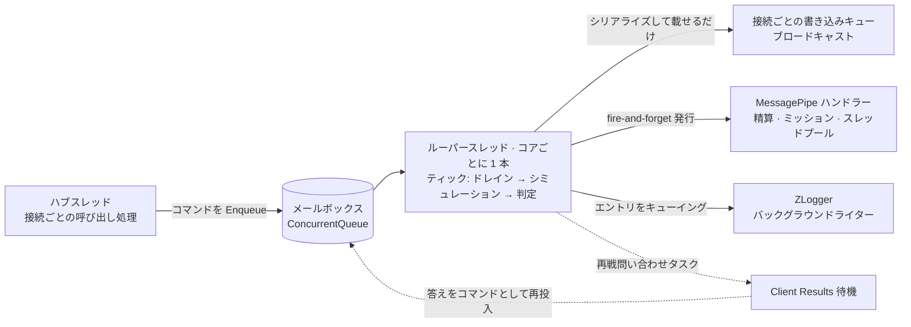

import SourceLink from '../../../../components/SourceLink.astro';

リアルタイムゲームサーバーは並行性問題の見本市です。2 つのクライアントが同時に入力を送り、接続はいつでも切れ、マッチの終了はデータベース書き込みを引き起こし、その間もシミュレーションは毎秒 20 ティックで回り続けなければなりません。このプロジェクトはこの問題を、共有状態にロックをかける方式では解きませんでした。代わりに不変条件を 1 つ立て、すべてをその下に整列させています。**ティックループは決して待たない。そしてルームの状態を触るスレッドはつねに 1 つ。**

この原則自体は [LogicLooper](../../libraries/logiclooper/)、[MessagePipe](../../libraries/messagepipe/)、[ZLogger](../../libraries/zlogger/) の各ページに断片として登場しました。この編ではその断片を、RoomServer プロセス 1 つのスレッド地図として束ね直します。

## スレッド地図

RoomServer のプロセスには性格の異なるスレッドが 4 種類住んでいます。ハブ呼び出しを処理するリクエストスレッド、コアごとに 1 本固定のルーパースレッド、スレッドプールで回るタスク群、そして ZLogger のバックグラウンドライタースレッドです。



矢印の向きがそのまま規則です。ルーパースレッドへ**入る**ものはすべてキューを経由し、ルーパースレッドから**出る**ものはすべて待ちません。この 2 文がこの編のすべてで、残りは各矢印の事情です。

## 状態ごとに所有スレッドは 1 つ

出発点はルームクラスの冒頭に書かれた宣言です。

```csharp
// One room is one LogicLooper action. Every field below is written on the loop thread only: hub
// threads reach the room through the command mailbox and nowhere else.
internal sealed class DuelRoom
{
    private readonly ConcurrentQueue<RoomCommand> _commands = new();
```

<SourceLink path="src/SharpCampus.RoomServer/Rooms/DuelRoom.cs" />

盤面、座席、待機入力、状態機械まで、ルームのフィールドはすべてルーパースレッドでのみ書き換えられます。ハブが受けた入室・入力・投了・切断はルームを直接触らず、`RoomCommand` になってメールボックスに座り、各ティック冒頭のドレインがまとめて処理します。フィールドごとにロックを悩む代わりに「状態を触るスレッドは 1 つ」を成立させ、競合そのものをなくす、アクターモデルの縮図です。メールボックスがティックパイプラインの中でどう消費されるかは[ルームのライフサイクル](../../architecture/room-lifecycle/)が扱います。

境界には門番が 1 人います。

```csharp
    // Rejecting once the room is closing is what keeps a hub from awaiting a reply nobody will send.
    public bool TryPost(RoomCommand command)
    {
        lock (_mailboxGate)
        {
            if (_closed)
            {
                return false;
            }

            _commands.Enqueue(command);
            return true;
        }
    }
```

<SourceLink path="src/SharpCampus.RoomServer/Rooms/DuelRoom.cs" />

ルームでほぼ唯一のロックがここ、それも投入の瞬間だけ握られます。クローズ判定と投入が一体でなければ、誰も空けないメールボックスにコマンドが座り、ハブが永遠に待つ事故が起きるからです。ロックは状態を守るためではなく、境界の原子性を守るために使われています。

## 出ていくものはすべて待たない

ティックの中で外の世界に触れる地点は 3 か所ありますが、3 つとも同じ形です。渡して、待たない。

**ブロードキャスト**。毎ティックのデルタは [MagicOnion](../../libraries/magiconion/) のグループプロキシから出ていきます。

```csharp
        // The group proxy only serialises onto each connection's write queue, so the loop never waits
        // on a client here.
        Everyone()?.OnTickDelta(TickDeltaFactory.Create(result, _simulation.Board1, _simulation.Board2));
```

<SourceLink path="src/SharpCampus.RoomServer/Rooms/DuelRoom.cs" />

プロキシの仕事は、シリアライズ済みメッセージを各接続の書き込みキューに載せるところまでです。回線の遅いクライアントは自分のキューが詰まるだけで、ループの次のティックを止めることはできません。

**精算**。マッチが終わると、結果を [MessagePipe](../../libraries/messagepipe/) に発行します。

```csharp
        // Fire and forget: settlement talks to a database, and nothing a room does may make the loop
        // thread wait. A room that never started never gets here, and has no match to settle.
        _matchFinished.Publish(new MatchFinishedEvent(
```

<SourceLink path="src/SharpCampus.RoomServer/Rooms/DuelRoom.cs" />

`PublishAsync` ではなく `Publish` です。データベースとの往復はスレッドプールのハンドラーが背負い、ループは発行した瞬間に次の仕事へ進みます。投げっぱなしにした書き込みをサーバー終了時にどう待ち切るか(InFlightHandler)は MessagePipe ページの持ち分です。

**ログ**。[ZLogger](../../libraries/zlogger/) のログ呼び出しは UTF8 エントリをキューに入れて終わり、実際のコンソール書き込みはバックグラウンドライタースレッドが行います。コンソール I/O がティックを塞がない理由です。同じページの `Hosting.Diagnostics` フィルターの話はこの構造の裏面でもあります。あとから別スレッドで列挙されるログ状態が生きたオブジェクトを読めば、それ自体がデータレースになります。

## await が必要になったら、タスクで出てコマンドで帰る

再戦の提案はこのモデルの試金石です。サーバーがクライアントのメソッドを呼び、返り値を受け取る Client Results は本質的に `await` ですが、ループアクションは `await` できません。

```csharp
    // The question is asked from the loop thread but answered off it: a loop action cannot await, so
    // each ask runs as its own task and posts what it hears back into the mailbox.
    private void OfferRematch(IGroup<IDuelHubReceiver> group)
```

<SourceLink path="src/SharpCampus.RoomServer/Rooms/DuelRoom.cs" />

問い合わせは座席ごとに別タスクとして立ち上げます。注目すべきは、答えが帰ってくる道です。

```csharp
        try
        {
            accepted = await client.AskRematchAsync(timeoutSeconds, cancellationToken);
        }
        catch (Exception e)
        {
            // A client that errored, dropped or ran out the clock has all said the same thing.
            _logger.RoomRematchUnanswered(RoomId, playerIndex, e.Message);
        }

        TryPost(RoomCommand.RematchAnswer(playerIndex, accepted));
```

<SourceLink path="src/SharpCampus.RoomServer/Rooms/DuelRoom.cs" />

タスクは答えを手にしても、座席の状態を自分で直しません。答えもまた `RoomCommand` になってメールボックスへ戻り、次のティックのドレインがルーパースレッドで処理します。「ループの外で起きたことはすべてコマンドとして入ってくる」という規則が、例外なく適用されているわけです。

## それでも残る同期

ロックが 0 なわけではありません。ただし残った場所はすべて、ルームの状態ではなく**ライフタイムの境界**を守っています。前述のメールボックスの門番、そしてルーム生成を直列化する <SourceLink path="src/SharpCampus.RoomServer/Rooms/RoomManager.cs" /> の生成ゲート(定員チェックと登録が一体でなければ、ドレイン決定の後ろにルームが滑り込みます)まで、握る時間がキュー操作数行ぶんの短いロックばかりです。

いちばん微妙なのはロックではなく、この 1 行です。

```csharp
    // Completed by whoever sees the last room go while draining. Release runs on the loop thread, and a
    // waiter's continuation must never run there: shutdown work would be ticking the rooms it waits on.
    private readonly TaskCompletionSource _idle = new(TaskCreationOptions.RunContinuationsAsynchronously);
```

<SourceLink path="src/SharpCampus.RoomServer/Rooms/RoomManager.cs" />

`TaskCompletionSource` は既定では、結果をセットしたスレッドで待機側の継続処理まで実行してしまいます。最後のルームの解放はルーパースレッドで起きるので、既定のままだと、ドレイン中のシャットダウンコードが「自分が待っていたルームを回していたまさにそのスレッド」で走ることになります。`RunContinuationsAsynchronously` はその密航を防ぐ柵です。「ティックループを塞がない」という不変条件は、タスク完了のオプションフラグにまで降りてきます。

## ルームだけの形ではない

「所有スレッド 1 つ + 境界はキュー」という形は、このプロセスの別の場所でも繰り返されます。ZLogger はまさにこの構造(発行側はキューに入れ、ライタースレッドが書きます)ですし、[R3](../../libraries/r3/) で組んだボットの知覚・判断パイプラインも、ハブの受信ループという単一スレッドの上で回ります。ボットのコードのコメントを借りれば、着地の採点程度は受信ループが背負える計算量なので、専用スレッドは作りませんでした。

並行性設計というとロックとアトミック操作の技巧を思い浮かべがちですが、このスタックが見せているのは逆です。スレッドの所有権を先に決めれば、技巧が要る場所はほとんど残りません。

## 関連ページ

- [LogicLooper](../../libraries/logiclooper/): ルーパースレッドと「決して待たない」不変条件の出どころ
- [MessagePipe](../../libraries/messagepipe/): fire-and-forget の代償を払う InFlightHandler
- [ルームのライフサイクル](../../architecture/room-lifecycle/): メールボックスが消費されるティックパイプラインの全体
- [ZLogger](../../libraries/zlogger/): バックグラウンドライターと非同期シンクの一般原則
