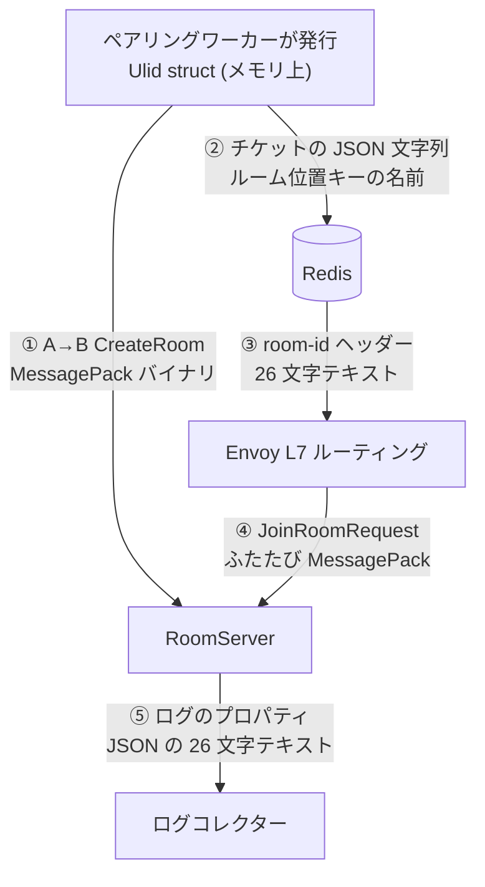

import SourceLink from '../../../../components/SourceLink.astro';

このシステムのシリアライザーは 1 つではありません。同じプロセスが、ある値は [MessagePack](../../libraries/messagepack/) のバイナリで、ある値は [MemoryPack](../../libraries/memorypack/) のバイナリで、ある値は JSON で、ある値はただのテキストで送り出します。無秩序に見えますが、実際は逆です。フォーマットにはそれぞれ勝てる場所があり、**境界の両端に誰がいるか**が毎回の選択を決めてきました。この編ではその選択を 1 枚の地図に集め、`RoomId` を追跡子にして、値が境界を越えるたびに表現を着替える様子をたどります。

## 地図

| 境界 | フォーマット | 両端 | そのフォーマットである理由 |
| --- | --- | --- | --- |
| クライアント ↔ サーバー RPC | MessagePack | コンソールクライアント · サーバー | 公開仕様、クロスプラットフォーム、サイズと速度 |
| サーバー → サーバー A→B | MessagePack | ApiServer · RoomServer/BotServer | 2 つ目のプロトコルを作らない |
| マスターデータ | ソースは JSON、配布物は MessagePack | 編集する人 · サーバー起動 | 編集は人、読み込みは機械の持ち分 |
| Redis: チケット · ルームレジストリ | JSON 文字列 · ハッシュフィールド | サーバー · redis-cli を持つ人 | 運用中に目で読む値 |
| Redis: リーダーボードキャッシュ | MemoryPack | サーバー · サーバー | 両端が同じ .NET なら、残る基準は速度だけ |
| 構造化ログ | JSON | サーバー · ログコレクター | コレクターの母語 |
| HTTP 開発窓口 | JSON (JsonTranscoding) | curl や Swagger を持つ開発者 · ApiServer | 人の手で呼ぶ窓口 |
| DB カラム | 包んだプリミティブそのまま | サーバー · PostgreSQL | SQL が読み、インデックスを張る値 |
| gRPC ヘッダー `room-id` | 26 文字テキスト | クライアント · Envoy | ペイロードを開かずに読める必要がある値 |

## 基準: 両端に誰がいるか

[MemoryPack ページ](../../libraries/memorypack/)の一文(「シリアライザー選択は両端に誰がいるかの問題です」)をシステム全体に一般化すると、地図は 4 つの区域に整理されます。

- **機械同士、コントラクトは公開**: MessagePack。クライアントが別の言語・プラットフォームでありうる場所なので公開仕様のフォーマットが要り、毎ティックのデルタが通る場所なのでサイズと速度がそのまま帯域と CPU です。
- **機械同士、自社サーバー専用**: MemoryPack。クロスプラットフォームの義務がなければ、いちばん速いものを使います。
- **人や汎用ツールが挟まる場所**: JSON。ログコレクター、Swagger、redis-cli の前では、バイナリは損しかしません。
- **インフラが通りすがりに読む場所**: ただのテキスト。Envoy は `room-id` ヘッダーだけを見てルーティングし、ペイロードを解釈しません。

フォーマットを 1 つに統一するのは単純化ではない、というのがこの地図の要点です。ログを MessagePack で書けばコレクターの前で詰まり、キャッシュを JSON で書けば理由なく遅くなり、ルーティングキーをペイロードに入れれば入口がデシリアライズを強いられます。少なくあるべきなのはフォーマットの数ではなく、**選ぶ規則の数**です。

## RoomId の旅

この地図を値 1 つの目で見直すと、`RoomId` はマッチ 1 戦の間に表現を 5 回着替えます。



メモリ上では [Ulid](../../libraries/ulid/) の struct(①になる前)、ワイヤー上では MessagePack バイナリ(①と④)、Redis とヘッダーでは 26 文字テキスト(②と③)、ログでは JSON のプロパティ(⑤)です。③の現場はこう見えます。

```csharp
        var hubHeaders = new Metadata { { "room-id", ticket.RoomId.ToString() } };
```

<SourceLink path="src/SharpCampus.Client/Duel/DuelFlow.cs" />

注目すべきは、この往復に手書きの変換コードがほとんどないことです。MessagePack フォーマッターと JSON コンバーターは [UnitGenerator](../../libraries/unitgenerator/) が値オブジェクトに生成しておいたもので、テキスト往復の `Parse` も生成オプション 1 つで付いてきたメソッドです。どの境界でどの生成物が働くかの詳細は UnitGenerator と [Ulid](../../libraries/ulid/) のページが扱います。

そしてどの境界でも、人の目に見える表記は同じ 26 文字です。redis-cli で見た値、ヘッダーに載った値、ログで検索した値がすべて同じ文字列なので、マッチ 1 つをシステムの端から端まで追跡する作業がコピー & ペーストで済みます。

## 境界を守る規則

地図が保たれるには規則が 2 つ要ります。

**フォーマットが違えば型も違う**。リーダーボードキャッシュは、コントラクトの DTO とそっくりの型を別に持ってミラーリングします。直接の理由はコントラクトのアセンブリが netstandard2.1 で MemoryPack が .NET 7 以上という実務上の制約ですが、その結果として「ワイヤーのコントラクトが変わるとキャッシュのフォーマットも静かに変わる」という遠隔結合も一緒に消えました。詳細は [MemoryPack ページ](../../libraries/memorypack/)にあります。

**シリアライズ構成は 1 か所から来る**。MessagePack のオプションは、コントラクトを話すすべてのプロセスが `SharpCampus.Shared` の静的クラス 1 か所から取ります。どれか 1 つのプロセスだけリゾルバー構成が違うと、同じバイト列を互いに違う読み方をしてしまうからです。この構成クラスは [MessagePack ページ](../../libraries/messagepack/)が扱います。

## 関連ページ

- [MessagePack-CSharp](../../libraries/messagepack/): 公開コントラクト区域の主
- [MemoryPack](../../libraries/memorypack/): サーバー専用区域の主、そして「両端」基準の出どころ
- [UnitGenerator](../../libraries/unitgenerator/) · [Ulid](../../libraries/ulid/): 境界ごとに働く生成コンバーターたち
- [ZLogger](../../libraries/zlogger/): ログ区域の JSON 出力と、値オブジェクトの表記
