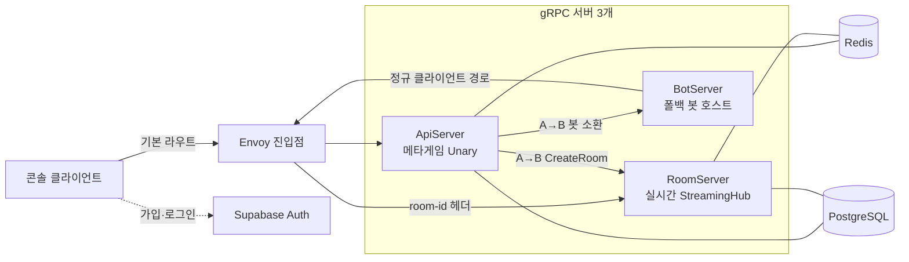

import { CardGrid, LinkCard } from '@astrojs/starlight/components';

SharpCampus는 gRPC 서버 3개와 인프라 3종으로 구성됩니다. 이 장에서 전체 그림과 "왜 이렇게 나눴나"를 잡고, 이어지는 3개 장이 매치메이킹, 룸 수명주기, 정산 이벤트를 하나씩 깊이 파고듭니다.

## 전체 그림

배포 형상에서 클라이언트가 아는 주소는 Envoy 하나뿐입니다. 계정·매치메이킹 호출은 기본 라우트로 ApiServer에 가고, 대전 스트림은 `room-id` gRPC 헤더를 보고 해당 룸을 가진 RoomServer로 라우팅됩니다. 개발 중에는 진입점 없이 각 서버 포트로 직접 연결해도 동작이 같습니다 ([시작 가이드 1부](../getting-started/local-run/)가 이 형태입니다).

## 서버를 나눈 이유

세 서버는 상태의 성격이 다릅니다. 그 차이가 확장 방식과 종료 방식까지 갈라놓기 때문에 처음부터 분리했습니다.

- **ApiServer**는 무상태입니다. 계정 확인, 프로필, 상점·미션, 매치메이킹 전부 요청-응답 1회로 끝나고, 상태는 Redis와 PostgreSQL에 있습니다. 어느 인스턴스가 받아도 같으므로 수평 확장이 자유롭습니다.
- **RoomServer**는 상태를 가집니다. 진행 중인 매치의 시뮬레이션은 룸을 만든 프로세스의 메모리에만 존재합니다. 그래서 클라이언트를 "그 룸이 있는 그 서버"로 보내는 라우팅이 필요하고, 종료할 때는 진행 중인 매치를 끝까지 틱하고 나가는 드레이닝이 필요합니다.
- **BotServer**는 큐에 상대가 없을 때만 일하는 보조 서버입니다. 소환된 봇은 자기 계정으로 로그인해 일반 클라이언트와 같은 경로로 큐에 들어오므로, 나머지 시스템에 봇 특례 코드가 없습니다.

이 분리가 이후 장들의 전제입니다. 서버 간 RPC(A→B), room-id 라우팅, 드레이닝 전부 "메타는 무상태, 매치는 상태 보유"라는 나눔에서 나옵니다.

## 통신 경로 3종과 계약 2벌

모든 RPC는 MagicOnion입니다. 경로는 3종이고, 계약 인터페이스는 노출 범위에 따라 2개 프로젝트로 나뉩니다.

| 경로 | 방식 | 인증 | 계약 프로젝트 |
| --- | --- | --- | --- |
| 클라이언트 → ApiServer | Unary (요청-응답) | JWT | `SharpCampus.Shared` |
| 클라이언트 → RoomServer | StreamingHub (양방향 스트림) | JWT + 입장 토큰 | `SharpCampus.Shared` |
| ApiServer → RoomServer·BotServer | Unary (서버 간, A→B) | 내부망 전용 | `SharpCampus.Shared.Internal` |

서버 간 호출에 별도 프로토콜을 쓰지 않고 클라이언트와 같은 MagicOnion을 그대로 쓰는 것이 이 프로젝트의 핵심 사용례 중 하나입니다. ApiServer는 매치가 성사되면 MagicOnion 클라이언트로 RoomServer의 `IRoomControlService.CreateRoomAsync`를 호출합니다. `Shared.Internal`의 계약은 클라이언트 배포물에 실리지 않습니다.

인증은 Supabase Auth(GoTrue)가 JWT를 발급하고 서버는 검증만 합니다. 서버는 발급자가 아니므로, 다른 IdP로 바꾸려면 검증 설정 한 곳만 바꾸면 됩니다.

## 상태가 사는 곳

장애와 확장을 따질 때 기준이 되는 표입니다.

| 상태 | 위치 | 성격 |
| --- | --- | --- |
| 진행 중인 매치 (보드·피스·틱) | RoomServer 프로세스 메모리 | 룸과 함께 생기고 사라짐. 이것 때문에 room-id 라우팅과 드레이닝이 존재 |
| 매치 큐·티켓·룸 레지스트리·룸 위치 | Redis | ApiServer 여러 대가 공유. TTL로 자연 소멸 |
| 리더보드 (레이팅·일간 승수) | Redis Sorted Set | 정산이 커밋 후 반영하는 파생 데이터 |
| 프로필·전적·미션 진행·보유 스킨 | PostgreSQL | 영속 데이터. 정산 트랜잭션이 쓰는 곳 |
| 게임 상수 (중력·공격 테이블·미션 정의) | MasterMemory 인메모리 | 읽기 전용. 시작 시 `masterdata/`에서 로드 |

## 더 깊이

<CardGrid>
  <LinkCard title="매치메이킹" href="matchmaking/" description="큐 진입부터 입장 토큰까지. 페어링 워커가 Redis 큐를 읽고 A→B 호출로 방을 만드는 경로를 따라갑니다." />
  <LinkCard title="룸 수명주기" href="room-lifecycle/" description="룸 생성, 메일박스 액터 모델, 틱 파이프라인, 재접속 유예, 재대결, 드레이닝까지 룸의 일생을 봅니다." />
  <LinkCard title="정산 이벤트" href="settlement/" description="매치 종료가 코인·레이팅·미션·리더보드로 퍼지는 경로. 틱 루프에서 부수 효과를 분리하는 방법입니다." />
</CardGrid>
