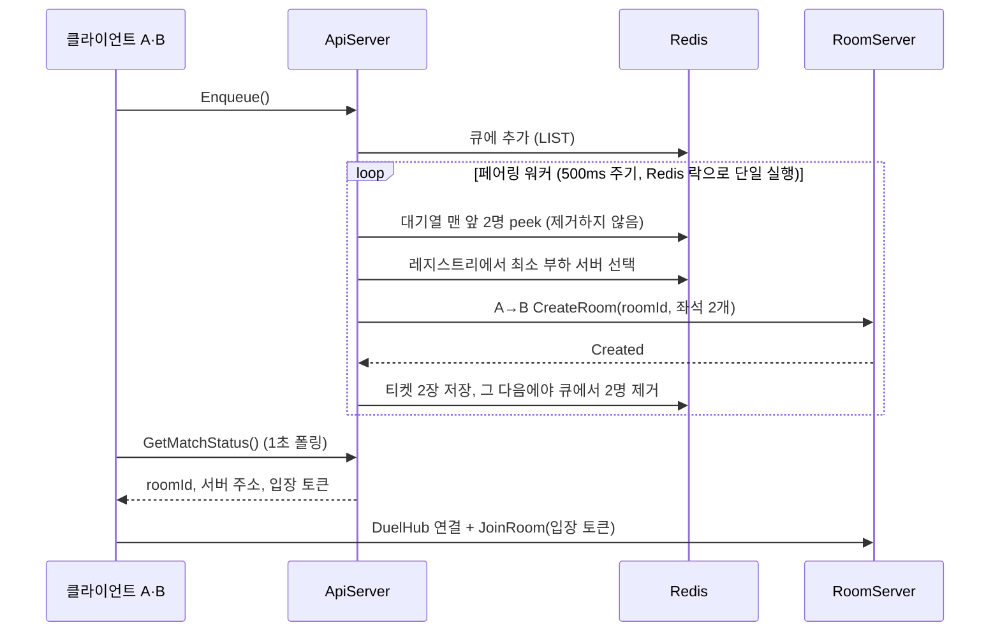

import SourceLink from '../../../../components/SourceLink.astro';

클라이언트가 **Play a duel**을 고른 순간부터 방에 앉기까지의 경로입니다. 이 경로의 주인공은 ApiServer 안에서 돌아가는 페어링 워커 하나이고, 큐·티켓·레지스트리는 전부 Redis에 있습니다.

## 흐름 한눈에

## 큐는 Redis에 하나

`IMatchmakingService`의 큐 진입·취소·상태 조회는 전부 Unary 호출이고, 대기열 자체는 Redis LIST입니다. ApiServer를 여러 대 띄워도 어느 인스턴스가 요청을 받든 같은 큐를 보므로, 매치메이킹은 인스턴스 수와 무관하게 동작합니다. 큐 옆에는 각 대기자의 진입 시각을 담는 해시가 하나 더 있는데, 아래 봇 폴백이 이 시각을 봅니다.

## 페어링 워커: 큐에서 방으로

페어링은 클라이언트 호출이 아니라 <SourceLink path="src/SharpCampus.ApiServer/Matchmaking/MatchmakingWorker.cs" />의 몫입니다. `BackgroundService`가 500ms마다 한 패스를 돌면서 대기열 맨 앞의 2명을 짝지어 방을 만듭니다.

인스턴스가 여러 대일 때 같은 2명을 서로 다른 인스턴스가 동시에 짝지으면 안 되므로, 패스는 Redis 락(`SET NX EX`)을 잡은 1개 인스턴스만 진행합니다. 락을 놓친 인스턴스는 그 패스를 건너뜁니다.

짝짓기는 도착 순서(FIFO)입니다. 실서비스라면 레이팅 밴드 안에서 짝짓고 대기가 길어질수록 밴드를 넓히겠지만, 이 프로젝트는 파이프라인 자체를 보여 주는 쪽을 택했습니다 (코드의 `Production note:` 주석이 이 경계를 표시합니다).

## 꺼내지 않고 읽는 이유

워커는 큐에서 2명을 꺼내지(pop) 않고 읽기만(peek) 합니다. 방 생성과 티켓 저장이 다 끝난 뒤에야 큐에서 제거합니다. 순서가 이렇게 된 이유가 이 워커에서 가장 배울 만한 지점입니다.

- 꺼내 놓고 방을 만들면, 첫 CreateRoom이 걸리는 동안 그 2명은 "큐에도 없고 티켓도 없는" 상태가 됩니다. 1초 폴링 중인 클라이언트가 그 창을 보면 매칭이 사라진 것으로 오인합니다.
- 읽기만 하면 실패했을 때 되돌릴 것이 없습니다. 방 생성이 거절되면 큐는 그대로이므로 다음 패스가 같은 2명을 다시 집습니다.
- 티켓을 먼저 쓰고 제거를 마지막에 두는 것도 같은 원칙입니다. 클라이언트 눈에는 항상 "대기 중" 아니면 "매치 성사"만 보입니다.

읽기와 제거 사이의 정합성은 위의 페어링 락이 지킵니다. 락 안에서만 큐를 만지므로 그 사이에 다른 인스턴스가 끼어들 수 없습니다.

## 방 배정과 A→B 호출

방을 어느 RoomServer에 만들지는 룸 레지스트리가 정합니다. 각 RoomServer는 5초마다 자기 이름과 현재 룸 수를 Redis에 재등록하고 (TTL 15초, 죽은 서버는 자연 소멸), 워커는 그중 부하가 가장 적은 서버를 고릅니다.

방 생성은 서버 간 MagicOnion 호출입니다. 워커가 Ulid로 `roomId`를 발급하고, 좌석 2개(각 대기자의 프로필에서 가져온 닉네임·스킨)를 담아 <SourceLink path="src/SharpCampus.Shared.Internal/Rooms/IRoomControlService.cs" />의 `CreateRoomAsync`를 호출합니다. 클라이언트와 똑같은 프레임워크, 똑같은 소스 제너레이터를 서버 간 RPC에도 그대로 쓰는 것이 이 호출의 핵심입니다.

응답이 `Created`가 아니면 (정원 초과, 드레이닝 중, 서버 무응답) 그 짝은 큐에 그대로 남고, 다음 패스가 다른 서버로 다시 시도합니다.

## 티켓과 입장 토큰

방이 만들어지면 워커는 대기자마다 티켓을 남깁니다. 티켓에는 `roomId`, 접속할 서버 주소, 그리고 **입장 토큰**이 들어 있습니다.

입장 토큰은 `{ userId, roomId, 만료(60초) }`를 HMAC-SHA256으로 서명한 값입니다. 서명 키는 ApiServer와 RoomServer만 공유하므로, 방 주소와 `roomId`를 알아내는 것만으로는 입장할 수 없습니다. 위조·만료·다른 방의 토큰은 전부 입장 거부입니다.

티켓과 별도로, 각 플레이어의 "활성 룸" 항목이 티켓보다 오래 남습니다. 매치 도중 클라이언트가 죽어도 다시 접속하면 이 항목이 같은 방으로 돌려보냅니다. 자세한 복귀 절차는 [룸 수명주기](../room-lifecycle/)에서 다룹니다.

## 매치 통지는 폴링

매치 성사는 push가 아니라 1초 주기의 `GetMatchStatus()` Unary 폴링으로 전달됩니다. 교육용으로는 폴링이 단순하고 의존이 없기 때문입니다. 실서비스라면 스트림이나 푸시 알림으로 바꿀 지점이고, 코드에 `Production note:`로 표시되어 있습니다.

## 상대가 없으면 봇

짝짓기가 다 끝나고도 혼자 남은 대기자가 있고 그 대기가 임계(개발 설정 15초, 기본 2분)를 넘으면, 워커는 A→B로 BotServer의 `IBotControlService.SummonAsync`를 호출합니다. 소환된 봇은 자기 Supabase 계정으로 로그인해 **일반 클라이언트와 같은 3회의 호출로 큐에 들어옵니다**. 다음 패스가 사람과 봇을 정규 경로 그대로 짝지으므로, 페어링·토큰·정산·리더보드 어디에도 봇 특례 코드가 없습니다.

소환 시도는 Redis의 쿨다운 마커(TTL 30초)로 한 번에 1회로 제한됩니다. BotServer가 꺼져 있거나 계정 풀이 바닥나도 로그만 남기고 매칭 파이프라인은 영향받지 않습니다.

## 방까지 가는 길: room-id 라우팅

개발 로컬에서는 티켓의 서버 주소가 RoomServer 직결 주소라 이야기가 끝나지만, 배포 형상에서는 모든 클라이언트가 Envoy 하나에만 연결합니다. 이때 티켓의 주소는 Envoy이고, 클라이언트가 붙이는 `room-id` gRPC 헤더를 Envoy의 Lua 필터가 읽어 "이 방을 가진 서버"를 Redis의 룸 위치 키로 해석한 뒤 해당 RoomServer로 스트림을 넘깁니다. 클라이언트 코드는 두 형상에서 같습니다. 티켓이 주는 주소로 연결하고 헤더를 붙일 뿐입니다.

이 라우팅을 직접 눈으로 확인하는 실습은 [시작 가이드 2부](../../getting-started/docker-compose/)에 있습니다.
