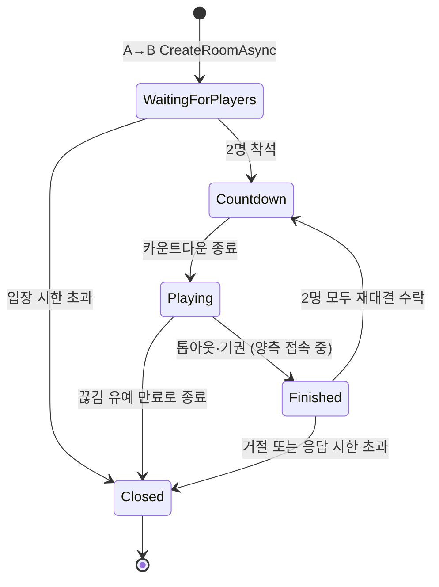

import SourceLink from '../../../../components/SourceLink.astro';

룸 하나는 매치 하나입니다. 이 장은 룸이 만들어져서 닫힐 때까지의 상태 전이를 따라가면서, RoomServer 설계의 중심인 "모든 변이는 루프 스레드에서만"이라는 규칙이 각 단계에서 어떻게 지켜지는지 봅니다.

## 상태 전이 한눈에

승패가 나면 어느 경로든 정산 이벤트가 발행됩니다. `Finished`는 결과가 난 뒤 재대결을 묻는 상태이고, 물을 상대가 없는 종료(끊김 유예 만료 등)는 곧바로 `Closed`로 갑니다.

## 룸은 ApiServer만 만든다

클라이언트에서 룸을 만드는 경로는 없습니다. 페어링 워커의 A→B `CreateRoomAsync`가 유일한 입구이고, <SourceLink path="src/SharpCampus.RoomServer/Rooms/RoomManager.cs" />가 요청을 받아 정원·중복·드레이닝 여부를 검사한 뒤 룸을 등록합니다.

등록은 곧 [LogicLooper](https://github.com/Cysharp/LogicLooper) 루프 액션 등록입니다. 룸 하나가 루프 액션 하나가 되어, 이후 이 룸에서 일어나는 모든 일은 20 TPS로 도는 틱 안에서 처리됩니다. 응답을 돌려주기 전에 룸 위치 키(`room:<roomId>`)를 Redis에 먼저 씁니다. 응답이 돌아가는 순간 페어링 워커가 티켓을 발급하므로, 진입점이 라우팅에 쓸 키는 그보다 먼저 존재해야 하기 때문입니다.

시드는 게임마다 RoomServer가 새로 만듭니다. 양쪽 보드가 같은 피스 순서를 쓰기 때문에, 시드를 알면 상대의 다음 피스를 읽을 수 있습니다. 그래서 시드는 A→B 페이로드에도 실리지 않습니다.

## 입장 검증은 허브, 착석은 룸

<SourceLink path="src/SharpCampus.RoomServer/Hubs/DuelHub.cs" />는 룸 메일박스 위의 얇은 어댑터입니다. 입장 요청이 오면 허브가 무상태로 검증할 수 있는 것을 전부 먼저 거릅니다. 입장 토큰의 서명과 만료, 토큰의 `roomId`가 대상 룸과 일치하는지, 토큰의 `userId`가 연결의 JWT `sub`와 일치하는지, 그리고 그 계정이 이 룸의 기대 좌석 2개 중 하나인지까지 확인한 뒤에야 Join 명령을 메일박스에 넣습니다.

좌석 배치는 룸이 만들어질 때 전달받은 (계정, 닉네임, 스킨) 2개로 고정되고 이후 바뀌지 않습니다. 다른 계정은 토큰이 있어도 앉을 수 없고, 닉네임은 프로필에서 가져온 값이라 스푸핑할 수 없습니다.

## 메일박스: 락 대신 단일 스레드

<SourceLink path="src/SharpCampus.RoomServer/Rooms/DuelRoom.cs" />의 모든 필드는 루프 스레드에서만 쓰입니다. 허브 호출(입장, 입력, 기권, 끊김, 스냅샷, 재대결 응답)은 룸을 직접 만지지 않고 `ConcurrentQueue`에 명령을 넣을 뿐이고, 루프가 틱 시작마다 쌓인 명령을 일괄 처리합니다.

- 답을 돌려줘야 하는 명령(입장, 스냅샷)만 `TaskCompletionSource`로 회신합니다. 허브는 그 태스크를 기다리고, 루프는 결과만 세팅하고 지나갑니다.
- 브로드캐스트는 루프가 그룹 프록시를 직접 호출합니다. 프록시는 각 연결의 쓰기 큐에 직렬화만 하므로 루프가 클라이언트를 기다리는 일이 없습니다.
- 닫히는 룸은 메일박스를 마지막으로 한 번 더 비워, 그 사이 들어온 명령의 대기자에게도 응답합니다. 이것이 없으면 허브가 영원히 기다리는 행(hang)이 생깁니다.

락 경합을 고민하는 대신 "룸 상태를 만지는 스레드는 하나"로 만들어 추론을 단순하게 하는, 액터 모델의 축소판입니다.

## 틱 파이프라인 (20 TPS)

`Playing` 상태의 틱 하나는 이렇게 흐릅니다.

1. **명령 드레인**: 메일박스에 쌓인 명령을 전부 처리합니다. 입력은 좌석별 대기열에 쌓입니다.
2. **유예 카운트**: 끊긴 좌석의 남은 유예 틱을 줄이고, 만료되면 매치를 끝냅니다.
3. **시뮬레이션 틱**: 좌석별 대기 입력을 틱당 상한까지만 소비해 GameCore의 `Tick()`에 넘깁니다. 상한을 넘긴 입력은 다음 틱으로 이월되지 않고 버려집니다. 입력을 몰아 보내는 클라이언트가 나중 틱에서 행동을 더 얻는 일이 없어야 하기 때문입니다. 중력·회전·라인 클리어·가비지·승패 판정은 전부 이 안에서 일어납니다.
4. **델타 브로드캐스트**: 틱 결과를 양측에 보냅니다.
5. **종료 판정**: 시뮬레이션이 끝을 보고했으면 결과 통지와 정산 발행으로 넘어갑니다.

## 끊김과 재접속

연결이 끊기면 허브의 `OnDisconnected`가 끊김 명령을 메일박스에 넣습니다. 명령에는 연결 ID가 함께 실립니다. 이미 새 연결이 좌석을 되찾은 뒤에 옛 연결의 끊김이 뒤늦게 도착해 좌석을 비우는 일을 막기 위해서입니다.

매치 중 끊김은 즉시 패배가 아닙니다. 좌석에 유예 10초가 걸리고, 게임은 그 좌석의 입력 없이 계속 진행됩니다. 유예 안에 다시 접속하면 같은 좌석으로 복귀합니다. 룸이 매치 시작 통지를 그 연결에만 다시 보내고, 클라이언트는 평소의 시작 절차대로 스냅샷을 요청해 보드 전체를 복원합니다. 매치메이킹의 활성 룸 항목이 티켓보다 오래 남는 이유가 이것입니다. 죽었다 살아난 클라이언트도 같은 방을 다시 찾을 수 있습니다.

유예가 다 지나면 남은 쪽의 승리로 끝나고, 양쪽 다 만료되면 무승부입니다. 반면 기권은 유예 없이 그 자리에서 끝납니다. 유예는 실패한 연결을 위한 것이지, 그만두기로 한 플레이어를 위한 것이 아니기 때문입니다.

## 재대결: 서버가 클라이언트를 호출한다

매치가 정상 종료(톱아웃·기권)했고 양측이 접속 중이면 룸은 `Finished`로 넘어가 재대결을 묻습니다. 이 질의는 MagicOnion 7의 **Client Results**, 즉 서버가 클라이언트의 메서드를 호출하고 반환값을 받는 기능을 씁니다.

- 루프 액션은 `await`할 수 없으므로, 질의는 좌석마다 태스크로 띄우고 답이 오면 메일박스로 재투입합니다. 답도 결국 명령이 되어 루프 스레드에서 처리됩니다.
- Client Results의 기본 시한은 5초인데 제안 창은 10초라, 호출마다 별도의 `CancellationToken`을 만들어 겁니다.
- 한쪽이 거절하면 그 즉시 양쪽 모두에게 종료를 알립니다. 수락한 쪽이 성립할 수 없는 제안의 남은 시한을 기다릴 이유가 없기 때문입니다. 오류·끊김·무응답은 전부 거절로 칩니다.
- 2명 모두 수락하면 새 시드와 새 `MatchId`로 카운트다운부터 다시 시작합니다. 매치 ID가 게임 단위인 이유가 여기 있습니다. 재대결은 별도의 게임으로 정산됩니다.

## 닫힘과 뒷정리

어느 경로로든 `Closed`에 도달하면 룸은 메일박스를 마지막으로 비우고, 매니저가 뒷정리를 합니다. 룸 목록에서 제거, 룸 위치 키 삭제, 두 플레이어의 활성 룸 항목 해제까지 끝나면 두 사람은 곧바로 다시 큐에 설 수 있습니다.

한 가지 함정도 여기서 처리됩니다. LogicLooper는 루프 액션이 예외를 던지면 그 예외를 등록 시점의 태스크에 담고 액션을 조용히 해제합니다. 아무도 그 태스크를 지켜보지 않으면, 룸은 로그 1줄 없이 영원히 틱이 멈춘 채 좌석과 복귀 항목을 붙들고 있게 됩니다. 그래서 매니저는 등록 태스크를 항상 관찰하고, 폴트가 보이면 에러를 남기고 룸을 중단 처리합니다.

## 드레이닝: 종료가 매치를 끊지 않게

RoomServer가 SIGTERM을 받으면 (롤링 업데이트, 스케일 다운) <SourceLink path="src/SharpCampus.RoomServer/Rooms/RoomDrainService.cs" />가 Kestrel이 멈추기 **전에** 개입합니다. `IHostedLifecycleService.StoppingAsync`가 스트림이 아직 살아 있는 마지막 시점이기 때문입니다.

1. **신규 배정 차단**: 이후의 `CreateRoomAsync`는 `Draining`으로 거절됩니다. 페어링 워커는 거절을 받으면 큐를 건드리지 않고 다음 패스에 다른 서버로 재시도하므로, ApiServer 쪽 코드는 아무것도 몰라도 됩니다.
2. **레지스트리 이탈**: 자기 이름을 즉시 지워 워커의 선택지에서 빠집니다.
3. **완주 대기**: 진행 중인 룸이 전부 닫힐 때까지 기다립니다 (설정 시한 안에서, K8s 형상은 240초).

시한에는 사슬이 있습니다. 드레인 시한 < .NET 호스트의 종료 시한 < K8s의 `terminationGracePeriodSeconds`. 안쪽이 바깥쪽보다 짧아야 각 단계가 강제 종료 전에 자기 마무리를 끝낼 수 있습니다. 롤링 업데이트 중에 매치가 끊기지 않는 것을 직접 확인하는 실습은 [시작 가이드 3부](../../getting-started/kubernetes/)에 있습니다.

매치가 끝난 뒤의 이야기, 즉 발행된 정산 이벤트가 어디로 가는지는 [정산 이벤트](../settlement/)에서 이어집니다.
