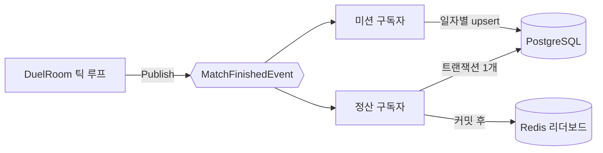

import SourceLink from '../../../../components/SourceLink.astro';

매치가 끝나는 순간 해야 할 일이 갑자기 많아집니다. 코인 지급, 레이팅 계산, 전적 2행 기록, 미션 진행 반영, 리더보드 갱신. 전부 데이터베이스나 Redis를 오가는 작업인데, 이 순간의 룸은 아직 50ms 예산으로 도는 틱 루프 안에 있습니다. 이 장은 그 긴장을 [MessagePipe](https://github.com/Cysharp/MessagePipe)의 pub/sub으로 푸는 구조를 다룹니다.

## 판정과 부수 효과의 분리

원칙은 하나입니다. **틱 루프는 게임 판정만 하고, 그 결과로 해야 할 일은 이벤트로 떠넘긴다.** 룸은 승패가 나면 `MatchFinishedEvent`를 발행하고 곧바로 다음 일로 넘어갑니다. 발행은 fire-and-forget이라 루프 스레드는 구독자를 기다리지 않습니다.

이벤트는 `MatchFinishedEvent` **1종뿐**이고, 구독자가 2개 붙습니다. 라인 클리어·가비지 같은 세분 이벤트를 두지 않은 것은 의도적입니다. 정산과 미션이 필요로 하는 수치가 전부 매치 종료 시점의 보드 통계와 승패에 들어 있어서, 이벤트를 늘릴 이유가 없었습니다. 대신 "같은 이벤트를 구독자마다 독립적으로 구독한다"가 이 구조의 핵심이 됩니다.

## 이벤트는 자기 복사본을 들고 다닌다

<SourceLink path="src/SharpCampus.RoomServer/Rooms/MatchFinishedEvent.cs" />에는 매치 ID, 승패와 종료 사유, 진행 틱 수, 그리고 플레이어 2명분의 계정과 보드 통계(클리어 라인, 가비지, 하드 드롭, 최대 콤보 등)가 전부 담깁니다. 구독자가 룸을 다시 들여다볼 필요가 없도록 필요한 것을 통째로 실어 보내는 것입니다. 덕분에 룸이 이미 닫힌 뒤에 실행되는 핸들러도 완전한 매치 하나를 가지고 일합니다.

이벤트의 단위는 룸이 아니라 게임입니다. 재대결은 새 `MatchId`로 다시 발행되어 별도의 매치로 정산됩니다.

## 정산 구독자: 트랜잭션 1개로

<SourceLink path="src/SharpCampus.RoomServer/Rooms/MatchSettlementHandler.cs" />는 룸의 루프 스레드가 아닌 곳에서, 뒤에 요청도 없이 실행됩니다. 그래서 DbContext가 필요로 하는 스코프를 직접 만듭니다.

계산 자체는 <SourceLink path="src/SharpCampus.Server.Common/Settlement/SettlementCalculator.cs" />가 맡습니다. 프로필 2개와 경제 상수만 받아 결과를 돌려주는 순수 함수라, 데이터베이스 없이 규칙만 테스트할 수 있습니다.

- 레이팅은 Elo입니다: `R' = R + K(S − E)`. K는 마스터 데이터의 경제 테이블에서 옵니다.
- 무승부는 레이팅을 움직이지 않습니다. 동시 톱아웃이 두 실력에 대해 말해 주는 것은 없기 때문입니다. 코인은 패배 보상과 같게 지급합니다. 승리는 없었지만 게임은 끝까지 치렀기 때문입니다.

쓰기는 <SourceLink path="src/SharpCampus.Server.Common/Settlement/MatchSettlementService.cs" />가 **단일 트랜잭션**으로 묶습니다. 두 프로필의 코인·레이팅 갱신과 전적 2행 추가가 함께 커밋되거나 함께 실패합니다. 커밋이 끝난 뒤에야 Redis 리더보드에 반영합니다. 레이팅 Sorted Set을 갱신하고, 승자가 있으면 일간 승수 보드에 더합니다.

실패 처리는 두 단계로 나뉩니다. 트랜잭션이 실패하면 로그만 남습니다 (실서비스라면 outbox에 쓰고 재시도할 지점이라는 `Production note:`가 코드에 있습니다). 리더보드 반영이 실패하면 프로필은 이미 커밋된 뒤라, 뒤처진 것은 파생 데이터인 보드뿐입니다.

## 미션 구독자: 같은 이벤트, 다른 관심사

<SourceLink path="src/SharpCampus.RoomServer/Rooms/MissionProgressHandler.cs" />는 같은 이벤트의 두 번째 구독자입니다. 정산이 게임의 보상을 지급하는 동안, 이쪽은 같은 게임을 그날의 미션 진행에 반영합니다. 마스터 데이터의 미션 목록을 돌며 지표(플레이 수, 승수, 클리어 라인, 가비지, 하드 드롭)별 증가분을 계산하고, UTC 날짜를 키로 진행도를 upsert합니다.

두 핸들러는 서로의 존재를 모릅니다. 룸도 구독자가 몇인지 모릅니다. 발행 1회에 구독자를 늘리는 것이 곧 기능 추가가 되는 구조입니다.

## 구독자 단위 격리

구독은 구독자마다 별도의 hosted service가 관리합니다 (<SourceLink path="src/SharpCampus.RoomServer/Rooms/MatchSettlementSubscription.cs" /> 등). 수명이 분리되어 있으니 실패도 분리됩니다. 정산 핸들러가 데이터베이스 장애로 죽어도 미션 진행은 기록되고, 그 반대도 마찬가지입니다. 한쪽의 예외가 다른 쪽을 멈추지 않는 것이 pub/sub을 쓴 이유의 절반입니다.

## 종료와 진행 중인 쓰기

fire-and-forget 발행에는 대가가 있습니다. 프로세스가 내려갈 때 "발행은 됐지만 아직 쓰는 중인" 정산이 있을 수 있습니다. 그래서 각 구독 서비스는 종료 시 <SourceLink path="src/SharpCampus.RoomServer/Rooms/InFlightHandler.cs" /> 래퍼로 진행 중인 핸들러가 끝나기를 기다립니다.

이 창은 이론이 아닙니다. 봇은 재대결 제안을 즉시 거절하므로 봇 매치의 룸은 종료 직후 바로 닫히고, 드레인 중인 서버라면 마지막 매치의 정산 쓰기가 프로세스 종료와 경합합니다. 그래서 드레이닝은 두 축입니다. [룸 수명주기](../room-lifecycle/)의 드레인이 매치를 완주시키고, 여기의 쓰기 대기가 그 매치의 정산까지 완주시킵니다.

MessagePipe 자체의 API와 DI 구성은 라이브러리 섹션에서 별도로 다룹니다.
