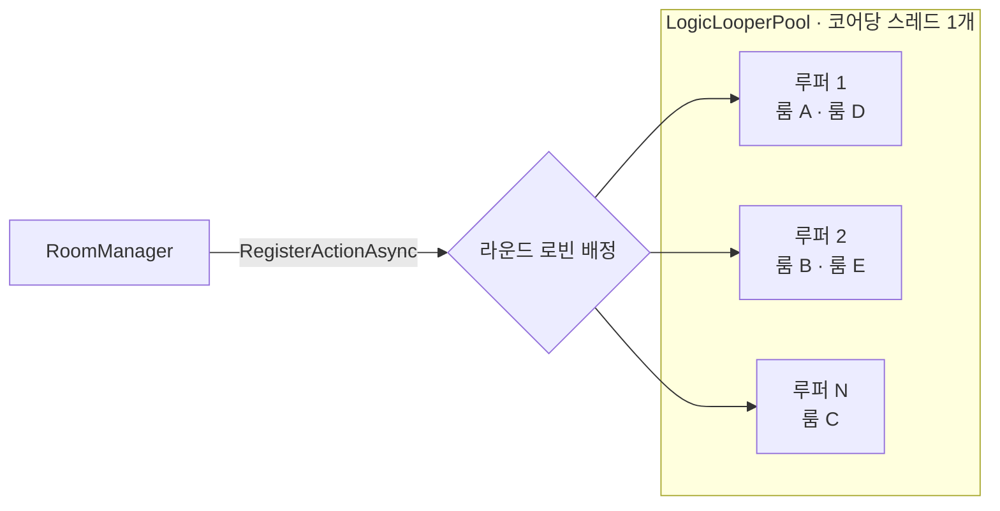

import SourceLink from '../../../../components/SourceLink.astro';

LogicLooper는 Cysharp의 서버용 게임 루프 라이브러리입니다. 스레드 하나가 고정 프레임레이트로 돌면서 등록된 액션 수백, 수천 개를 매 틱 호출해 줍니다. SharpCampus에서는 RoomServer의 심장입니다. [서버 권위 시뮬레이션](../../architecture/room-lifecycle/)의 중력·회전·라인 클리어 판정 전부가 이 루프의 틱 안에서 일어납니다. 버전은 1.6.0입니다.

- GitHub: [Cysharp/LogicLooper](https://github.com/Cysharp/LogicLooper)

## 왜 쓰나

실시간 룸을 만드는 소박한 방법은 룸마다 `Task.Delay` 루프나 전용 스레드를 하나씩 주는 것입니다. 룸 10개까지는 문제가 없지만, 룸 수백 개가 되면 스레드도 타이머도 수백 개가 되고, 스케줄링 비용이 시뮬레이션 비용을 넘어섭니다.

LogicLooper의 답은 반대 방향입니다. **스레드 수는 코어 수에 고정하고, 룸을 스레드가 아니라 루프 액션으로** 만듭니다. 루퍼 하나가 자기에게 등록된 액션들을 매 틱 순서대로 호출하므로, 룸 1,000개는 스레드 1,000개가 아니라 "코어 수만큼의 루퍼에 분배된 액션 1,000개"입니다.

## 풀 구성: 코어당 루퍼 1개

RoomServer는 시작할 때 루퍼 풀을 싱글턴으로 만듭니다.

```csharp
builder.Services.AddSingleton<ILogicLooperPool>(provider => new LogicLooperPool(
    provider.GetRequiredService<DuelRules>().TickRate,
    Environment.ProcessorCount,
    RoundRobinLogicLooperPoolBalancer.Instance));
```

<SourceLink path="src/SharpCampus.RoomServer/Program.cs" />

틱레이트는 코드 상수가 아니라 [마스터 데이터](../mastermemory/)에서 옵니다(초당 20틱). 세 번째 인자가 밸런서입니다. 새 액션이 등록될 때 어느 루퍼가 받을지 정하는 정책으로, 여기서는 라운드 로빈으로 돌아가며 나눠 줍니다.



## 룸 = 루프 액션 1개

룸 생성의 마지막 줄이 등록입니다.

```csharp
var room = new DuelRoom(roomId, players, rules, masterData, logger, matchFinished, Release);
_rooms[roomId] = room;
_ = ObserveAsync(room, loopers.RegisterActionAsync((in _) => Tick(room)));
```

<SourceLink path="src/SharpCampus.RoomServer/Rooms/RoomManager.cs" />

액션의 반환값 `bool`이 수명입니다. `true`를 돌려주는 동안 다음 틱에 또 불리고, 룸이 끝나 `false`를 돌려주면 루퍼가 액션을 내립니다. 별도의 해제 호출이 없습니다. 룸의 `Tick()` 메서드가 등록 람다와 분리되어 있는 것도 의도입니다. 테스트가 루퍼 없이 룸을 한 틱씩 직접 굴릴 수 있습니다.

매 틱은 `Stopwatch.GetTimestamp()`로 소요 시간을 재서 메트릭에 기록합니다. 룸들이 틱 예산을 얼마나 쓰는지가 "이 프로세스가 룸을 더 받을 수 있는가"의 근거이기 때문입니다.

## 루프 액션의 불변식: 절대 기다리지 않는다

루퍼 스레드 하나가 룸 여러 개를 돌린다는 것은, **한 룸이 블로킹하면 같은 루퍼의 다른 룸들도 함께 멈춘다**는 뜻입니다. 그래서 루프 액션 안에서는 await도, 락 대기도, I/O도 금지입니다. 이 제약이 RoomServer의 설계 전체를 결정합니다.

- 허브 스레드에서 오는 입력·입장·접속 해제는 [메일박스](../../architecture/room-lifecycle/)(`ConcurrentQueue<RoomCommand>`)에 쌓이고, 틱 첫머리에 한꺼번에 비워집니다.
- 클라이언트로 나가는 브로드캐스트는 [MagicOnion 멀티캐스터](../magiconion/)가 쓰기 큐에 얹기만 하므로 기다림이 없습니다.
- 정산 같은 DB 작업은 [MessagePipe](../messagepipe/)로 루프 밖에 던집니다.

## 예외를 관찰하라

`RegisterActionAsync`는 `Task`를 돌려주는데, 이 태스크는 액션이 스스로 끝날 때뿐 아니라 **액션이 예외를 던졌을 때도** 완료됩니다. 루퍼는 예외를 잡아 이 태스크에 실어 주고 액션을 조용히 내릴 뿐, 아무 데도 로그하지 않습니다. 이 태스크를 버리면, 틱이 멈췄는데 좌석과 입장권은 그대로인 좀비 룸이 남습니다.

```csharp
internal async Task ObserveAsync(DuelRoom room, Task ticking)
{
    try
    {
        await ticking;
    }
    catch (Exception exception)
    {
        logger.RoomTickFaulted(exception, room.RoomId);
        room.Abort();
    }
}
```

<SourceLink path="src/SharpCampus.RoomServer/Rooms/RoomManager.cs" />

그래서 등록 태스크는 반드시 누군가 await합니다. 예외가 나면 로그를 남기고 룸을 강제 종료해, 플레이어와 레지스트리가 정리되게 합니다.

## 더 보기

- [룸 수명주기](../../architecture/room-lifecycle/): 이 루프 위에서 룸이 나고 자라고 닫히는 전체 이야기 (5단계 틱 파이프라인, 드레이닝)
- [MessagePipe](../messagepipe/): 루프가 절대 기다리지 않기 위해 부수 효과를 내보내는 통로
- [MasterMemory](../mastermemory/): 틱레이트를 포함한 시뮬레이션 상수의 출처
