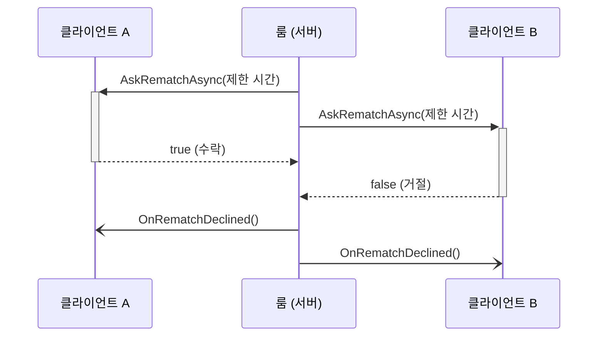

import SourceLink from '../../../../components/SourceLink.astro';

MagicOnion은 Cysharp가 만든 .NET·Unity용 RPC 프레임워크입니다. 전송은 표준 gRPC(HTTP/2)를 그대로 쓰지만, 프로토콜 스키마를 `.proto` 파일이 아니라 **C# 인터페이스**로 정의합니다. 페이로드 직렬화는 [MessagePack](../messagepack/)이 맡습니다. SharpCampus의 모든 통신(클라이언트 → 서버, 서버 → 서버, 서버 → 클라이언트 호출까지)이 이 프레임워크 위에 있고, 버전은 7.10.2입니다.

- 공식 문서: [cysharp.github.io/MagicOnion](https://cysharp.github.io/MagicOnion/)
- GitHub: [Cysharp/MagicOnion](https://github.com/Cysharp/MagicOnion)

## 왜 쓰나

일반적인 gRPC 개발은 `.proto` 파일을 작성하고, protoc으로 서버 스텁과 클라이언트 스텁을 생성하고, 계약이 바뀔 때마다 이 파이프라인을 다시 돌리는 흐름입니다. 서버와 클라이언트가 전부 C#인 프로젝트에서는 이 중간 단계가 순수한 관리 비용입니다.

MagicOnion은 공유 프로젝트에 둔 인터페이스 하나가 스키마이자 서버 계약이자 클라이언트 프록시의 원천입니다. 서버는 인터페이스를 구현하고, 클라이언트는 같은 인터페이스로 프록시를 만듭니다. 계약이 어긋나면 런타임 에러가 아니라 **컴파일 에러**로 드러납니다.

게임 서버 관점에서는 하나가 더 있습니다. 요청-응답(Unary)과 실시간 양방향 스트림(StreamingHub)을 한 프레임워크가 같은 계약 방식으로 제공하므로, 메타게임 API와 실시간 대전을 스택을 갈아타지 않고 만들 수 있습니다. 바닥이 표준 gRPC라서 Envoy 같은 L7 인프라도 그대로 통합니다 ([아키텍처 개요](../../architecture/)의 `room-id` 라우팅이 그 예입니다).

## 계약: 인터페이스가 곧 프로토콜

Unary 서비스 계약은 `IService<TSelf>`를 상속한 인터페이스입니다. 매치메이킹 큐 계약 전문이 이렇게 생겼습니다.

```csharp
public interface IMatchmakingService : IService<IMatchmakingService>
{
    UnaryResult<MatchStatusResponse> EnqueueAsync();
    UnaryResult CancelAsync();
    UnaryResult<MatchStatusResponse> GetStatusAsync();
}
```

<SourceLink path="src/SharpCampus.Shared/Services/IMatchmakingService.cs" />

반환 타입 `UnaryResult<T>`가 gRPC 요청-응답 1회를 뜻하고, 응답 본문이 없으면 비제네릭 `UnaryResult`를 씁니다. 이 인터페이스가 사는 곳이 노출 범위를 정합니다. 클라이언트가 부르는 계약은 `SharpCampus.Shared`, ApiServer가 RoomServer·BotServer를 부르는 내부 계약은 `SharpCampus.Shared.Internal`에 있고 클라이언트 배포물에 실리지 않습니다 (구분 기준은 [아키텍처 개요](../../architecture/#통신-경로-3종과-계약-2벌)에 정리되어 있습니다).

## Unary: 메타게임 API

ApiServer는 계정·프로필·상점·미션·리더보드·전적·매치메이킹·상태 확인까지 Unary 서비스 8종을 노출합니다. 구현체는 평범한 클래스이고, ASP.NET Core 위에서 돌기 때문에 인증도 표준 방식입니다. 서비스 클래스에 `[Authorize]`를 붙이면 Supabase가 발급한 JWT를 검증 미들웨어가 확인해 줍니다 (상태 확인용 `IStatusService`만 익명 허용).

등록은 한 줄이 아니라 배열입니다.

```csharp
app.MapMagicOnionService([
    typeof(StatusService),
    typeof(AccountService),
    // ...
    typeof(MatchmakingService),
]);
```

<SourceLink path="src/SharpCampus.ApiServer/Program.cs" />

인자 없는 `MapMagicOnionService()`는 엔트리 어셈블리만 스캔하는데, 이 프로젝트의 서비스 구현 대부분은 두 서버가 공유하는 `SharpCampus.Server.Common`에 살기 때문에 명시 등록이 필요합니다.

## StreamingHub: 실시간 대전

대전 스트림은 StreamingHub입니다. 계약이 인터페이스 2개 한 쌍인 점이 Unary와 다릅니다. 클라이언트가 서버에 부르는 메서드는 `IDuelHub`에, 서버가 클라이언트에 밀어 넣는 메서드는 `IDuelHubReceiver`에 둡니다.

```csharp
public interface IDuelHub : IStreamingHub<IDuelHub, IDuelHubReceiver>
{
    Task<JoinRoomResult> JoinAsync(JoinRoomRequest request);
    Task SendInputsAsync(GameInput[] inputs);
    Task<DuelSnapshot> RequestSnapshotAsync();
    Task ForfeitAsync();
}
```

<SourceLink path="src/SharpCampus.Shared/Duel/IDuelHub.cs" /> · <SourceLink path="src/SharpCampus.Shared/Duel/IDuelHubReceiver.cs" />

서버 구현 <SourceLink path="src/SharpCampus.RoomServer/Hubs/DuelHub.cs" />는 `StreamingHubBase<IDuelHub, IDuelHubReceiver>`를 상속한 얇은 어댑터입니다. 입장에 성공하면 연결을 `Group.AddAsync($"room:{roomId}")`로 룸 이름의 그룹에 넣는데, 이 그룹이 브로드캐스트 창구입니다. 같은 이름으로 합류한 연결들은 같은 `IGroup<IDuelHubReceiver>` 인스턴스를 받으므로, 룸은 그룹 하나만 쥐고 있으면 됩니다.

그룹에서 얻는 프록시를 **멀티캐스터**라고 부릅니다. `_group.All`은 두 좌석 모두에게, `_group.Single(connectionId)`는 특정 좌석에게 리시버 메서드를 호출하는 `IDuelHubReceiver` 구현체입니다. 호출은 각 연결의 쓰기 큐에 직렬화해 두는 것으로 끝나기 때문에, 틱 루프가 느린 클라이언트를 기다리는 일이 없습니다. 이 성질이 [룸 수명주기](../../architecture/room-lifecycle/)의 "루프는 절대 기다리지 않는다" 원칙을 받쳐 줍니다. 한 가지 주의점도 거기서 다룹니다. 그룹은 마지막 연결이 떠나는 순간 dispose되므로, 룸은 죽은 그룹을 그룹이 없는 것과 같게 취급합니다.

## 서버 간 호출: A→B도 같은 프레임워크

매치가 성사되면 ApiServer가 RoomServer에 방을 만들어 달라고 요청합니다. 이 서버 간 호출에 별도 프로토콜을 쓰지 않고, 클라이언트와 완전히 같은 MagicOnion 클라이언트를 씁니다.

```csharp
var client = MagicOnionClient.Create<IRoomControlService>(
    _channels.GetOrAdd(controlEndpoint, GrpcChannel.ForAddress),
    ContractSerialization.Provider);

// ...
return await client.CreateRoomAsync(request);
```

<SourceLink path="src/SharpCampus.ApiServer/Matchmaking/RoomControlClient.cs" />

`GrpcChannel`은 수명이 긴 자원이라 룸 서버당 하나를 캐시합니다. 대상 서버가 죽어 있으면(`Unavailable`) 호출자가 대기자들을 큐에 되돌리는데, 이 흐름은 [매치메이킹](../../architecture/matchmaking/)에서 따라갑니다. 봇 소환(`IBotControlService.SummonAsync`)도 같은 모양입니다.

## Client Results: 서버가 클라이언트를 호출한다

MagicOnion 7의 신기능입니다. 리시버 메서드가 `void`가 아니라 `Task<T>`를 반환하면, 서버가 클라이언트의 메서드를 호출하고 **답이 돌아올 때까지 기다릴** 수 있습니다. 이 프로젝트에서는 재대결 제안이 이 기능입니다.

```csharp
Task<bool> AskRematchAsync(int timeoutSeconds, CancellationToken cancellationToken = default);
```

<SourceLink path="src/SharpCampus.Shared/Duel/IDuelHubReceiver.cs" />



호출은 좌석별로 `_group.Single(connectionId)`을 통해 나가고, 한쪽이 거절하면 남은 제한 시간을 기다리지 않고 바로 정리합니다. 실전에서 챙길 점이 둘 있습니다. Client Results의 기본 타임아웃은 5초라서, 그보다 긴 제안 시간을 주려면 호출마다 `CancellationTokenSource`를 만들어 토큰을 넘겨야 합니다. 그리고 틱 루프 액션은 await할 수 없으므로, 룸은 질문을 별도 태스크로 띄우고 답을 메일박스 커맨드로 되돌려 받습니다. 전체 흐름은 [룸 수명주기](../../architecture/room-lifecycle/)에 있습니다. <SourceLink path="src/SharpCampus.RoomServer/Rooms/DuelRoom.cs" />

## Heartbeat: 끊어진 줄 알아채기

TCP 연결은 조용히 죽을 수 있습니다. 상대가 말을 안 하는 것인지 줄이 끊긴 것인지 구분하려면 누군가 주기적으로 신호를 보내야 하고, MagicOnion 7은 이걸 서버·클라이언트 양방향 내장 기능으로 제공합니다.

서버 쪽은 옵션 3줄입니다.

```csharp
options.EnableStreamingHubHeartbeat = true;
options.StreamingHubHeartbeatInterval = TimeSpan.FromSeconds(1);
options.StreamingHubHeartbeatTimeout = TimeSpan.FromSeconds(5);
```

<SourceLink path="src/SharpCampus.RoomServer/Program.cs" />

1초마다 확인하고 5초 무응답이면 연결을 끊습니다. 이 수치는 룸의 재접속 유예 10초에서 역산한 것입니다. 소리 없이 죽은 연결을 유예 안에서 충분히 일찍 알아채야 좌석이 운영체제의 소켓 타임아웃까지 방치되지 않습니다.

클라이언트 쪽은 반대 방향의 하트비트를 스스로 보내면서, 응답 왕복 시간을 대전 화면의 지연 표시로 씁니다.

```csharp
var options = StreamingHubClientOptions.CreateWithDefault(callOptions: new CallOptions(hubHeaders))
    .WithClientHeartbeatInterval(_heartbeatInterval)
    .WithClientHeartbeatResponseReceived(heartbeat => status.Measure(heartbeat.RoundTripTime));
```

<SourceLink path="src/SharpCampus.Client/Duel/DuelFlow.cs" />

정리하면 서버 하트비트는 사라진 클라이언트를 알아채는 장치, 클라이언트 하트비트는 지연을 재고 죽은 서버를 알아채는 장치입니다.

## JsonTranscoding: 개발용 HTTP 창구

gRPC 서비스는 curl로 바로 두드릴 수 없습니다. MagicOnion의 JSON transcoding은 Unary 서비스를 HTTP/1 + JSON 엔드포인트로도 열어 주는 기능이고, 이 프로젝트는 개발 환경에서만 켭니다.

```csharp
if (builder.Environment.IsDevelopment())
{
    magicOnion.AddJsonTranscoding();
    builder.Services.AddEndpointsApiExplorer();
    builder.Services.AddMagicOnionJsonTranscodingSwagger();
    builder.Services.AddSwaggerGen(options => options.IncludeMagicOnionXmlComments(typeof(IStatusService).Assembly));
}
```

<SourceLink path="src/SharpCampus.ApiServer/Program.cs" />

Swagger UI가 함께 붙는데, 문서 내용은 따로 쓰는 것이 아니라 계약 인터페이스의 XML 문서 주석(`///`)에서 옵니다. `SharpCampus.Shared`가 `GenerateDocumentationFile`로 XML을 만들고 `IncludeMagicOnionXmlComments`가 그걸 읽는 구조라, 계약 주석이 곧 API 문서가 됩니다.

## 소스 제너레이터: 미리 만들어 두는 클라이언트

`MagicOnionClient.Create<T>()`가 돌려주는 프록시는 기본적으로 런타임 코드 생성으로 만들어집니다. 소스 제너레이터를 쓰면 이걸 컴파일 타임으로 앞당길 수 있습니다. 마커 클래스 하나면 됩니다.

```csharp
[MagicOnionClientGeneration(typeof(IStatusService))]
internal partial class MagicOnionClientInitializer;
```

<SourceLink path="src/SharpCampus.Client.Common/MagicOnionClientInitializer.cs" />

지정한 타입이 속한 어셈블리를 스캔해, 그 안의 모든 서비스 계약에 대한 클라이언트 프록시를 미리 생성합니다. 콘솔 클라이언트와 BotServer가 각각 이 마커를 두고 있어, 클라이언트 쪽에 런타임 코드 생성이 남지 않습니다. IL 생성이 막히는 Unity IL2CPP 같은 AOT 환경에서는 선택이 아니라 필수가 되는 장치인데, 직렬화 쪽 짝인 MessagePack의 소스 제너레이터와 함께 보면 그림이 완성됩니다. [MessagePack-CSharp 페이지](../messagepack/)에서 이어집니다.

## 더 보기

- [아키텍처 개요](../../architecture/): 경로 3종(Unary/StreamingHub/A→B)과 계약 2벌이 전체 그림 어디에 놓이는지
- [룸 수명주기](../../architecture/room-lifecycle/): DuelHub와 Client Results가 실전에서 어떻게 굴러가는지
- [매치메이킹](../../architecture/matchmaking/): A→B 호출이 페어링 파이프라인 어디에 끼는지
- [MessagePack-CSharp](../messagepack/): 이 모든 호출의 페이로드를 담당하는 직렬화기
