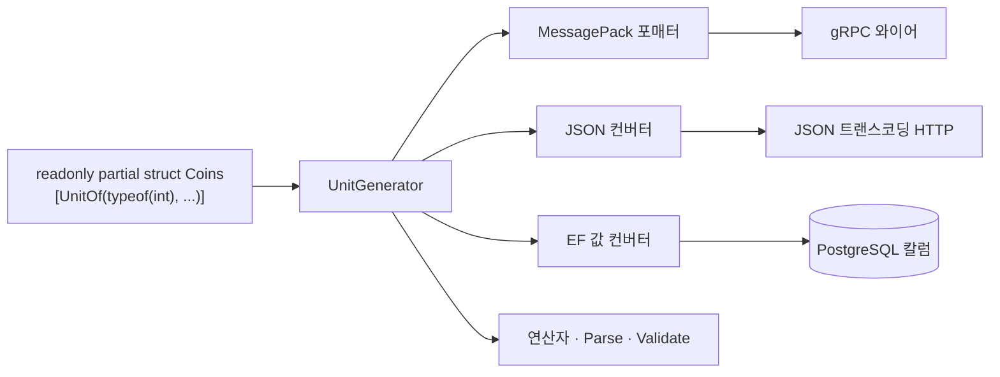

import SourceLink from '../../../../components/SourceLink.astro';

UnitGenerator는 `[UnitOf]` 애트리뷰트 하나 붙인 빈 struct 선언을 완성된 값 객체(value object)로 만들어 주는 Cysharp의 소스 제너레이터입니다. 이 프로젝트의 ID·수치 타입 9종(`UserId`, `RoomId`, `MatchId`, `TickNumber`, `PlayerIndex`, `Coins`, `Rating`, `SkinId`, `MissionId`)이 전부 이 방식으로 만들어졌습니다. 버전은 2.0.0입니다.

- GitHub: [Cysharp/UnitGenerator](https://github.com/Cysharp/UnitGenerator)

## 왜 쓰나

`UserId`도 `Guid`, 상점 가격도 잔액도 전부 `int`로 두면, 컴파일러에게는 서로 다른 의미의 값이 모두 같은 타입입니다. 인자 순서를 바꿔 넣거나 틱 번호를 코인 잔액에 더해도 컴파일은 통과합니다. 값마다 전용 타입으로 감싸면 이런 실수가 전부 타입 오류가 되지만, 이 패턴이 실무에서 밀려나는 이유는 비용입니다. 동등성 비교, 직렬화 포매터, DB 컨버터, `Parse`까지 타입마다 손으로 갖추려면 수백 줄이 듭니다.

UnitGenerator는 그 비용을 선언 한 줄로 줄입니다. 어떤 편의를 생성할지는 옵션 플래그 조합으로 고르고, 나머지는 컴파일 타임에 만들어집니다.

## 한 줄 선언과 옵션 메뉴

소프트 재화 `Coins`의 선언 전문입니다.

```csharp
/// <summary>
/// Soft currency an account spends on cosmetic items.
/// </summary>
// Arithmetic and comparison exist so the shop's debit is a translatable EF expression: the balance
// check and the subtraction both run inside the database.
[UnitOf(typeof(int), UnitOptions.Persisted | UnitGenerateOptions.ArithmeticOperator | UnitGenerateOptions.Comparable)]
public readonly partial struct Coins;
```

<SourceLink path="src/SharpCampus.Shared/Values/Coins.cs" />

9종의 선언은 감싼 프리미티브와 옵션만 다릅니다.

| 타입 | 프리미티브 | 옵션의 특징 |
| --- | --- | --- |
| `UserId` | `Guid` | Persisted + ParseMethod |
| `RoomId` · `MatchId` | `Ulid` | Transported + ParseMethod |
| `Coins` | `int` | Persisted + 산술 연산자 + 비교 |
| `Rating` | `int` | Persisted |
| `TickNumber` | `int` | MessagePack 포매터 + 비교 |
| `PlayerIndex` | `int` | MessagePack 포매터 + Validate |
| `SkinId` · `MissionId` | `string` | Persisted + 비교(연산자 제외) |

Persisted와 Transported는 이 프로젝트가 정의한 프리셋 상수입니다. "DB까지 가는 값"과 "와이어만 타는 값"이라는 두 부류가 반복되니, 조합을 한 곳에 모았습니다.

```csharp
// Single home for the target-framework split, so each value object declares its options in one line.
internal static class UnitOptions
{
    // MessagePack carries these over the wire and into the master data binary, JSON carries them
    // through the master data source file and the transcoded HTTP endpoints. EF Core is the odd one
    // out: a server-side, net-only dependency, so the Unity-facing netstandard build must compile
    // without the converter while the net10.0 build the servers reference carries it.
    public const UnitGenerateOptions Persisted =
#if NET10_0_OR_GREATER
        UnitGenerateOptions.MessagePackFormatter
        | UnitGenerateOptions.JsonConverter
        | UnitGenerateOptions.EntityFrameworkValueConverter;
#else
        UnitGenerateOptions.MessagePackFormatter | UnitGenerateOptions.JsonConverter;
#endif
```

<SourceLink path="src/SharpCampus.Shared/UnitOptions.cs" />

`SharpCampus.Shared`는 netstandard2.1과 net10.0 두 타깃으로 빌드되는데, EF Core 컨버터는 서버 전용 의존성이라 netstandard 빌드에서는 생성 옵션에서 빠집니다. 값 객체 선언부는 그대로 두고 프리셋 한 곳만 `#if`로 갈라지는 구조입니다.

## 생성물이 각 경계에 꽂히는 자리

옵션이 만들어 내는 것은 타입 안의 편의 멤버만이 아니라, 값이 프로세스 밖으로 나가는 경계마다 하나씩의 어댑터입니다.



MessagePack 포매터 덕분에 값 객체는 와이어에서 감싼 프리미티브 그대로 나갑니다(자세한 이야기는 [MessagePack-CSharp 페이지](../messagepack/)). JSON 컨버터는 개발용 JSON 트랜스코딩 HTTP 엔드포인트와 마스터 데이터 소스 파일이 씁니다. EF 컨버터만은 생성해 두어도 EF가 알아서 찾지 못해서, DbContext에 수동으로 등록합니다.

```csharp
    protected override void ConfigureConventions(ModelConfigurationBuilder configurationBuilder)
    {
        // UnitGenerator emits these converters, but EF never finds them on its own: without this registration
        // every value object would be mapped as an unsupported entity type instead of its underlying column.
        configurationBuilder.Properties<UserId>().HaveConversion<UserId.UserIdValueConverter>();
        configurationBuilder.Properties<Coins>().HaveConversion<Coins.CoinsValueConverter>();
        configurationBuilder.Properties<Rating>().HaveConversion<Rating.RatingValueConverter>();
        configurationBuilder.Properties<MatchId>().HaveConversion<MatchId.MatchIdValueConverter>();
        configurationBuilder.Properties<SkinId>().HaveConversion<SkinId.SkinIdValueConverter>();
        configurationBuilder.Properties<MissionId>().HaveConversion<MissionId.MissionIdValueConverter>();
    }
```

<SourceLink path="src/SharpCampus.Server.Common/Data/SharpCampusDbContext.cs" />

## 연산자가 DB 안에서 실행된다

`Coins`에 산술·비교 옵션을 준 이유는 편하게 더하고 빼기 위해서가 아닙니다. 상점의 차감 쿼리가 값 객체 채로 EF 번역식이 되기 위해서입니다.

```csharp
        var debited = await db.Profiles
            .Where(p => p.UserId == userId && p.Coins >= price)
            .ExecuteUpdateAsync(setters => setters
                .SetProperty(p => p.Coins, p => p.Coins - price)
                // A lambda so the database's own clock stamps the row, the same way a rename does.
                .SetProperty(p => p.UpdatedAt, _ => DateTimeOffset.UtcNow));
```

<SourceLink path="src/SharpCampus.Server.Common/Data/ShopRepository.cs" />

`p.Coins >= price`의 잔액 확인과 `p.Coins - price`의 차감이 모두 SQL로 번역되어 데이터베이스 안에서 실행됩니다. 생성된 `>=`·`-` 연산자와 값 컨버터가 있기에 성립하는 문장입니다.

## 와이어에서 들어오는 값도 검증된다

`PlayerIndex`는 대전의 좌석 번호라 0 또는 1만 유효합니다. Validate 옵션을 주면 생성자에 검증 훅이 생기는데, 생성되는 MessagePack 포매터도 역직렬화 때 그 생성자를 지나가므로 조작된 페이로드로도 없는 좌석이 프로세스에 들어올 수 없습니다.

```csharp
// Validate runs from the constructor the generated MessagePack formatter deserialises through, so a
// seat that never existed cannot enter the process from the wire either.
[UnitOf(typeof(int), UnitGenerateOptions.MessagePackFormatter | UnitGenerateOptions.Validate)]
public readonly partial struct PlayerIndex
{
    private partial void Validate()
    {
        if (value is not (0 or 1))
        {
            throw new ArgumentOutOfRangeException(nameof(value), value, "A duel seat is 0 or 1.");
        }
    }
}
```

<SourceLink path="src/SharpCampus.Shared/Values/PlayerIndex.cs" />

`string` 기반인 `SkinId`·`MissionId`에는 반대 방향의 조정이 있습니다. Comparable 옵션은 `<`·`>` 같은 관계 연산자까지 생성하는데 string 위에서는 그 연산자가 컴파일되지 않아서, `WithoutComparisonOperator`로 연산자만 빼고 `IComparable` 구현은 남깁니다. 마스터 데이터 인덱스가 키 정렬과 이진 탐색에 `IComparable`을 쓰기 때문입니다.

## 더 보기

- [MessagePack-CSharp](../messagepack/): 값 객체가 와이어에서 프리미티브 그대로 나가는 원리
- [Ulid](../ulid/): `RoomId`·`MatchId`가 감싸는 식별자와 경계별 처리
