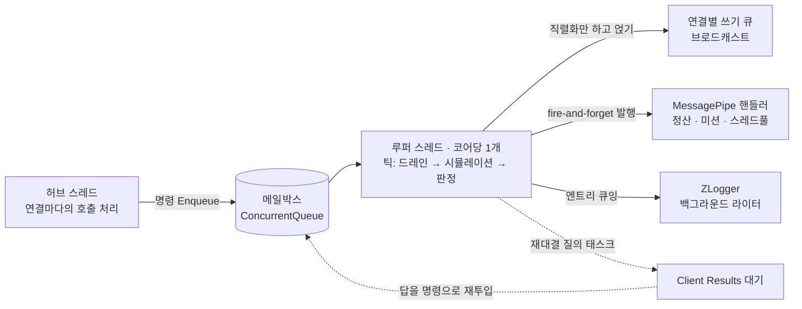

import SourceLink from '../../../../components/SourceLink.astro';

실시간 게임 서버는 동시성 문제의 전시장입니다. 두 클라이언트가 동시에 입력을 보내고, 연결은 아무 때나 끊기고, 매치 종료는 데이터베이스 쓰기를 일으키고, 그 와중에 시뮬레이션은 초당 20틱으로 쉬지 않고 돌아야 합니다. 이 프로젝트는 이 문제를 공유 상태에 락을 거는 방식으로 풀지 않았습니다. 대신 불변식 하나를 세우고 전부를 그 아래 정렬했습니다. **틱 루프는 절대 기다리지 않는다. 그리고 룸 상태를 만지는 스레드는 언제나 하나다.**

이 원칙 자체는 [LogicLooper](../../libraries/logiclooper/), [MessagePipe](../../libraries/messagepipe/), [ZLogger](../../libraries/zlogger/) 페이지에 조각조각 등장했습니다. 이 편은 그 조각들을 RoomServer 프로세스 하나의 스레드 지도로 다시 묶습니다.

## 스레드 지도

RoomServer 프로세스에는 성격이 다른 스레드가 4종 삽니다. 허브 호출을 처리하는 요청 스레드, 코어당 1개씩 고정된 루퍼 스레드, 스레드풀에서 도는 태스크들, 그리고 ZLogger의 백그라운드 라이터 스레드입니다.



화살표의 방향이 곧 규칙입니다. 루퍼 스레드로 **들어오는** 것은 전부 큐를 거치고, 루퍼 스레드에서 **나가는** 것은 전부 기다리지 않습니다. 이 두 문장이 이 편의 전부이고, 나머지는 각 화살표의 사연입니다.

## 상태마다 주인 스레드가 하나

출발점은 룸 클래스의 머리에 적힌 선언입니다.

```csharp
// One room is one LogicLooper action. Every field below is written on the loop thread only: hub
// threads reach the room through the command mailbox and nowhere else.
internal sealed class DuelRoom
{
    private readonly ConcurrentQueue<RoomCommand> _commands = new();
```

<SourceLink path="src/SharpCampus.RoomServer/Rooms/DuelRoom.cs" />

보드, 좌석, 대기 입력, 상태 머신까지 룸의 모든 필드는 루퍼 스레드에서만 씁니다. 허브가 받은 입장·입력·기권·끊김은 룸을 직접 만지는 대신 `RoomCommand`가 되어 메일박스에 앉고, 틱 첫머리의 드레인이 한꺼번에 처리합니다. 필드마다 락을 고민하는 대신 "만지는 스레드가 하나"로 만들어 경합 자체를 없애는, 액터 모델의 축소판입니다. 이 메일박스가 틱 파이프라인 안에서 어떻게 소비되는지는 [룸 수명주기](../../architecture/room-lifecycle/)가 다룹니다.

경계에는 문지기가 하나 있습니다.

```csharp
    // Rejecting once the room is closing is what keeps a hub from awaiting a reply nobody will send.
    public bool TryPost(RoomCommand command)
    {
        lock (_mailboxGate)
        {
            if (_closed)
            {
                return false;
            }

            _commands.Enqueue(command);
            return true;
        }
    }
```

<SourceLink path="src/SharpCampus.RoomServer/Rooms/DuelRoom.cs" />

룸에서 거의 유일한 락이 여기, 그것도 큐에 넣는 순간에만 잡힙니다. 닫힘 검사와 투입이 한 덩어리여야 "아무도 비우지 않을 메일박스에 명령이 앉아 허브가 영원히 기다리는" 사고가 안 나기 때문입니다. 락은 상태를 보호하는 데 쓰인 것이 아니라 경계의 원자성을 지키는 데 쓰였습니다.

## 나가는 것은 전부 기다리지 않는다

틱 안에서 바깥세상과 닿는 지점은 3곳인데, 셋 다 같은 모양입니다. 넘기고, 기다리지 않습니다.

**브로드캐스트.** 매 틱의 델타는 [MagicOnion](../../libraries/magiconion/) 그룹 프록시로 나갑니다.

```csharp
        // The group proxy only serialises onto each connection's write queue, so the loop never waits
        // on a client here.
        Everyone()?.OnTickDelta(TickDeltaFactory.Create(result, _simulation.Board1, _simulation.Board2));
```

<SourceLink path="src/SharpCampus.RoomServer/Rooms/DuelRoom.cs" />

프록시가 하는 일은 각 연결의 쓰기 큐에 직렬화된 메시지를 얹는 것까지입니다. 회선이 느린 클라이언트는 자기 큐가 밀릴 뿐, 루프의 다음 틱을 막지 못합니다.

**정산.** 매치가 끝나면 결과를 [MessagePipe](../../libraries/messagepipe/)에 발행합니다.

```csharp
        // Fire and forget: settlement talks to a database, and nothing a room does may make the loop
        // thread wait. A room that never started never gets here, and has no match to settle.
        _matchFinished.Publish(new MatchFinishedEvent(
```

<SourceLink path="src/SharpCampus.RoomServer/Rooms/DuelRoom.cs" />

`PublishAsync`가 아니라 `Publish`입니다. 데이터베이스 왕복은 스레드풀의 핸들러가 지고, 루프는 발행 즉시 다음 일로 넘어갑니다. 던지고 잊은 쓰기를 서버 종료가 어떻게 끝까지 기다려 주는지(InFlightHandler)는 MessagePipe 페이지의 몫입니다.

**로그.** [ZLogger](../../libraries/zlogger/)의 로그 호출은 UTF8 엔트리를 큐에 넣는 것으로 끝나고, 실제 콘솔 쓰기는 백그라운드 라이터 스레드가 합니다. 콘솔 I/O가 틱을 막지 않는 이유입니다. 같은 페이지의 `Hosting.Diagnostics` 필터 이야기는 이 구조의 뒷면이기도 합니다. 나중에 다른 스레드에서 열리는 로그 상태가 살아 있는 객체를 읽으면 그 자체로 데이터 레이스가 됩니다.

## await가 필요해지면, 태스크로 나갔다가 명령으로 돌아온다

재대결 제안은 이 모델의 시험대입니다. 서버가 클라이언트의 메서드를 호출하고 답을 받는 Client Results는 본질적으로 `await`인데, 루프 액션은 `await`할 수 없습니다.

```csharp
    // The question is asked from the loop thread but answered off it: a loop action cannot await, so
    // each ask runs as its own task and posts what it hears back into the mailbox.
    private void OfferRematch(IGroup<IDuelHubReceiver> group)
```

<SourceLink path="src/SharpCampus.RoomServer/Rooms/DuelRoom.cs" />

질의는 좌석마다 별도 태스크로 띄웁니다. 눈여겨볼 것은 답이 돌아오는 길입니다.

```csharp
        try
        {
            accepted = await client.AskRematchAsync(timeoutSeconds, cancellationToken);
        }
        catch (Exception e)
        {
            // A client that errored, dropped or ran out the clock has all said the same thing.
            _logger.RoomRematchUnanswered(RoomId, playerIndex, e.Message);
        }

        TryPost(RoomCommand.RematchAnswer(playerIndex, accepted));
```

<SourceLink path="src/SharpCampus.RoomServer/Rooms/DuelRoom.cs" />

태스크는 답을 받아도 룸의 좌석 상태를 직접 고치지 않습니다. 답조차 `RoomCommand`가 되어 메일박스로 돌아가고, 다음 틱의 드레인이 루퍼 스레드에서 처리합니다. "루프 밖에서 벌어진 일은 전부 명령으로 들어온다"는 규칙이 예외 없이 적용되는 것입니다.

## 그래도 남는 동기화

락이 0인 것은 아닙니다. 남은 자리는 전부 룸 상태가 아니라 **수명 경계**입니다. 위의 메일박스 게이트, 그리고 룸 생성을 직렬화하는 <SourceLink path="src/SharpCampus.RoomServer/Rooms/RoomManager.cs" />의 생성 게이트(정원 검사와 등록이 한 덩어리여야 드레이닝 결정 뒤로 룸이 미끄러져 들어오지 않습니다)까지, 잡는 시간이 큐 조작 몇 줄인 짧은 락들입니다.

가장 미묘한 것은 락이 아니라 이 한 줄입니다.

```csharp
    // Completed by whoever sees the last room go while draining. Release runs on the loop thread, and a
    // waiter's continuation must never run there: shutdown work would be ticking the rooms it waits on.
    private readonly TaskCompletionSource _idle = new(TaskCreationOptions.RunContinuationsAsynchronously);
```

<SourceLink path="src/SharpCampus.RoomServer/Rooms/RoomManager.cs" />

`TaskCompletionSource`는 기본 동작에서 완료를 세팅한 그 스레드로 대기자의 후속 작업을 끌어와 실행합니다. 마지막 룸의 해제는 루퍼 스레드에서 일어나므로, 이 기본값대로라면 드레이닝 셧다운 코드가 자기가 기다리던 룸들을 돌리던 바로 그 스레드에서 돌게 됩니다. `RunContinuationsAsynchronously`가 그 밀항을 막는 울타리입니다. "틱 루프를 막지 않는다"는 불변식은 이렇게 태스크 완료의 세부 옵션에까지 내려갑니다.

## 룸만의 모양이 아니다

"주인 스레드 하나 + 경계는 큐"라는 모양은 이 프로세스의 다른 곳에서도 반복됩니다. ZLogger가 정확히 이 구조(발행자는 큐에 넣고, 라이터 스레드가 씁니다)이고, [R3](../../libraries/r3/)로 만든 봇의 지각·판단 파이프라인도 허브의 수신 루프라는 단일 스레드 위에서 돕니다. 봇 코드의 주석 표현을 빌리면, 착지 계산쯤은 수신 루프가 감당할 수 있는 비용이라 별도 스레드를 만들지 않았습니다.

동시성 설계라고 하면 락과 원자 연산의 기교를 떠올리기 쉽지만, 이 스택이 보여 주는 것은 반대입니다. 스레드 소유권을 먼저 정하면 기교가 필요한 자리가 거의 남지 않습니다.

## 더 보기

- [LogicLooper](../../libraries/logiclooper/): 루퍼 스레드와 "절대 기다리지 않는다" 불변식의 출처
- [MessagePipe](../../libraries/messagepipe/): fire-and-forget의 대가를 지불하는 InFlightHandler
- [룸 수명주기](../../architecture/room-lifecycle/): 메일박스가 소비되는 틱 파이프라인 전체
- [ZLogger](../../libraries/zlogger/): 백그라운드 라이터와 비동기 싱크의 일반 원칙
