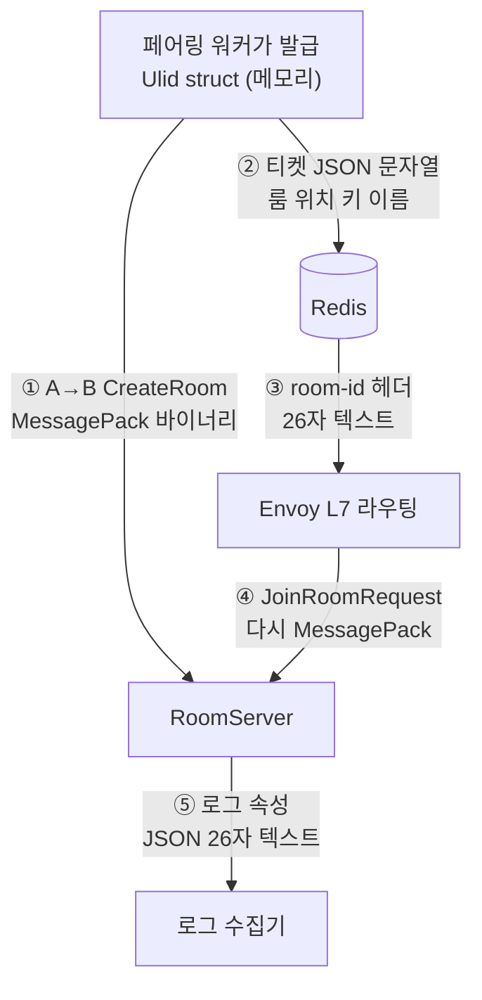

import SourceLink from '../../../../components/SourceLink.astro';

이 시스템의 직렬화기는 하나가 아닙니다. 같은 프로세스가 어떤 값은 [MessagePack](../../libraries/messagepack/) 바이너리로, 어떤 값은 [MemoryPack](../../libraries/memorypack/) 바이너리로, 어떤 값은 JSON으로, 어떤 값은 그냥 텍스트로 내보냅니다. 무질서해 보이지만 반대입니다. 포맷마다 자기가 이기는 자리가 다르고, **경계의 양끝에 누가 있는가**가 매번 선택을 정했습니다. 이 편은 그 선택들을 지도 한 장으로 모으고, `RoomId` 하나를 추적자 삼아 값이 경계를 넘을 때마다 표현을 갈아입는 모습을 따라갑니다.

## 지도

| 경계 | 포맷 | 양끝 | 그 포맷인 이유 |
| --- | --- | --- | --- |
| 클라이언트 ↔ 서버 RPC | MessagePack | 콘솔 클라 · 서버 | 공개 규격, 교차 플랫폼, 크기와 속도 |
| 서버 → 서버 A→B | MessagePack | ApiServer · RoomServer/BotServer | 두 번째 프로토콜을 만들지 않는다 |
| 마스터 데이터 | 소스는 JSON, 배포본은 MessagePack | 편집하는 사람 · 서버 기동 | 편집은 사람, 적재는 기계의 몫 |
| Redis: 티켓·룸 레지스트리 | JSON 문자열·해시 필드 | 서버 · redis-cli를 든 사람 | 운영 중 눈으로 읽는 값 |
| Redis: 리더보드 캐시 | MemoryPack | 서버 · 서버 | 양끝이 같은 .NET이면 남는 기준은 속도뿐 |
| 구조화 로그 | JSON | 서버 · 로그 수집기 | 수집기의 모국어 |
| HTTP 개발 창구 | JSON (JsonTranscoding) | curl·Swagger를 든 개발자 · ApiServer | 사람 손으로 부르는 창구 |
| DB 칼럼 | 감싼 프리미티브 그대로 | 서버 · PostgreSQL | SQL이 읽고 인덱싱하는 값 |
| gRPC 헤더 `room-id` | 26자 텍스트 | 클라 · Envoy | 페이로드를 열지 않고 읽어야 하는 값 |

## 기준: 양끝에 누가 있는가

[MemoryPack 페이지](../../libraries/memorypack/)의 한 문장("직렬화기 선택은 양끝에 누가 있는가의 문제입니다")을 시스템 전체로 일반화하면 지도가 4개 구역으로 정리됩니다.

- **기계끼리, 계약은 공개**: MessagePack. 클라이언트가 다른 언어·플랫폼일 수 있는 자리라 규격이 공개된 포맷이어야 하고, 매 틱 나가는 델타가 지나는 자리라 크기와 속도가 곧 대역폭과 CPU입니다.
- **기계끼리, 우리 서버 전용**: MemoryPack. 교차 플랫폼 의무가 없으면 가장 빠른 것을 씁니다.
- **사람이나 범용 도구가 끼는 자리**: JSON. 로그 수집기, Swagger, redis-cli 앞에서 바이너리는 손해만 있습니다.
- **인프라가 스치듯 읽는 자리**: 그냥 텍스트. Envoy는 `room-id` 헤더만 보고 라우팅하지 페이로드를 해석하지 않습니다.

포맷을 하나로 통일하는 것이 단순함이 아니라는 점이 이 지도의 요지입니다. 로그를 MessagePack으로 쓰면 수집기 앞에서 막히고, 캐시를 JSON으로 쓰면 이유 없이 느리고, 라우팅 키를 페이로드에 넣으면 진입점이 복호화를 해야 합니다. 단순한 것은 포맷의 수가 아니라 **선택 규칙의 수**입니다.

## RoomId의 여행

이 지도를 값 하나의 눈으로 다시 보면, 매치 한 판 동안 `RoomId`는 표현을 5번 갈아입습니다.



메모리에서는 [Ulid](../../libraries/ulid/) struct(①이 되기 전), 와이어에서는 MessagePack 바이너리(①·④), Redis와 헤더에서는 26자 텍스트(②·③), 로그에서는 JSON 속성(⑤)입니다. ③의 현장은 이렇게 생겼습니다.

```csharp
        var hubHeaders = new Metadata { { "room-id", ticket.RoomId.ToString() } };
```

<SourceLink path="src/SharpCampus.Client/Duel/DuelFlow.cs" />

주목할 것은 이 왕복에 손으로 쓴 변환 코드가 거의 없다는 점입니다. MessagePack 포매터와 JSON 컨버터는 [UnitGenerator](../../libraries/unitgenerator/)가 값 객체에 생성해 둔 것이고, 텍스트 왕복의 `Parse`도 생성 옵션 하나로 딸려 나온 메서드입니다. 경계마다 어떤 생성물이 일하는지의 상세는 UnitGenerator와 [Ulid](../../libraries/ulid/) 페이지가 다룹니다.

그리고 어느 경계에서든 사람 눈에 보이는 표기는 같은 26자입니다. redis-cli에서 본 값, 헤더에 실린 값, 로그에서 검색한 값이 전부 같은 문자열이라, 매치 하나를 시스템 끝에서 끝까지 추적하는 일이 복사·붙여넣기가 됩니다.

## 경계를 지키는 규칙

지도가 유지되려면 규칙이 2개 필요합니다.

**포맷이 다르면 타입도 다르다.** 리더보드 캐시는 계약 DTO와 똑같이 생긴 타입을 별도로 두고 미러링합니다. 계약 어셈블리는 netstandard2.1이고 MemoryPack은 .NET 7 이상이라는 실무 제약이 직접 이유지만, 그 결과로 "와이어 계약이 바뀌면 캐시 포맷도 조용히 바뀐다"는 원격 결합도 함께 사라졌습니다. 상세는 [MemoryPack 페이지](../../libraries/memorypack/)에 있습니다.

**직렬화 구성은 한곳에서 온다.** MessagePack 옵션은 계약을 쓰는 모든 프로세스가 `SharpCampus.Shared`의 정적 클래스 한곳에서 가져갑니다. 어느 한 프로세스만 리졸버 구성이 다르면 같은 바이트를 서로 다르게 읽게 되기 때문입니다. 이 구성 클래스는 [MessagePack 페이지](../../libraries/messagepack/)가 다룹니다.

## 더 보기

- [MessagePack-CSharp](../../libraries/messagepack/): 공개 계약 구역의 주인
- [MemoryPack](../../libraries/memorypack/): 서버 전용 구역의 주인, 그리고 "양끝" 기준의 출처
- [UnitGenerator](../../libraries/unitgenerator/) · [Ulid](../../libraries/ulid/): 경계마다 일하는 생성 컨버터들
- [ZLogger](../../libraries/zlogger/): 로그 구역의 JSON 출력과 값 객체 표기
