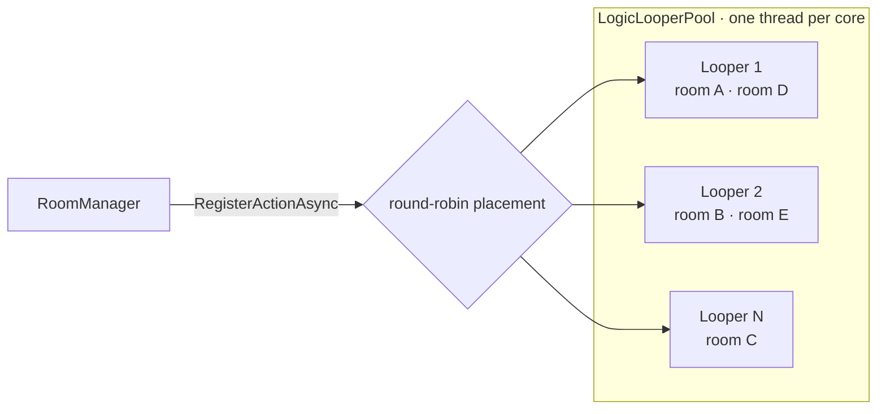

import SourceLink from '../../../components/SourceLink.astro';

LogicLooper is Cysharp's game loop library for servers. One thread runs at a fixed frame rate and invokes hundreds or thousands of registered actions every tick. In SharpCampus it is the heart of the RoomServer: gravity, rotation, and line-clear rulings of the [server-authoritative simulation](../../architecture/room-lifecycle/) all happen inside this loop's ticks. The version is 1.6.0.

- GitHub: [Cysharp/LogicLooper](https://github.com/Cysharp/LogicLooper)

## Why this library

The naive way to build real-time rooms is to give each one its own `Task.Delay` loop or dedicated thread. Fine at 10 rooms — but at hundreds of rooms that is hundreds of threads and timers, and scheduling overhead overtakes simulation cost.

LogicLooper's answer runs the other way: **pin the thread count to the core count and make a room a loop action, not a thread.** Each looper invokes its registered actions in order every tick, so 1,000 rooms are not 1,000 threads — they are 1,000 actions spread over core-count loopers.

## The pool: one looper per core

The RoomServer builds the looper pool as a singleton at startup:

```csharp
builder.Services.AddSingleton<ILogicLooperPool>(provider => new LogicLooperPool(
    provider.GetRequiredService<DuelRules>().TickRate,
    Environment.ProcessorCount,
    RoundRobinLogicLooperPoolBalancer.Instance));
```

<SourceLink path="src/SharpCampus.RoomServer/Program.cs" />

The tick rate is not a code constant — it comes from [master data](../mastermemory/) (20 ticks per second). The third argument is the balancer: the policy deciding which looper receives a newly registered action, round-robin here.



## One room = one loop action

The last line of room creation is the registration:

```csharp
var room = new DuelRoom(roomId, players, rules, masterData, logger, matchFinished, Release);
_rooms[roomId] = room;
_ = ObserveAsync(room, loopers.RegisterActionAsync((in _) => Tick(room)));
```

<SourceLink path="src/SharpCampus.RoomServer/Rooms/RoomManager.cs" />

The action's `bool` return value is its lifetime. While it returns `true` it gets called again next tick; when the room is done and returns `false`, the looper unregisters the action — there is no separate deregistration call. Keeping the room's `Tick()` method separate from the registration lambda is deliberate too: tests can drive a room one tick at a time with no looper involved.

Every tick is timed with `Stopwatch.GetTimestamp()` and recorded as a metric, because how much of the tick budget the rooms spend is the evidence for "can this process take another room."

## The loop action invariant: never wait

One looper thread running many rooms means **one blocking room stalls every other room on the same looper**. So inside a loop action there is no await, no lock waiting, no I/O. That constraint shapes the whole RoomServer design:

- Inputs, joins, and disconnects arriving on hub threads pile up in the [mailbox](../../architecture/room-lifecycle/) (`ConcurrentQueue<RoomCommand>`) and are drained at the top of each tick.
- Outgoing broadcasts only enqueue onto write queues via the [MagicOnion multicaster](../magiconion/), so there is nothing to wait on.
- Database work like settlement is thrown out of the loop through [MessagePipe](../messagepipe/).

## Observe your exceptions

`RegisterActionAsync` returns a `Task` — one that completes not only when the action ends itself, but also **when the action throws**. The looper catches the exception, hands it to this task, quietly unregisters the action, and logs nothing. Discard that task and you are left with a zombie room: ticking stopped, seats and entry tickets still held.

```csharp
internal async Task ObserveAsync(DuelRoom room, Task ticking)
{
    try
    {
        await ticking;
    }
    catch (Exception exception)
    {
        logger.RoomTickFaulted(exception, room.RoomId);
        room.Abort();
    }
}
```

<SourceLink path="src/SharpCampus.RoomServer/Rooms/RoomManager.cs" />

So the registration task is always awaited by someone. On an exception it logs and force-closes the room, so players and the registry get cleaned up.

## See also

- [Room lifecycle](../../architecture/room-lifecycle/): the full story of a room living and dying on this loop (the five-step tick pipeline, draining)
- [MessagePipe](../messagepipe/): the outlet the loop uses so it never has to wait on side effects
- [MasterMemory](../mastermemory/): where the tick rate and the other simulation constants come from
