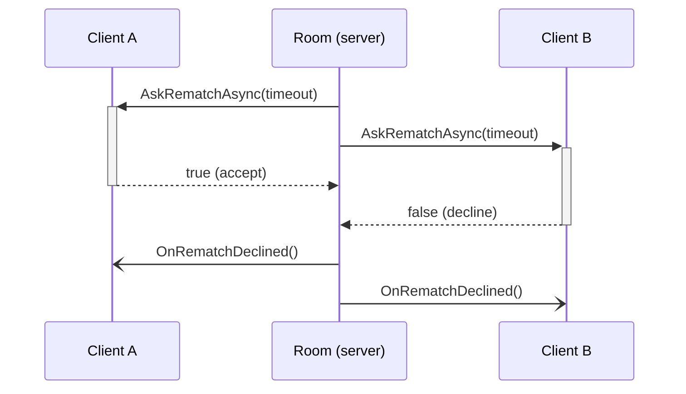

import SourceLink from '../../../components/SourceLink.astro';

MagicOnion is Cysharp's RPC framework for .NET and Unity. It transports over standard gRPC (HTTP/2), but the protocol schema is a **C# interface** rather than a `.proto` file, and payloads are serialized with [MessagePack](../messagepack/). Every call in SharpCampus — client to server, server to server, even server calling into a client — rides on this framework, at version 7.10.2.

- Official docs: [cysharp.github.io/MagicOnion](https://cysharp.github.io/MagicOnion/)
- GitHub: [Cysharp/MagicOnion](https://github.com/Cysharp/MagicOnion)

## Why this library

Ordinary gRPC development means writing `.proto` files, running protoc to generate server and client stubs, and re-running that pipeline on every contract change. When both ends of the wire are C#, that middle step is pure overhead.

With MagicOnion, one interface in a shared project is the schema, the server contract, and the source of the client proxy. The server implements the interface; the client builds a proxy from the same interface. A mismatch surfaces as a **compile error**, not a runtime one.

For a game server there is one more draw: request-response calls (Unary) and real-time bidirectional streams (StreamingHub) live in one framework with one contract style, so the metagame API and the real-time duel don't need separate stacks. And because the floor is standard gRPC, L7 infrastructure like Envoy works unchanged — the `room-id` routing in the [architecture overview](../../architecture/) is exactly that.

## Contracts: the interface is the protocol

A Unary service contract is an interface extending `IService<TSelf>`. The matchmaking queue contract, in full:

```csharp
public interface IMatchmakingService : IService<IMatchmakingService>
{
    UnaryResult<MatchStatusResponse> EnqueueAsync();
    UnaryResult CancelAsync();
    UnaryResult<MatchStatusResponse> GetStatusAsync();
}
```

<SourceLink path="src/SharpCampus.Shared/Services/IMatchmakingService.cs" />

The return type `UnaryResult<T>` means one gRPC request-response; the non-generic `UnaryResult` covers calls with no response body. Where the interface lives decides who can see it: contracts clients call sit in `SharpCampus.Shared`, while the internal contracts the ApiServer uses against RoomServer and BotServer sit in `SharpCampus.Shared.Internal` and never ship to clients (the split is laid out in the [architecture overview](../../architecture/#three-call-paths-two-contracts)).

## Unary: the metagame API

The ApiServer exposes eight Unary services: account, profile, shop, missions, leaderboard, match history, matchmaking, and a status check. Implementations are plain classes, and because they run on ASP.NET Core, authentication is the standard kind — put `[Authorize]` on the service class and the JWT middleware validates the Supabase-issued token (only `IStatusService` allows anonymous calls).

Registration takes an array rather than one line:

```csharp
app.MapMagicOnionService([
    typeof(StatusService),
    typeof(AccountService),
    // ...
    typeof(MatchmakingService),
]);
```

<SourceLink path="src/SharpCampus.ApiServer/Program.cs" />

The parameterless `MapMagicOnionService()` scans only the entry assembly, and most of this project's service implementations live in `SharpCampus.Server.Common`, shared by both servers — hence the explicit list.

## StreamingHub: the real-time duel

The duel stream is a StreamingHub. Unlike Unary, the contract is a pair of interfaces: methods clients call on the server go in `IDuelHub`, and methods the server pushes to clients go in `IDuelHubReceiver`.

```csharp
public interface IDuelHub : IStreamingHub<IDuelHub, IDuelHubReceiver>
{
    Task<JoinRoomResult> JoinAsync(JoinRoomRequest request);
    Task SendInputsAsync(GameInput[] inputs);
    Task<DuelSnapshot> RequestSnapshotAsync();
    Task ForfeitAsync();
}
```

<SourceLink path="src/SharpCampus.Shared/Duel/IDuelHub.cs" /> · <SourceLink path="src/SharpCampus.Shared/Duel/IDuelHubReceiver.cs" />

The server implementation, <SourceLink path="src/SharpCampus.RoomServer/Hubs/DuelHub.cs" />, is a thin adapter extending `StreamingHubBase<IDuelHub, IDuelHubReceiver>`. On a successful join it adds the connection to a group named after the room via `Group.AddAsync($"room:{roomId}")` — and that group is the broadcast outlet. Connections joining under the same name receive the same `IGroup<IDuelHubReceiver>` instance, so the room only needs to hold one group.

The proxy a group hands out is called a **multicaster**: `_group.All` is an `IDuelHubReceiver` whose calls reach both seats, and `_group.Single(connectionId)` targets one seat. A call only serializes onto each connection's write queue, so the tick loop never waits on a slow client — the property behind the "the loop never waits" rule in the [room lifecycle](../../architecture/room-lifecycle/) chapter. One caveat lives there too: a group is disposed with the last connection that leaves it, so the room treats a dead group the same as no group at all.

## Server to server: A→B on the same framework

When a match is made, the ApiServer asks a RoomServer to stand up a room. That server-to-server call uses no separate protocol — it is the exact same MagicOnion client a game client would use:

```csharp
var client = MagicOnionClient.Create<IRoomControlService>(
    _channels.GetOrAdd(controlEndpoint, GrpcChannel.ForAddress),
    ContractSerialization.Provider);

// ...
return await client.CreateRoomAsync(request);
```

<SourceLink path="src/SharpCampus.ApiServer/Matchmaking/RoomControlClient.cs" />

A `GrpcChannel` is a long-lived resource, so one is cached per room server. When the target is down (`Unavailable`), the caller puts the waiting pair back in the queue — a flow the [matchmaking](../../architecture/matchmaking/) chapter follows end to end. Bot summoning (`IBotControlService.SummonAsync`) has the same shape.

## Client Results: the server calls the client

New in MagicOnion 7. When a receiver method returns `Task<T>` instead of `void`, the server can invoke a method on a client and **wait for its answer**. In this project, the rematch offer is that feature:

```csharp
Task<bool> AskRematchAsync(int timeoutSeconds, CancellationToken cancellationToken = default);
```

<SourceLink path="src/SharpCampus.Shared/Duel/IDuelHubReceiver.cs" />



Each ask goes out per seat through `_group.Single(connectionId)`, and one refusal ends the offer immediately rather than running out the clock. Two practical points: Client Results calls time out after five seconds by default, so an offer longer than that needs a `CancellationTokenSource` per call; and a tick-loop action cannot await, so the room runs each ask as its own task and receives the answer back as a mailbox command. The full flow is in the [room lifecycle](../../architecture/room-lifecycle/) chapter. <SourceLink path="src/SharpCampus.RoomServer/Rooms/DuelRoom.cs" />

## Heartbeat: noticing a cut line

A TCP connection can die silently. Telling a quiet peer from a severed line takes a periodic signal, and MagicOnion 7 ships that as a built-in, in both directions.

The server side is three option lines:

```csharp
options.EnableStreamingHubHeartbeat = true;
options.StreamingHubHeartbeatInterval = TimeSpan.FromSeconds(1);
options.StreamingHubHeartbeatTimeout = TimeSpan.FromSeconds(5);
```

<SourceLink path="src/SharpCampus.RoomServer/Program.cs" />

Check every second, disconnect after five unanswered — numbers derived backwards from the room's 10-second disconnect grace: a silently dead connection has to be noticed well inside the grace, or the seat would sit there until the operating system gives up on the socket.

The client sends its own heartbeat in the other direction, and uses the round trip as the latency readout on the duel HUD:

```csharp
var options = StreamingHubClientOptions.CreateWithDefault(callOptions: new CallOptions(hubHeaders))
    .WithClientHeartbeatInterval(_heartbeatInterval)
    .WithClientHeartbeatResponseReceived(heartbeat => status.Measure(heartbeat.RoundTripTime));
```

<SourceLink path="src/SharpCampus.Client/Duel/DuelFlow.cs" />

In short: the server heartbeat notices a vanished client; the client heartbeat measures latency and notices a dead server.

## JsonTranscoding: an HTTP window for development

You can't poke a gRPC service with curl. MagicOnion's JSON transcoding also exposes Unary services as HTTP/1 + JSON endpoints, and this project turns it on only in the development environment:

```csharp
if (builder.Environment.IsDevelopment())
{
    magicOnion.AddJsonTranscoding();
    builder.Services.AddEndpointsApiExplorer();
    builder.Services.AddMagicOnionJsonTranscodingSwagger();
    builder.Services.AddSwaggerGen(options => options.IncludeMagicOnionXmlComments(typeof(IStatusService).Assembly));
}
```

<SourceLink path="src/SharpCampus.ApiServer/Program.cs" />

Swagger UI comes along, and its documentation isn't written separately — it comes from the XML doc comments (`///`) on the contract interfaces. `SharpCampus.Shared` emits the XML with `GenerateDocumentationFile`, `IncludeMagicOnionXmlComments` reads it, and the contract comments become the API docs.

## Source generator: clients built ahead of time

The proxy `MagicOnionClient.Create<T>()` returns is produced by runtime code generation by default. The source generator moves that to compile time, and a single marker class is all it takes:

```csharp
[MagicOnionClientGeneration(typeof(IStatusService))]
internal partial class MagicOnionClientInitializer;
```

<SourceLink path="src/SharpCampus.Client.Common/MagicOnionClientInitializer.cs" />

It scans the assembly containing the named type and pre-generates client proxies for every service contract in it. The console client and the BotServer each carry this marker, leaving no runtime code generation on the client side. On AOT platforms that forbid IL emission — Unity IL2CPP being the big one — this stops being an optimization and becomes a requirement, and the picture completes with its serialization counterpart: the MessagePack source generator, covered on the [MessagePack-CSharp page](../messagepack/).

## See also

- [Architecture overview](../../architecture/): where the three call paths (Unary/StreamingHub/A→B) and two contract projects sit in the whole
- [Room lifecycle](../../architecture/room-lifecycle/): DuelHub and Client Results at work
- [Matchmaking](../../architecture/matchmaking/): where the A→B call fits in the pairing pipeline
- [MessagePack-CSharp](../messagepack/): the serializer under every one of these calls
