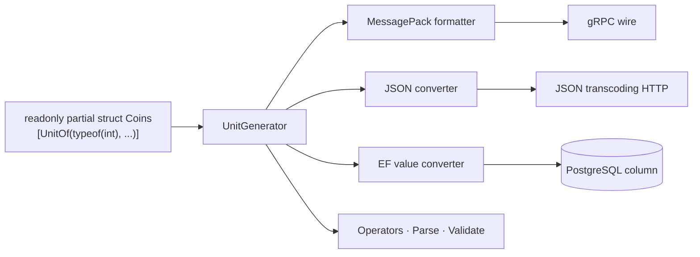

import SourceLink from '../../../components/SourceLink.astro';

UnitGenerator is a Cysharp source generator that takes an empty struct declaration carrying a single `[UnitOf]` attribute and completes it into a full value object. All nine of this project's ID and quantity types — `UserId`, `RoomId`, `MatchId`, `TickNumber`, `PlayerIndex`, `Coins`, `Rating`, `SkinId`, `MissionId` — are built this way. The version is 2.0.0.

- GitHub: [Cysharp/UnitGenerator](https://github.com/Cysharp/UnitGenerator)

## Why this library

If `UserId` is a `Guid` and both a shop price and a balance are `int`, then to the compiler, values with entirely different meanings all share a type. Swap two arguments, add a tick number to a coin balance — everything compiles. Wrapping each value in its own type turns all of those mistakes into type errors, but what usually pushes the pattern out of real codebases is the cost: equality, serialization formatters, DB converters, and `Parse` add up to hundreds of hand-written lines per type.

UnitGenerator shrinks that cost to a one-line declaration. Which conveniences get generated is chosen by combining option flags; the rest happens at compile time.

## One-line declarations and the option menu

The full declaration of the soft currency `Coins`:

```csharp
/// <summary>
/// Soft currency an account spends on cosmetic items.
/// </summary>
// Arithmetic and comparison exist so the shop's debit is a translatable EF expression: the balance
// check and the subtraction both run inside the database.
[UnitOf(typeof(int), UnitOptions.Persisted | UnitGenerateOptions.ArithmeticOperator | UnitGenerateOptions.Comparable)]
public readonly partial struct Coins;
```

<SourceLink path="src/SharpCampus.Shared/Values/Coins.cs" />

The nine declarations differ only in the wrapped primitive and the options:

| Type | Primitive | What the options add |
| --- | --- | --- |
| `UserId` | `Guid` | Persisted + ParseMethod |
| `RoomId` · `MatchId` | `Ulid` | Transported + ParseMethod |
| `Coins` | `int` | Persisted + arithmetic operators + comparison |
| `Rating` | `int` | Persisted |
| `TickNumber` | `int` | MessagePack formatter + comparison |
| `PlayerIndex` | `int` | MessagePack formatter + Validate |
| `SkinId` · `MissionId` | `string` | Persisted + comparison (operators excluded) |

Persisted and Transported are preset constants this project defines. Two families kept recurring — "values that reach the database" and "values that only ride the wire" — so the combinations live in one place:

```csharp
// Single home for the target-framework split, so each value object declares its options in one line.
internal static class UnitOptions
{
    // MessagePack carries these over the wire and into the master data binary, JSON carries them
    // through the master data source file and the transcoded HTTP endpoints. EF Core is the odd one
    // out: a server-side, net-only dependency, so the Unity-facing netstandard build must compile
    // without the converter while the net10.0 build the servers reference carries it.
    public const UnitGenerateOptions Persisted =
#if NET10_0_OR_GREATER
        UnitGenerateOptions.MessagePackFormatter
        | UnitGenerateOptions.JsonConverter
        | UnitGenerateOptions.EntityFrameworkValueConverter;
#else
        UnitGenerateOptions.MessagePackFormatter | UnitGenerateOptions.JsonConverter;
#endif
```

<SourceLink path="src/SharpCampus.Shared/UnitOptions.cs" />

`SharpCampus.Shared` builds for two targets, netstandard2.1 and net10.0. The EF Core converter is a server-only dependency, so the netstandard build drops it from the generation options. The value-object declarations stay untouched; only the preset splits on `#if`.

## Where the generated pieces plug in

What the options produce is not just convenience members inside the type — it is one adapter per boundary the value crosses on its way out of the process.



The MessagePack formatter is why a value object travels the wire as its bare primitive (the details are on the [MessagePack-CSharp page](../messagepack/)). The JSON converter serves the dev-only JSON transcoding HTTP endpoints and the master data source file. The EF converter alone is generated but never discovered — EF cannot find it on its own, so the DbContext registers it by hand:

```csharp
    protected override void ConfigureConventions(ModelConfigurationBuilder configurationBuilder)
    {
        // UnitGenerator emits these converters, but EF never finds them on its own: without this registration
        // every value object would be mapped as an unsupported entity type instead of its underlying column.
        configurationBuilder.Properties<UserId>().HaveConversion<UserId.UserIdValueConverter>();
        configurationBuilder.Properties<Coins>().HaveConversion<Coins.CoinsValueConverter>();
        configurationBuilder.Properties<Rating>().HaveConversion<Rating.RatingValueConverter>();
        configurationBuilder.Properties<MatchId>().HaveConversion<MatchId.MatchIdValueConverter>();
        configurationBuilder.Properties<SkinId>().HaveConversion<SkinId.SkinIdValueConverter>();
        configurationBuilder.Properties<MissionId>().HaveConversion<MissionId.MissionIdValueConverter>();
    }
```

<SourceLink path="src/SharpCampus.Server.Common/Data/SharpCampusDbContext.cs" />

## Operators that run inside the database

`Coins` carries arithmetic and comparison options not for convenient in-memory math, but so the shop's debit query stays a translatable EF expression while working with the value object directly:

```csharp
        var debited = await db.Profiles
            .Where(p => p.UserId == userId && p.Coins >= price)
            .ExecuteUpdateAsync(setters => setters
                .SetProperty(p => p.Coins, p => p.Coins - price)
                // A lambda so the database's own clock stamps the row, the same way a rename does.
                .SetProperty(p => p.UpdatedAt, _ => DateTimeOffset.UtcNow));
```

<SourceLink path="src/SharpCampus.Server.Common/Data/ShopRepository.cs" />

The balance check in `p.Coins >= price` and the subtraction in `p.Coins - price` are both translated to SQL and executed inside the database. The generated `>=` and `-` operators, together with the value converter, are what make the statement possible.

## Values arriving off the wire get validated too

`PlayerIndex` is a duel seat number, so only 0 and 1 are valid. The Validate option adds a validation hook to the constructor — and since the generated MessagePack formatter also deserializes through that constructor, a seat that never existed cannot enter the process even from a tampered payload:

```csharp
// Validate runs from the constructor the generated MessagePack formatter deserialises through, so a
// seat that never existed cannot enter the process from the wire either.
[UnitOf(typeof(int), UnitGenerateOptions.MessagePackFormatter | UnitGenerateOptions.Validate)]
public readonly partial struct PlayerIndex
{
    private partial void Validate()
    {
        if (value is not (0 or 1))
        {
            throw new ArgumentOutOfRangeException(nameof(value), value, "A duel seat is 0 or 1.");
        }
    }
}
```

<SourceLink path="src/SharpCampus.Shared/Values/PlayerIndex.cs" />

The string-backed `SkinId` and `MissionId` need an adjustment in the opposite direction. The Comparable option would also emit relational operators like `<` and `>`, which do not compile over a string — so `WithoutComparisonOperator` drops the operators while keeping the `IComparable` implementation, which the master data index still needs to sort and binary-search its keys.

## See also

- [MessagePack-CSharp](../messagepack/): why a value object crosses the wire as its bare primitive
- [Ulid](../ulid/): the identifier `RoomId` and `MatchId` wrap, and its per-boundary handling
