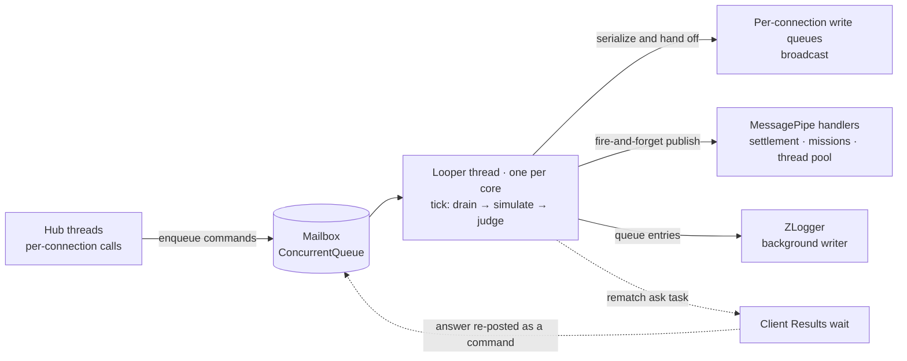

import SourceLink from '../../../components/SourceLink.astro';

A real-time game server is a showroom of concurrency problems. Two clients send inputs at the same time, connections drop whenever they please, a finished match triggers database writes, and through all of it the simulation has to keep ticking twenty times a second. This project did not solve that with locks around shared state. It set up one invariant and lined everything up underneath it: **the tick loop never waits, and room state is only ever touched by one thread.**

The principle itself has appeared in pieces on the [LogicLooper](../../libraries/logiclooper/), [MessagePipe](../../libraries/messagepipe/), and [ZLogger](../../libraries/zlogger/) pages. This essay reassembles those pieces into a single thread map of the RoomServer process.

## The thread map

Four kinds of thread live in a RoomServer process: the request threads handling hub calls, the looper threads pinned one per core, the tasks running on the thread pool, and ZLogger's background writer thread.



The direction of the arrows is the rule. Everything **entering** the looper thread goes through a queue, and everything **leaving** it never waits. Those two sentences are the whole essay; the rest is the story behind each arrow.

## One owner thread per piece of state

The starting point is the declaration at the head of the room class.

```csharp
// One room is one LogicLooper action. Every field below is written on the loop thread only: hub
// threads reach the room through the command mailbox and nowhere else.
internal sealed class DuelRoom
{
    private readonly ConcurrentQueue<RoomCommand> _commands = new();
```

<SourceLink path="src/SharpCampus.RoomServer/Rooms/DuelRoom.cs" />

Boards, seats, queued inputs, the state machine — every field of the room is written on the looper thread only. Joins, inputs, forfeits, and disconnects received by the hub never touch the room directly; each becomes a `RoomCommand` sitting in the mailbox, and the drain at the top of each tick processes them in a batch. Instead of reasoning about a lock per field, the design makes "one thread touches the state" true and removes the contention itself — an actor model in miniature. How the mailbox is consumed inside the tick pipeline is covered by the [room lifecycle](../../architecture/room-lifecycle/) chapter.

The boundary has one gatekeeper.

```csharp
    // Rejecting once the room is closing is what keeps a hub from awaiting a reply nobody will send.
    public bool TryPost(RoomCommand command)
    {
        lock (_mailboxGate)
        {
            if (_closed)
            {
                return false;
            }

            _commands.Enqueue(command);
            return true;
        }
    }
```

<SourceLink path="src/SharpCampus.RoomServer/Rooms/DuelRoom.cs" />

Almost the only lock in the room is here, and it is held only for the moment of the enqueue. The closed check and the post have to be one unit, or a command could land in a mailbox nobody will ever drain and leave a hub awaiting forever. The lock is not protecting state — it is protecting the atomicity of the boundary.

## Everything leaving never waits

Inside a tick, the outside world is touched at three points, and all three have the same shape: hand it off, don't wait.

**Broadcast.** Each tick's delta leaves through the [MagicOnion](../../libraries/magiconion/) group proxy.

```csharp
        // The group proxy only serialises onto each connection's write queue, so the loop never waits
        // on a client here.
        Everyone()?.OnTickDelta(TickDeltaFactory.Create(result, _simulation.Board1, _simulation.Board2));
```

<SourceLink path="src/SharpCampus.RoomServer/Rooms/DuelRoom.cs" />

The proxy's job ends at putting the serialized message onto each connection's write queue. A client on a slow line backs up its own queue and nothing else — it cannot hold up the loop's next tick.

**Settlement.** When a match ends, the result is published into [MessagePipe](../../libraries/messagepipe/).

```csharp
        // Fire and forget: settlement talks to a database, and nothing a room does may make the loop
        // thread wait. A room that never started never gets here, and has no match to settle.
        _matchFinished.Publish(new MatchFinishedEvent(
```

<SourceLink path="src/SharpCampus.RoomServer/Rooms/DuelRoom.cs" />

It is `Publish`, not `PublishAsync`. The database round trip is carried by a handler on the thread pool, and the loop moves on the moment the event is out. How a fired-and-forgotten write still gets waited for at shutdown — the InFlightHandler — belongs to the MessagePipe page.

**Logs.** A [ZLogger](../../libraries/zlogger/) log call ends at queueing a UTF8 entry; the actual console write happens on the background writer thread, which is why console I/O never blocks a tick. The `Hosting.Diagnostics` filter story on that page is the flip side of this structure: a log state that reads a live object when enumerated later, on another thread, is a data race all by itself.

## When await becomes necessary, leave as a task and return as a command

The rematch offer is this model's stress test. Client Results — the server calling a client's method and receiving its return value — is inherently an `await`, and a loop action cannot await.

```csharp
    // The question is asked from the loop thread but answered off it: a loop action cannot await, so
    // each ask runs as its own task and posts what it hears back into the mailbox.
    private void OfferRematch(IGroup<IDuelHubReceiver> group)
```

<SourceLink path="src/SharpCampus.RoomServer/Rooms/DuelRoom.cs" />

The ask is launched as a task per seat. What deserves the attention is the road the answer takes back.

```csharp
        try
        {
            accepted = await client.AskRematchAsync(timeoutSeconds, cancellationToken);
        }
        catch (Exception e)
        {
            // A client that errored, dropped or ran out the clock has all said the same thing.
            _logger.RoomRematchUnanswered(RoomId, playerIndex, e.Message);
        }

        TryPost(RoomCommand.RematchAnswer(playerIndex, accepted));
```

<SourceLink path="src/SharpCampus.RoomServer/Rooms/DuelRoom.cs" />

Even with the answer in hand, the task does not fix up the seat state itself. The answer becomes a `RoomCommand` too, goes back through the mailbox, and the next tick's drain handles it on the looper thread. The rule — everything that happened outside the loop enters as a command — applies without exception.

## The synchronization that remains

The lock count is not zero. But every remaining site guards a **lifetime boundary**, not room state: the mailbox gate above, and the creation gate in <SourceLink path="src/SharpCampus.RoomServer/Rooms/RoomManager.cs" /> that serializes room creation (the capacity check and the registration have to be one unit, so no room slips in behind a draining decision already made). All of them are short locks held for a few lines of queue work.

The subtlest piece is not a lock at all but this one line.

```csharp
    // Completed by whoever sees the last room go while draining. Release runs on the loop thread, and a
    // waiter's continuation must never run there: shutdown work would be ticking the rooms it waits on.
    private readonly TaskCompletionSource _idle = new(TaskCreationOptions.RunContinuationsAsynchronously);
```

<SourceLink path="src/SharpCampus.RoomServer/Rooms/RoomManager.cs" />

By default, a `TaskCompletionSource` runs its waiters' continuations on whatever thread set the result. The last room's release runs on a looper thread — so under the default, the draining shutdown code would run on the very thread that had been ticking the rooms it was waiting for. `RunContinuationsAsynchronously` is the fence against that stowaway. The invariant "never block the tick loop" reaches all the way down into an option flag on task completion.

## Not just the rooms' shape

The shape — one owner thread plus queues at the boundary — repeats elsewhere in the process. ZLogger is exactly this structure (publishers enqueue, the writer thread writes), and the bot's perceive-and-decide pipeline built with [R3](../../libraries/r3/) also runs on a single thread, the hub's receive loop. In the words of the bot code's own comment, scoring a few dozen collision-free drops is a cost the receive loop can afford, so no extra thread was made for it.

Concurrency design tends to evoke the craft of locks and atomic operations, but what this stack demonstrates is the opposite: decide thread ownership first, and very few places that need the craft remain.

## See also

- [LogicLooper](../../libraries/logiclooper/): where the looper threads and the "never wait" invariant come from
- [MessagePipe](../../libraries/messagepipe/): the InFlightHandler paying fire-and-forget's bill
- [Room lifecycle](../../architecture/room-lifecycle/): the whole tick pipeline the mailbox feeds
- [ZLogger](../../libraries/zlogger/): the background writer and the general rule for asynchronous sinks
