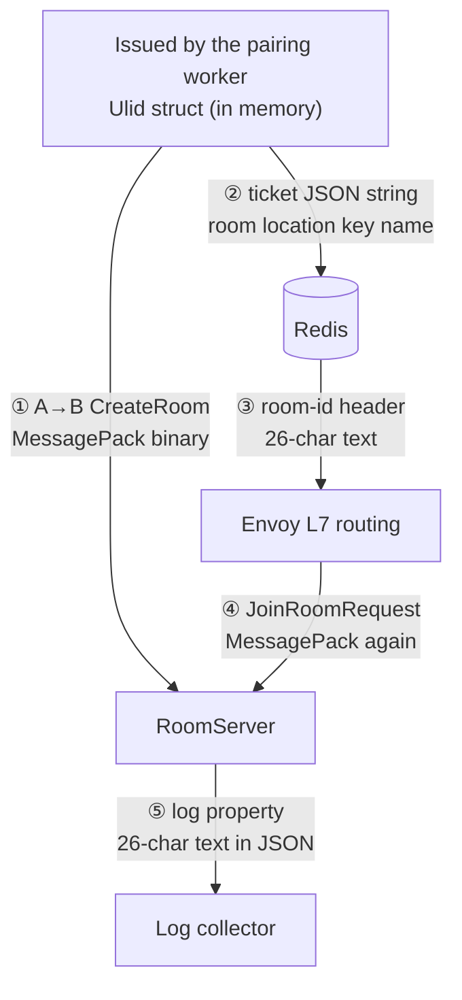

import SourceLink from '../../../components/SourceLink.astro';

This system does not have one serializer. The same process sends some values as [MessagePack](../../libraries/messagepack/) binary, some as [MemoryPack](../../libraries/memorypack/) binary, some as JSON, and some as plain text. It looks disorderly, and it is the opposite: each format has the ground where it wins, and every choice was decided by **who stands at the two ends of the boundary**. This essay collects those choices into one map, then follows a single `RoomId` as a tracer, watching it change representation each time it crosses a boundary.

## The map

| Boundary | Format | The two ends | Why that format |
| --- | --- | --- | --- |
| Client ↔ server RPC | MessagePack | console client · servers | public spec, cross-platform, size and speed |
| Server → server A→B | MessagePack | ApiServer · RoomServer/BotServer | no second protocol |
| Master data | JSON source, MessagePack binary shipped | the person editing · server startup | editing is for people, loading is for machines |
| Redis: tickets · room registry | JSON strings · hash fields | servers · a person holding redis-cli | values read by eye during operations |
| Redis: leaderboard cache | MemoryPack | server · server | both ends the same .NET, so the only criterion left is speed |
| Structured logs | JSON | servers · log collector | the collector's native language |
| HTTP dev window | JSON (JsonTranscoding) | a developer with curl or Swagger · ApiServer | a doorway called by hand |
| Database columns | the wrapped primitives as-is | servers · PostgreSQL | values SQL reads and indexes |
| gRPC header `room-id` | 26-character text | client · Envoy | a value that must be read without opening the payload |

## The rule: who is at the two ends

Generalize one sentence from the [MemoryPack page](../../libraries/memorypack/) — "picking a serializer is a question of who is at the two ends" — across the whole system, and the map settles into four zones.

- **Machine to machine, contract is public**: MessagePack. A client could be another language or platform, so the format needs a published spec; and the per-tick deltas pass through here, so size and speed are literally bandwidth and CPU.
- **Machine to machine, our servers only**: MemoryPack. With no cross-platform obligation, use the fastest thing there is.
- **A person or a general-purpose tool in the loop**: JSON. In front of a log collector, Swagger, or redis-cli, binary has only downsides.
- **Infrastructure reading in passing**: plain text. Envoy routes on the `room-id` header alone and never interprets the payload.

The point of the map is that unifying on one format would not be simplicity. Logs in MessagePack hit a wall at the collector; a cache in JSON is slow for no reason; a routing key inside the payload forces the entry point to deserialize. What should be small is not the number of formats but **the number of rules for choosing them**.

## The journey of a RoomId

Read the same map through the eyes of one value, and a `RoomId` changes representation five times across the life of a match.



In memory it is a [Ulid](../../libraries/ulid/) struct (before ①), on the wire it is MessagePack binary (① and ④), in Redis and the header it is 26-character text (② and ③), and in the logs it is a JSON property (⑤). Here is ③ in the flesh:

```csharp
        var hubHeaders = new Metadata { { "room-id", ticket.RoomId.ToString() } };
```

<SourceLink path="src/SharpCampus.Client/Duel/DuelFlow.cs" />

What deserves notice is how little hand-written conversion code this round trip contains. The MessagePack formatter and the JSON converter were generated onto the value object by [UnitGenerator](../../libraries/unitgenerator/), and the `Parse` for the text round trip is a method that came with one generation option. Which generated artifact works at which boundary is detailed on the UnitGenerator and [Ulid](../../libraries/ulid/) pages.

And at every boundary, what a human sees is the same 26 characters. The value read in redis-cli, the value riding the header, and the value searched in the logs are all one string — tracing a match end to end across the system becomes copy and paste.

## Keeping the boundaries honest

The map holds up on two rules.

**Different format, different type.** The leaderboard cache keeps its own type mirroring the contract DTO instead of reusing it. The direct reason is a practical constraint — the contract assembly is netstandard2.1 and MemoryPack requires .NET 7 or newer — but it also removed a remote coupling: a change to the wire contract can no longer silently change the cache format. Details are on the [MemoryPack page](../../libraries/memorypack/).

**Serialization options come from one place.** Every process that speaks the contracts takes its MessagePack options from a single static class in `SharpCampus.Shared`, because one process with a different resolver setup would read the same bytes differently. That configuration class is covered on the [MessagePack page](../../libraries/messagepack/).

## See also

- [MessagePack-CSharp](../../libraries/messagepack/): the owner of the public-contract zone
- [MemoryPack](../../libraries/memorypack/): the owner of the servers-only zone, and the origin of the "two ends" rule
- [UnitGenerator](../../libraries/unitgenerator/) · [Ulid](../../libraries/ulid/): the generated converters working at each boundary
- [ZLogger](../../libraries/zlogger/): the log zone's JSON output and how value objects appear in it
